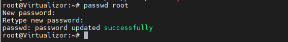

## Giới Thiệu

### 1. Tổng quan.

Virtualizor là một bảng điều khiển VPS dựa trên web cho phép người dùng triển khai và quản lý VPS trên máy chủ với các tính năng như hỗ trợ nhiều loại hệ thống ảo hóa (KVM, Xen, OpenVZ, Proxmox, Virtuozzo, LXC, vv) và hệ thống thanh toán giờ hàng giờ tích hợp.

### 2. Tính năng.

  + Một số tính năng miễn phí cơ bản của Virtualizor có thể bao gồm:
  + Triển khai VPS trên máy chủ với một cú nhấp chuột
  + Quản lý và cấu hình VPS trên giao diện web
  + Hỗ trợ nhiều loại hệ thống ảo hóa (KVM, Xen, OpenVZ, Proxmox, Virtuozzo, LXC, vv)
  + Tạo và quản lý tài khoản người dùng
  + Tạo và quản lùng VPS
  + Cung cấp các tùy chọn cấu hình VPS như cấu hình bộ nhớ, đĩa cứng, CPU, vv.
### 3. Yêu cầu.

Virtualizor yêu cầu các thiết bị máy chủ với các yêu cầu sau:

  + Hệ điều hành: CentOS 6, 7, 8 hoặc Red Hat Enterprise Linux 6, 7, 8.
  + Bộ xử lý: Tối thiểu 2 nhân (dual core) hoặc cao hơn.
  + Bộ nhớ RAM: Tối thiểu 2 GB hoặc cao hơn.
  + Dung lượng đĩa cứng: Tối thiểu 20 GB hoặc cao hơn.
  + Kết nối mạng: Cần có kết nối mạng tốt để triển khai và quản lý VPS.
  + Chú ý: Các yêu cầu có thể khác nhau tùy thuộc vào số lượng VPS được triển khai và dung lượng cần thiết cho mỗi VPS.

### 4. Lấy lisense dùng thử.

#### Bước 1: Đăng ký tài khoản Virtualizor.

Để lấy Virtualizor Trial License, bạn cần thực hiện các bước sau:

  + Truy cập trang chủ của Virtualizor: https://virtualizor.com/ và chọn “Try Virtualizor” hoặc “Free Trial” từ menu trên cùng, bấm vào Sign up và điền thông tin của bạn vào mẫu đăng ký miễn phí.

  

Xác nhận đăng ký bằng cách nhấp vào liên kết trong email xác nhận đã được gửi đến địa chỉ email của bạn.

  

Sau khi bấm vào link xác nhận email, bạn sẽ được đưa đến link như dưới. Như vậy bạn đã đăng ký thành công tài khoản Virtualizor.

  

#### Bước 2: Login tài khoản Virtualizor.

Vào https://www.softaculous.com/clients và login tài khoản vừa tạo xong.

  

Nếu login thành công, Virtualizor sẽ đưa bạn đến 1 trang trông giống như vậy. Tại Virtualizor Trial hãy click vào nó.

  

Điền địa chỉ IP Server ảo hoá của bạn, ví dụ 172.16.9.36 và bấm vào Get Trial.

Một thông báo A trial license has been issued hiện lên báo cho bạn biết bạn đã đăng ký lisense dùng thử thành công.

  

Bạn có thể vào My Licenses để xem thông tin tình trạng lisense.

  

Chú ý: Giấy phép thử nghiệm của Virtualizor có thời hạn và chỉ có thể sử dụng cho mục đích thử nghiệm và học tập. Nếu bạn muốn sử dụng Virtualizor cho mục đích thực tế, bạn cần mua giấy phép chính thức.

## Cài đặt

Theo khuyến nghị của phần mềm tại link sau:

https://www.virtualizor.com/docs/install/install-proxmox/

Mình cài đặt trên máy ảo Ubuntu22.04 IP 172.16.9.36

    wget -N http://files.virtualizor.com/install.sh
    chmod 0755 install.sh
    ./install.sh email=your@email.com kernel=proxmox

Dưới đây là giải thích về các tham số cài đặt:

  + email: Tham số này yêu cầu cung cấp địa chỉ email của quản trị viên. Địa chỉ email này thường được sử dụng để gửi thông báo hệ thống hoặc liên kết cài đặt với một người dùng cụ thể. Vui lòng cung cấp địa chỉ email chính xác!
  + kernel: Tham số này xác định kernel sẽ được sử dụng. Trong trường hợp này, giá trị là “virtuozzo”, cho biết kernel Virtuozzo sẽ được sử dụng.
  + noos: Thêm “noos=true” là một tham số để chỉ ra rằng bạn không muốn tải xuống hệ điều hành DomU cho DomU (máy ảo).
  + beta: Thêm “beta=true” là một tham số để chỉ ra rằng nếu có phiên bản mới hơn của Virtualizor có sẵn và bạn muốn thử nghiệm, bạn có thể sử dụng phiên bản beta.
  + interface: Bạn có thể chỉ định giao diện mặc định mà bạn muốn cài đặt. Nếu không được cung cấp, mặc định sẽ là “eth0”.
  + license: Trong trường hợp bạn cài đặt Virtualizor trên mạng nội bộ, bạn sẽ cần cung cấp mã khóa license HỢP LỆ. Để nhận được mã khóa license nội bộ, bạn cần mở một yêu cầu hỗ trợ.
  + Quá trình cài đặt sẽ bắt đầu ngay lập tức, bạn hãy xác nhận cài đặt bằng cách nhập y và bấm Enter.

    -----------------------------------------------
     Welcome to Softaculous Virtualizor Installer
    -----------------------------------------------
    To monitor installation : tail -f /root/virtualizor.log
 
    An existing installation of Virtualizor has been detected !
    If you continue to install Virtualizor, the existing installation
    and all its Data will be lost
    Do you want to continue installing ? [y/N]

Nếu Active Key thành công và sau khi cài đặt xong bạn sẽ nhận được thông tin như dưới. Hãy bấm Y để khởi động lại Proxmox.
 
   Congratulations, Virtualizor has been successfully installed

    API KEY : uKFqRe0yKFi3yDY6YadpmtKycAi5Qka4
    API Password : 6ke8iql8zn084s5Y2OxPiyhiG0P7QDM0

    You can login to the Virtualizor Admin Panel
    using your ROOT details at the following URL :

    https://14.248.82.xxx:4085/
    OR
    http://14.248.82.xxx:4084/

    You will need to reboot this machine to load the correct kernel
    Do you want to reboot now ? [y/N]

Bạn sẽ thấy có 2 url để bạn login trên trình duyệt đó là https://14.248.82.194:4085/ và http://14.248.82.194:4084/ nhưng nếu bạn muốn login bằng IP Public thì bạn phải Forward port 4085hoặc 4084 ra ngoài nhé. Do mình không muốn Public nên mình sử dụng IP Private của Node để truy cập luôn.

Như vậy URL của mình sẽ là:

    https://172.16.9.36:4085/
    OR
    http://172.16.9.36:4084/

    root@Virtualizor:~# service virtualizor start

    root@Virtualizor:~# systemctl enable virtualizor

    root@Virtualizor:~# init 6
     
Hãy sử dụng username và password của server để login root/mật khẩu root.

  

Nếu bạn đã nhập đúng thông tin username và password của server nhưng mà vẫn báo sai thì bạn hãy làm theo bước tiếp theo.

  

Hãy vào file /etc/pam.d/common-password, bạn sẽ nhìn thấy nội dung file này như dưới.

  

Hãy thay đổi tham số yescrypt thành sha512 tại dòng password [success=1 default=ignore] pam_unix.so obscure yescrypt và lưu lại.

  

Tiếp theo bạn hãy tiến hành đổi mật khẩu root cho Node này, bạn có thể sử dụng mật khẩu cũ khi đổi được nhé.

  

Và kết quả login thành công, hãy bấm skip để bỏ qua thông báo.

  

Tới đây mình đã hướng dẫn các bạn cài đặt Virtualizor trên Proxmox thành công.

