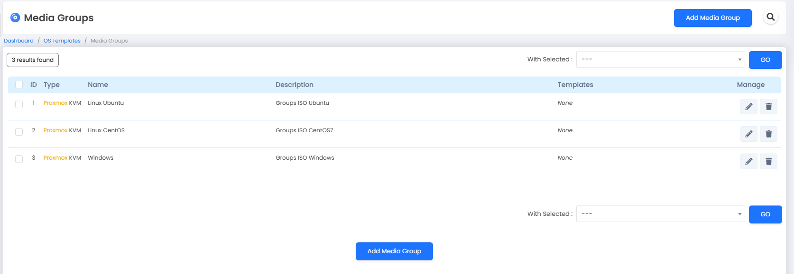

## 1. Tổng quan.

Trong Virtualizor, ``media`` (phương tiện) là thuật ngữ dùng để chỉ các tài nguyên như OS Templates, ISO và Media Groups. Dưới đây là giải thích tóm tắt về các chức năng liên quan đến media trong Virtualizor:

  + OS Templates: OS Templates là các bản cài đặt hệ điều hành sẵn có mà bạn có thể sử dụng để tạo máy ảo. Virtualizor cung cấp một danh sách các OS Templates chuẩn, bao gồm các phiên bản của các hệ điều hành phổ biến như CentOS, Ubuntu, Debian, Windows, v.v. Bạn có thể chọn và cài đặt OS Template tương ứng với nhu cầu của máy ảo.
  + Template Browser: Template Browser là công cụ giúp bạn duyệt và tìm kiếm các OS Templates có sẵn trong Virtualizor. Bạn có thể sử dụng tính năng tìm kiếm và lọc để dễ dàng tìm các OS Template phù hợp với yêu cầu của bạn.
  + Add Template: Chức năng Add Template cho phép bạn thêm một OS Template tùy chỉnh vào hệ thống Virtualizor. Bạn có thể tải lên (upload) file ISO hoặc file đĩa của hệ điều hành và cấu hình các thông số cần thiết để tạo thành một OS Template mới.
  + Create Template: Create Template là công cụ cho phép bạn tạo một OS Template từ máy ảo đang chạy. Bạn có thể chọn máy ảo và tạo một bản sao của nó để tạo thành một OS Template sẵn sàng để sử dụng cho các máy ảo mới.
  + List ISO: List ISO hiển thị danh sách các file ISO có sẵn trong hệ thống Virtualizor. File ISO thường được sử dụng để cài đặt hệ điều hành hoặc phần mềm vào máy ảo.
  + Add ISO: Add ISO cho phép bạn tải lên (upload) một file ISO vào hệ thống Virtualizor. Bạn có thể sử dụng file ISO này để cài đặt hoặc gắn kết với máy ảo.
  + Media Groups: Media Groups là tập hợp các file ISO hoặc file phương tiện tương tự nhau. Bạn có thể tạo các Media Groups để nhóm các file phương tiện lại với nhau, giúp quản lý và sử dụng chúng dễ dàng hơn.
  + Add Media Group: Chức năng Add Media Group cho phép bạn tạo một Media Group mới trong Virtualizor. Bạn có thể chọn các file ISO hoặc file phương tiện có sẵn và nhóm chúng vào một Media Group.
  + List Distros: List Distros hiển thị danh sách các bản phân phối Linux có sẵn trong hệ thống Virtualizor. Các bản phân phối Linux này tương tự như OS Templates và có thể được sử dụng để cài đặt máy ảo.
  + Add Distro: Add Distro cho phép bạn thêm một bản phân phối Linux tùy chỉnh vào hệ thống Virtualizor. Bạn có thể tải lên (upload) file ISO hoặc file đĩa của bản phân phối Linux và cấu hình các thông số cần thiết để tạo thành một Distro mới.
  + Enduser ISOs: Enduser ISOs là danh sách các file ISO mà người dùng cuối (end user) có quyền truy cập và sử dụng trong môi trường Virtualizor.

## 2. Cách thêm ISO vào Media.

Đầu tiên mình sẽ lấy link download của ISO, ví dụ của mình là bản Ubuntu 22.04 và CentOS7

    https://releases.ubuntu.com/22.04/ubuntu-22.04.5-live-server-amd64.iso

    http://centos-hcm.viettelidc.com.vn/7/isos/x86_64/CentOS-7-x86_64-Minimal-2207-02.iso

Hoặc 1 webserver được phép tải ISO

    http://172.16.9.108/ubuntu-22.04.1-live-server-amd64.iso

Tiếp theo bạn nên tạo 1 Media Ggroups.

  

Bạn đặt tên phù hợp

  

Thông báo tạo Media Groups thành công sau khi bạn bấm Save Media Group.

Bạn sẽ có một Save Media Group đầu tiên như dưới.

  

Áp dụng tương tự mình sẽ tạo thêm 2 group nữa để các bạn có cái nhìn trực quan hơn.

  

Tiếp theo mình tiến hành Add ISO vào, hãy nhập url download iso của bạn, điền tên của iso và chọn một Media Group. Khai báo xong bạn hãy bấm Download ISO.

  

  

Áp dụng tương tự mình tải thêm một số ISO để phục vụ cho các bài lab ở sau.

  

