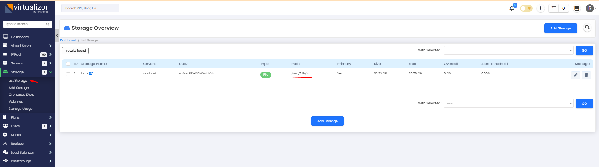
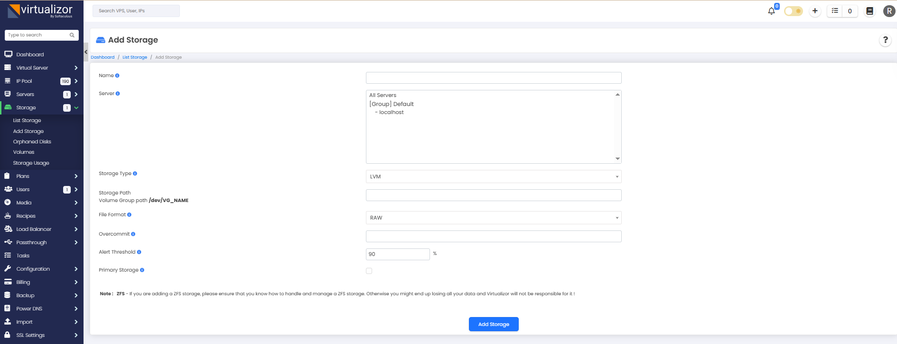
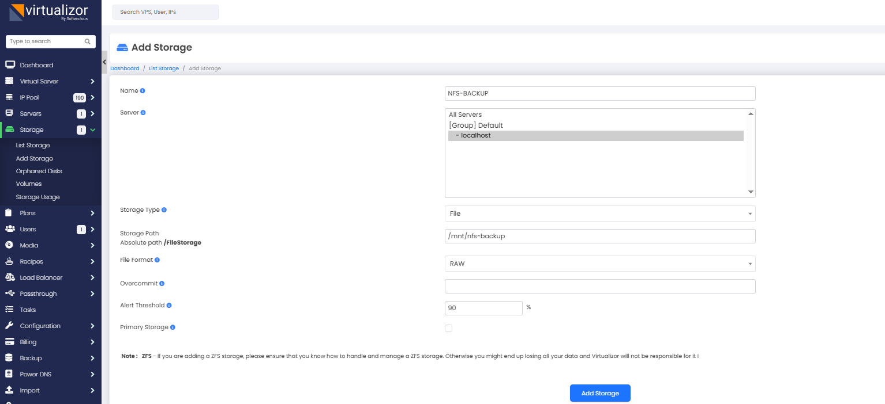
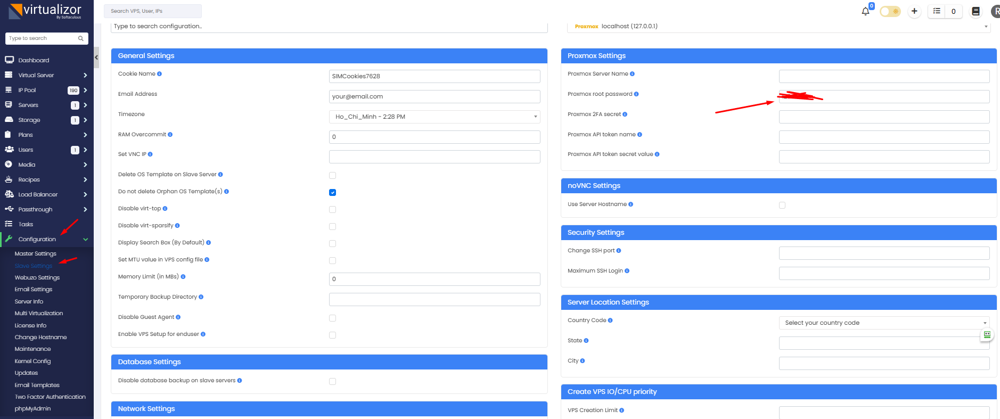
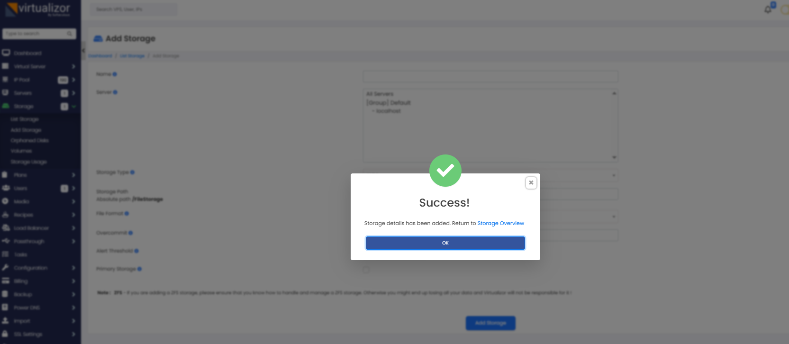
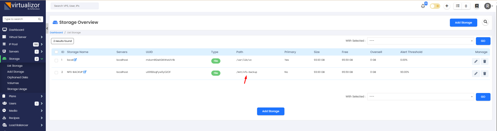
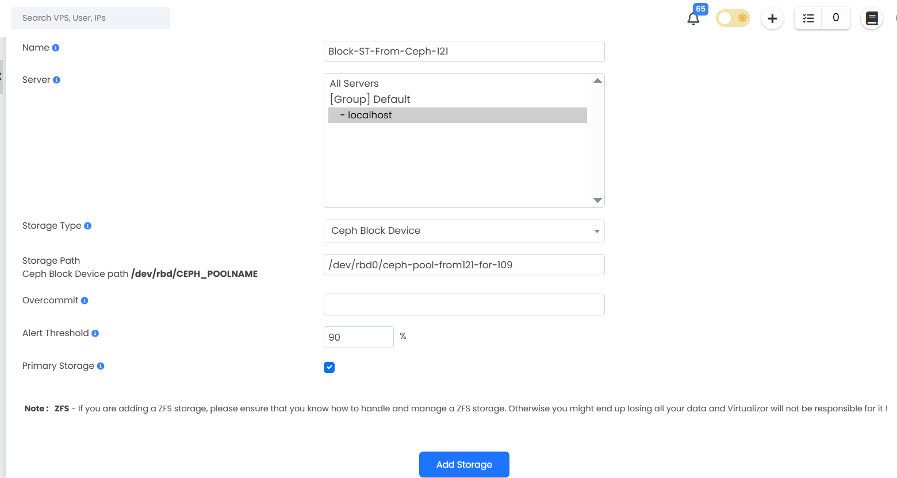
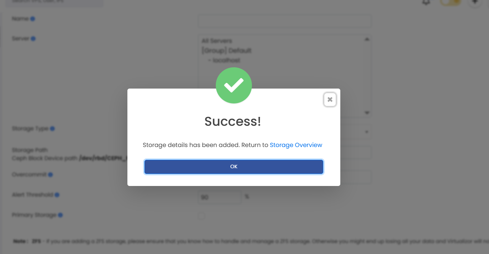

## 1. Tổng quan.

Trong ngữ cảnh của Virtualizor, storage (kho lưu trữ) là một khái niệm để định nghĩa và quản lý các tài nguyên lưu trữ được sử dụng cho máy ảo. Storage trong Virtualizor có thể là các hệ thống lưu trữ như NFS, iSCSI, Local, Ceph, ZFS, v.v. nơi dữ liệu máy ảo được lưu trữ.

Tuy nhiên, cần lưu ý rằng Virtualizor và Proxmox là hai hệ thống quản lý máy ảo riêng biệt và không chia sẻ trực tiếp các thông tin lưu trữ của nhau. Mặc dù Proxmox hỗ trợ nhiều hệ thống lưu trữ như Ceph, ZFS, nhưng khi sử dụng Virtualizor, bạn cần cấu hình và quản lý lại các kho lưu trữ này trong Virtualizor.

Điều này có nghĩa là, dù bạn đã thêm một kho lưu trữ (storage) trên Proxmox như Ceph hay ZFS, Virtualizor không tự động nhận biết và hiển thị chúng. Bạn cần thêm và cấu hình lại các kho lưu trữ đó trong giao diện quản lý của Virtualizor.

Từ đó, Virtualizor sẽ nhận biết và sử dụng các kho lưu trữ đã được thêm để quản lý máy ảo và tài nguyên. Việc này giúp Virtualizor có quyền kiểm soát và cấu hình lưu trữ một cách độc lập, giúp đơn giản hóa việc quản lý máy ảo và tài nguyên trong môi trường Virtualizor.

  

Bạn có thể bấm vào ``Add Storage`` , chúng ta sẽ xem các trường của nó.

  

Trong giao diện ``Add Storage`` của Virtualizor, các trường thông tin sau được sử dụng để cấu hình và thêm một kho lưu trữ mới:

  + Name: Đây là tên duy nhất cho kho lưu trữ mà bạn muốn thêm. Bạn có thể đặt tên theo sở thích của mình để dễ dàng nhận biết.
  + Server: Đây là địa chỉ IP hoặc tên máy chủ của máy chủ lưu trữ. Điều này chỉ định nơi mà kho lưu trữ sẽ được lưu trữ và quản lý.
  + Storage Type: Đây là loại lưu trữ được sử dụng. Virtualizor hỗ trợ nhiều loại lưu trữ như NFS, iSCSI, Local, Ceph, v.v.
  + File: Đây là tên tệp hoặc tên thư mục trên kho lưu trữ. Điều này chỉ định tệp hoặc thư mục cụ thể mà Virtualizor sẽ sử dụng để lưu trữ máy ảo hoặc dữ liệu.
  + Storage Path: Đây là đường dẫn tuyệt đối đến tệp hoặc thư mục lưu trữ trên máy chủ lưu trữ. Đường dẫn này sẽ chỉ định vị trí chính xác của lưu trữ trên máy chủ.
  + File Format: Đây là định dạng tệp được sử dụng cho lưu trữ. Các định dạng phổ biến bao gồm RAW, QCOW2, VMDK, v.v. Định dạng tệp cụ thể sẽ phụ thuộc vào yêu cầu và sự tương thích của hệ thống và ứng dụng.
  + Overcommit: Đây là tùy chọn để thiết lập chính sách overcommitment cho kho lưu trữ. Overcommitment cho phép bạn cấp phát nhiều tài nguyên hơn thực tế trên máy chủ, nhưng cần chú ý để không gây ảnh hưởng đến hiệu suất và sự ổn định của máy chủ.
  + Alert Threshold: Đây là ngưỡng cảnh báo cho sự sử dụng tài nguyên của kho lưu trữ. Khi sử dụng tài nguyên vượt quá ngưỡng này, hệ thống có thể cảnh báo hoặc thực hiện các hành động xử lý tương ứng.
  + Primary Storage: Đây là tùy chọn để đánh dấu kho lưu trữ là “Primary Storage”. Primary Storage là nơi lưu trữ chính được sử dụng cho máy ảo và dữ liệu.

Thông báo Note : ZFS - If you are adding a ZFS storage, please ensure that you know how to handle and manage a ZFS storage. Otherwise you might end up losing all your data and Virtualizor will not be responsible for it !có ý nghĩa cảnh báo về việc sử dụng và quản lý ZFS storage trong Virtualizor. ZFS là một hệ thống tệp hỗ trợ nhiều tính năng và mạnh mẽ, nhưng cũng đòi hỏi kiến thức và kỹ năng đặc biệt để quản lý nó một cách an toàn và hiệu quả.

Thông báo nhắc nhở rằng nếu bạn đang thêm một ZFS storage vào Virtualizor, bạn cần đảm bảo rằng bạn hiểu cách xử lý và quản lý ZFS storage. Nếu không tuân thủ đúng quy trình và không hiểu rõ cách hoạt động của ZFS, có thể xảy ra tình huống mất dữ liệu nghiêm trọng.

Virtualizor không chịu trách nhiệm cho việc mất dữ liệu nếu người dùng không hiểu hoặc không quản lý đúng ZFS storage. Do đó, điều quan trọng là đảm bảo bạn có đủ kiến thức và kỹ năng để làm việc với ZFS trước khi sử dụng nó trong môi trường Virtualizor.

## 2. Thêm Storage sử dụng Storage Type là File.

Đơn giản bản chỉ cần lấy thư mục nào có sẵn trên Node và rồi bạn trỏ vào Storage Path trên Vitualizator là xong.

  

Khi bấm Add nếu màn hình xoay quá lâu bạn cũng có thể bỏ qua nó bằng cách bấm vào nút tải lại trang, phần này mình đánh giá Vitualizator quá yếu.

>> Nếu bạn gặp lỗi chưa khai báo password, bạn hãy thêm pass root ssh vào mục như ảnh sau

  

OK 

  

  

Ngoài ra chúng ta có thể thêm các Storage của nhiều thể loại: NFS , FTP mount, SCSI , hay loại storage Ceph  

  

  