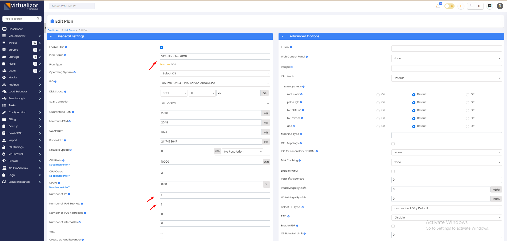
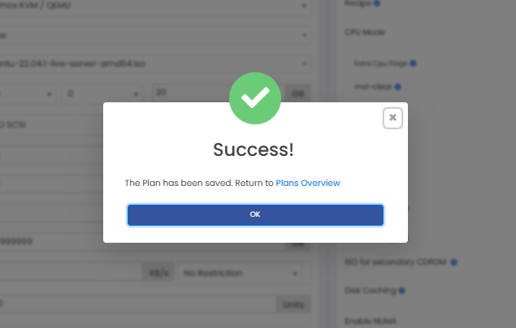
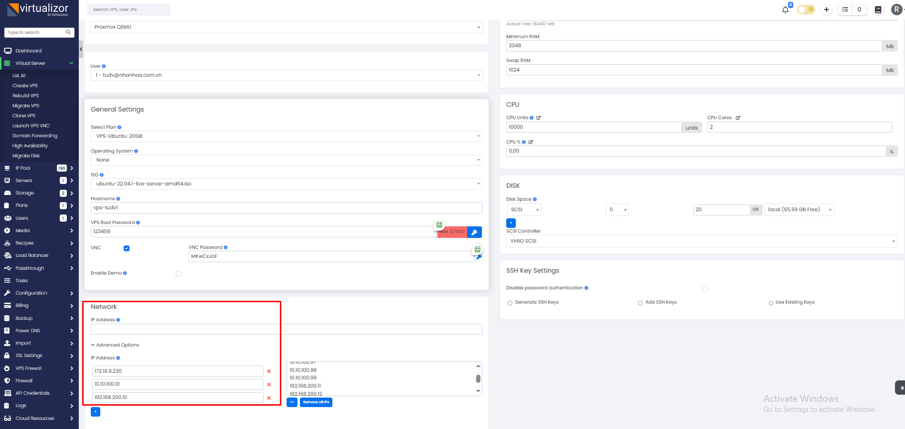

Mình tạo trước 1 Plan sau đó tạo VM

  

  

Tạo thử VM

  

Tổng quan

Virtualizor hỗ trợ Central Management của nhiều Nodes/Server để bạn có thể truy cập và tạo VPS chỉ từ máy chủ Master. Thêm một máy chủ trong Virtualizor rất dễ dàng. Bạn có thể “slave” một Máy chủ Virtualizor đã tồn tại và “deslave” bất kỳ lúc nào. Master chỉ giao tiếp với slave khi cần thiết. Slave chỉ trở thành một tài nguyên bổ sung cho master.

Lưu ý: Slave phải đã được cài đặt Virtualizor và cùng loại ảo hóa với Master. Ngoài ra, Master có thể là bất kỳ loại ảo hóa nào, chẳng hạn như OpenVZ, Xen hoặc Linux KVM…

OS Templates và File ISO

Khi tạo máy chủ ảo, rõ ràng rằng máy chủ sẽ cần các mẫu hệ điều hành (OS templates) hoặc file ISO để tạo một VPS, cho cả Slave và Master. Trong hệ thống quản lý trung tâm, tất cả các template OS và file ISO phải có trên máy chủ Master. Khi một VPS được tạo trên slave và nếu OS Template bị thiếu, nó sẽ được tải xuống từ Master.

Lấy thông tin máy chủ Slave

Để thêm máy chủ vào master, chúng ta cần lấy một số thông tin đăng nhập từ máy chủ slave sau khi đã cài đặt Virtualizor trên đó. Để làm điều này, bạn phải đăng nhập vào Bảng quản trị Virtualizor của slave và điều hướng đến Configuration >> Server Info. Hãy lưu ý Server Key Pass.

Thêm Server vào Master

Trên máy chủ Master, hãy truy cập vào Virtualizor Admin Panel, sau đó nhấp vào Servers >> Add Server. Điền thông tin “Server Name, IP Address và Server Password (Key Pass)” và sau đó nhấp vào “Add Server”. Master sẽ giao tiếp với máy chủ và phát hiện các chi tiết cần thiết. Nếu có xung đột nào đó xảy ra, master sẽ thông báo cho bạn.