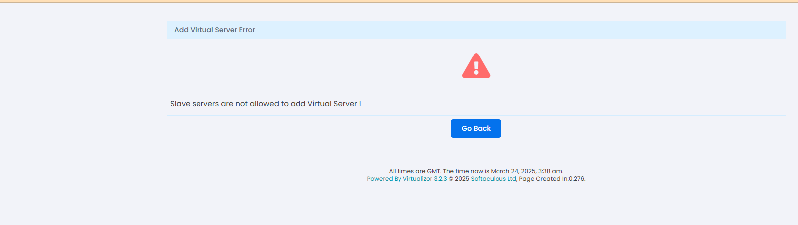
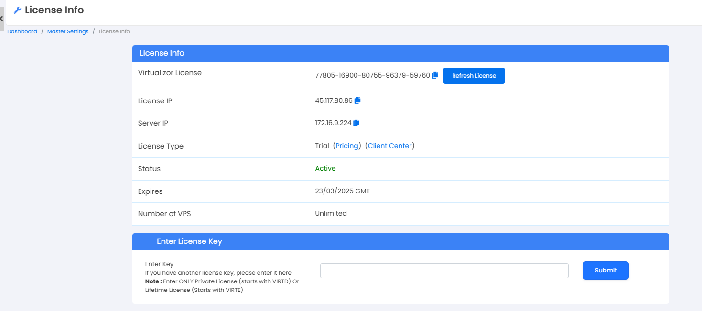
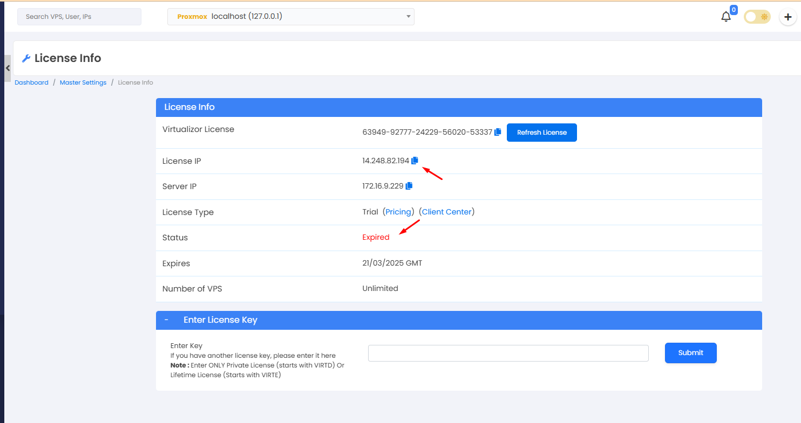

## Tình huống giả định của mình là máy Master hết hạn Lic >> Chuyển vai trò Master sang node khác

  

  

  

Hiện tại Node Master của mình có IP 172.16.9.229 hết hạn Lic và node Slave 172.16.9.224 đang có hạn Lic

Mình sẽ chuyển vai trò master của 172.16.9.229 sang 172.16.9.224

Hướng dẫn này sẽ giúp bạn trong trường hợp bạn muốn biến bất kỳ máy chủ Slave nào thành Master và máy chủ Master cũ thành máy chủ slave hoặc loại bỏ nó.

Lưu ý: Hành động này không thể hoàn tác. Vui lòng sao lưu database gốc trước khi tiếp tục. Điều này sẽ giúp bạn khôi phục lại database gốc nếu gặp sự cố hoặc bạn muốn hoàn tác các thay đổi sau khi export.

Nếu máy chủ Master cũ và mới của bạn đang sử dụng IP Public hoặc IP Private hoặc cả hai trên một số máy chủ slave chỉ có thể truy cập qua IP Private và đã được thêm vào cụm sử dụng IP Private, sau khi thực hiện toàn bộ hướng dẫn chuyển đổi máy chủ Master, bạn sẽ cần cập nhật thủ công IP Private của máy chủ Master mới cho biến 'masterip' trong file /usr/local/virtualizor/universal.php trên những máy chủ slave chỉ có thể truy cập qua IP Private.

## Kịch bản

Bạn muốn chuyển sang một máy chủ chỉ dùng cho việc làm máy chủ Master mới. Bạn sẽ cần cài đặt hệ điều hành trên máy chủ mới đó và cài đặt panel Master-only. Sau đó, bạn sẽ thêm máy chủ mới này vào cụm hiện tại như một máy chủ slave.

## Export

Vui lòng thực hiện lệnh sau để export database. Điều này sẽ giúp bạn khôi phục lại database trên máy chủ slave khác hoặc máy chủ mới.

