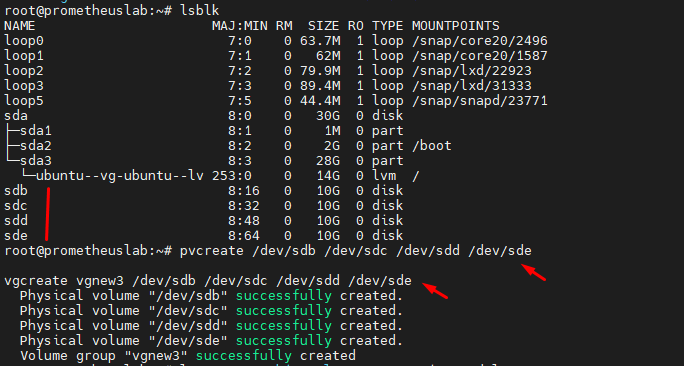
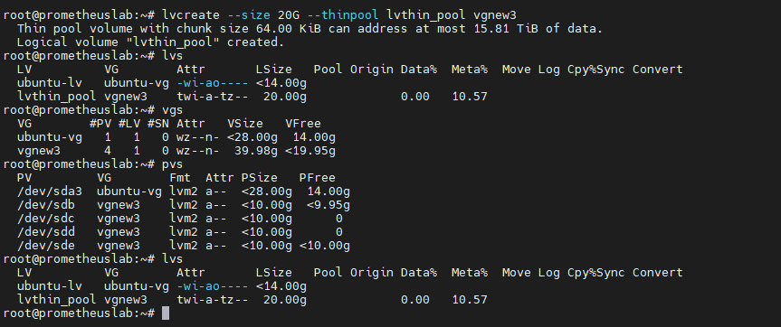

## 1. Create a LVM-thin pool

LVM-thin pool là một tính năng của Logical Volume Management (LVM) cho phép tạo ra các Logical Volume (LV) động, có thể tăng/giảm kích thước khi cần thiết.

LVM-thin pool cho phép tạo ra một "pool" các không gian lưu trữ ảo (thin pool), thay vì các LV cố định.

Các LV được tạo từ thin pool này được gọi là "thin LV".

Thin LV chỉ sử dụng không gian lưu trữ thực khi dữ liệu được ghi vào, thay vì cấp phát không gian lưu trữ tĩnh như truyền thống.

Điều này giúp tối ưu hóa việc sử dụng không gian lưu trữ, đồng thời cung cấp khả năng mở rộng linh hoạt.

Dưới đây là quy trình rút gọn:

 * Physical Volumes (PVs):
   * Biến các phân vùng vật lý thành PVs.
 * Volume Group (VG):
   * Nhóm các PVs thành một VG.
 * LVM Thin Pool:
   * Tạo thin pool trong VG.
 * LVM Thin Volumes:
   * Tạo các thin volumes từ thin pool.

    root@promox# lvcreate --size 100G --thinpool my_thinpool1 vmdata

Giải thích:

  + ``lvcreate``: Lệnh để tạo Logical Volume (LV).
  + -L 80G: Tạo LV với kích thước 80GB.
  + -T: Chỉ định tạo LV thin (từ thin pool).
  + -n vmstore: Đặt tên LV là ``vmstore``.
  + ``vmdata``: Tên của Volume Group (VG) mà LV ``vmstore`` sẽ được tạo trong đó.
#### Nếu bạn muốn sử dụng ổ đĩa dạng Thin LV trong thinpool 

    root@promox:~# mkfs.ext4 /dev/vmdata/my_thin_lv_volum_1

    root@promox:~# mkdir /mnt/my_thin_lv_volum_1

Để mount các thin LVs tự động khi khởi động lại hệ thống, hãy thêm các dòng sau vào ``/etc/fstab``:

    /dev/vmdata/ /mnt/my_thin_lv_volum_1 ext4 defaults 0 2

#### Giảm kích thước Thin Disk:

Trong trường hợp máy ảo (VM) sử dụng Thin Disk được tạo từ Thin LV vmstore, bạn có thể giảm kích thước của ổ đĩa máy ảo, nhưng với một số lưu ý:

Bạn có thể giảm kích thước của Thin Disk bằng cách thu nhỏ kích thước của Logical Volume (LV) bên trong vmstore.

Để thực hiện, sử dụng lệnh lvreduce trong Proxmox:

    # lvreduce -L <new_size> <vm_name>/<disk_name>

Thay <new_size> bằng kích thước mới mà bạn muốn và <vm_name>/<disk_name> bằng đường dẫn đến Thin Disk của máy ảo.
       
    root@promox:~# lvreduce -L 10G  vmdata/vm-105-disk-0
    root@promox:~# lvreduce -L 8G  vmdata/vm-105-disk-0
    root@promox:~# lvreduce -L 33G  vmdata/my_thin_lv_volum_1

## Ví dụ

Mình có 4 ổ ``sdb`` ``sdc`` ``sdd`` ``sde``

    pvcreate /dev/sdb /dev/sdc /dev/sdd /dev/sde

    vgcreate vgnew3 /dev/sdb /dev/sdc /dev/sdd /dev/sde

  

    lvcreate --size 20G --thinpool lvthin_pool vgnew3

  

    root@prometheuslab:~# lvs -o +devices vgnew3/lvthin_pool
      LV          VG     Attr       LSize  Pool Origin Data%  Meta%  Move Log Cpy%Sync Convert Devices
      lvthin_pool vgnew3 twi-a-tz-- 20.00g             0.00   10.57                            lvthin_pool_tdata(0)

     root@prometheuslab:~# lvdisplay -m vgnew3/lvthin_pool
      --- Logical volume ---
      LV Name                lvthin_pool
      VG Name                vgnew3
      LV UUID                jC2dz0-OVBN-gH5C-jOHN-0Cp4-Pquk-WxkTnp
      LV Write Access        read/write
      LV Creation host, time prometheuslab.dinhtu.xyz, 2025-03-26 01:24:30 +0000
      LV Pool metadata       lvthin_pool_tmeta
      LV Pool data           lvthin_pool_tdata
      LV Status              available
      # open                 0
      LV Size                20.00 GiB
      Allocated pool data    0.00%
      Allocated metadata     10.57%
      Current LE             5120
      Segments               1
      Allocation             inherit
      Read ahead sectors     auto
      - currently set to     256
      Block device           253:3

      --- Segments ---
      Logical extents 0 to 5119:
        Type                thin-pool
        Monitoring          monitored
        Chunk size          64.00 KiB
        Discards            passdown
        Thin count          0
        Transaction ID      0
        Zero new blocks     yes

    root@prometheuslab:~# lvcreate --size 19.9G --thinpool lvthin_pool2 vgnew3
      Rounding up size to full physical extent 19.90 GiB
      Thin pool volume with chunk size 64.00 KiB can address at most 15.81 TiB of data.
      Logical volume "lvthin_pool2" created.

    root@prometheuslab:~# lsblk
    NAME                        MAJ:MIN RM  SIZE RO TYPE MOUNTPOINTS
    loop0                         7:0    0 63.7M  1 loop /snap/core20/2496
    loop1                         7:1    0   62M  1 loop /snap/core20/1587
    loop2                         7:2    0 79.9M  1 loop /snap/lxd/22923
    loop3                         7:3    0 89.4M  1 loop /snap/lxd/31333
    loop5                         7:5    0 44.4M  1 loop /snap/snapd/23771
    sda                           8:0    0   30G  0 disk
    ├─sda1                        8:1    0    1M  0 part
    ├─sda2                        8:2    0    2G  0 part /boot
    └─sda3                        8:3    0   28G  0 part
      └─ubuntu--vg-ubuntu--lv   253:0    0   14G  0 lvm  /
    sdb                           8:16   0   10G  0 disk
    ├─vgnew3-lvthin_pool_tmeta  253:1    0   20M  0 lvm
    │ └─vgnew3-lvthin_pool      253:3    0   20G  0 lvm
    ├─vgnew3-lvthin_pool_tdata  253:2    0   20G  0 lvm
    │ └─vgnew3-lvthin_pool      253:3    0   20G  0 lvm
    ├─vgnew3-lvthin_pool2_tmeta 253:4    0   20M  0 lvm
    │ └─vgnew3-lvthin_pool2     253:6    0 19.9G  0 lvm
    └─vgnew3-lvthin_pool2_tdata 253:5    0 19.9G  0 lvm
      └─vgnew3-lvthin_pool2     253:6    0 19.9G  0 lvm
    sdc                           8:32   0   10G  0 disk
    └─vgnew3-lvthin_pool_tdata  253:2    0   20G  0 lvm
      └─vgnew3-lvthin_pool      253:3    0   20G  0 lvm
    sdd                           8:48   0   10G  0 disk
    └─vgnew3-lvthin_pool_tdata  253:2    0   20G  0 lvm
      └─vgnew3-lvthin_pool      253:3    0   20G  0 lvm
    sde                           8:64   0   10G  0 disk
    └─vgnew3-lvthin_pool2_tdata 253:5    0 19.9G  0 lvm
      └─vgnew3-lvthin_pool2     253:6    0 19.9G  0 lvm
    root@prometheuslab:~#

