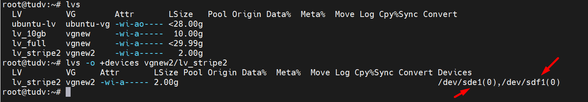

## 1. Khái niệm và mục đích sử dụng

### Khái niệm

  + LVM (Logical Volume Management): LVM là một công nghệ quản lý các phân vùng ổ đĩa, cho phép tạo, thay đổi kích thước, di chuyển và gộp các phân vùng một cách dễ dàng. Nó cung cấp sự linh hoạt và khả năng mở rộng trong quản lý không gian lưu trữ.
    LVM là một công nghệ quản lý khối lưu trữ logic, giúp tăng tính linh hoạt và khả năng mở rộng so với sử dụng ổ đĩa vật lý trực tiếp.
    Trong LVM, các ổ đĩa vật lý được nhóm lại thành các Physical Volumes (PV). Các PV này sau đó được nhóm lại thành các Volume Groups (VG).
    Từ các VG, quản trị viên có thể tạo ra các Logical Volumes (LV), là các khối lưu trữ logic mà các máy ảo và container sử dụng.
    LVM cho phép thực hiện các thao tác như tăng, giảm kích thước LV, di chuyển dữ liệu giữa các PV, và thêm/loại bỏ ổ đĩa vật lý.

  + LVM Thin: LVM Thin là một tính năng nâng cao của LVM, cho phép tạo các Logical Volume (LV) mỏng hơn, sử dụng không gian lưu trữ động và hiệu quả hơn. Nó giúp tối ưu hóa việc sử dụng không gian lưu trữ bằng cách chỉ sử dụng không gian đĩa khi cần thiết.

    Với LVM Thin, kích thước logic của LV có thể lớn hơn kích thước vật lý của các PV. Điều này cho phép overprovisioning dung lượng lưu trữ.
    LVM Thin sử dụng các pool dung lượng chia sẻ để cung cấp dung lượng cho các LV mỏng. Khi dữ liệu được ghi vào LV, dung lượng từ pool sẽ được cấp phát.
    Tính năng này giúp tối ưu hóa sử dụng dung lượng lưu trữ và tránh lãng phí.

## 2. Các kỹ thuật quản lý trong LVM 

  + Mở rộng và thu hẹp LV:
    + LVM cho phép bạn dễ dàng thay đổi kích thước của LV mà không cần khởi động lại hệ thống.
      Điều này rất hữu ích khi bạn cần tăng hoặc giảm dung lượng lưu trữ cho một ứng dụng.

  + Striping:

    + Là một kỹ thuật RAID (Redundant Array of Independent Disks) cấp độ 0.
    + Dữ liệu được chia thành các khối (stripe) và phân phối đều trên nhiều ổ đĩa vật lý (PVs).
    + Khi dữ liệu được đọc hoặc ghi, hệ thống có thể truy cập đồng thời vào nhiều PVs, giúp tăng tốc độ truyền dữ liệu.   

  + Mirroring:

    + Đây là kỹ thuật tạo bản sao dữ liệu trên nhiều PVs.
      Mirroring giúp tăng khả năng chịu lỗi bằng cách đảm bảo rằng dữ liệu vẫn có thể truy cập được ngay cả khi một ổ đĩa bị lỗi.

  + Snapshot:

    + Đây là kỹ thuật tạo bản sao "tức thời" của LV.
      Snapshot cho phép bạn khôi phục dữ liệu về trạng thái trước đó nếu cần thiết.

  + Thin provisioning:

    + Đây là kỹ thuật cho phép bạn cấp phát dung lượng lưu trữ lớn hơn dung lượng thực tế có sẵn.
      Thin provisioning giúp tối ưu hóa việc sử dụng không gian lưu trữ, đặc biệt là trong các môi trường ảo hóa.

#### Lưu ý khi sử dụng LVM

Khi các PVs (Physical Volumes) trong LVM (Logical Volume Manager) có dung lượng khác nhau, điều này có thể ảnh hưởng đến cách LVM phân bổ không gian và hiệu suất của các LV (Logical Volumes). Dưới đây là một số vấn đề tiềm ẩn:

  + Phân bổ không gian không đồng đều:

    + LVM sẽ cố gắng phân bổ không gian đều từ các PVs vào VG (Volume Group). Tuy nhiên, nếu các PVs có dung lượng khác nhau, điều này có thể dẫn đến việc một số PVs bị sử dụng nhiều hơn các PVs khác.
      Điều này có thể dẫn đến tình trạng mất cân bằng về không gian lưu trữ và hiệu suất.

  + Hiệu suất không tối ưu:

    + Khi sử dụng striping (chia sọc) trên các PVs có dung lượng khác nhau, hiệu suất có thể không được tối ưu.
      Điều này là do LVM sẽ phân bổ các stripe có kích thước bằng nhau trên tất cả các PVs. Nếu một PV có dung lượng nhỏ hơn, nó có thể trở thành điểm nghẽn hiệu suất.
  
  + Khó khăn trong việc mở rộng và quản lý:

    + Việc quản lý các VG với các PVs có dung lượng khác nhau có thể phức tạp hơn.
      Việc mở rộng VG hoặc LV có thể gặp khó khăn nếu không có đủ không gian trống trên tất cả các PVs.

  + Rủi ro về dữ liệu:

    + Nếu một PV bị lỗi, dữ liệu trên LV sẽ bị mất. Rủi ro này tăng lên nếu dữ liệu được phân bổ không đều trên các PVs.

#### Tuy nhiên:

  + LVM vẫn có thể hoạt động với các PVs có dung lượng khác nhau.
  + LVM cung cấp các công cụ và tùy chọn để quản lý không gian lưu trữ và tối ưu hóa hiệu suất, chẳng hạn như:
    + pvresize: Để thay đổi kích thước PV.
    + vgextend: Để mở rộng VG.
    + lvextend: Để mở rộng LV.

## 3. Thực hành Logical Volume Manager (LVM)

Trong LVM (Logical Volume Manager), các khái niệm PVs, VGs và LVs đóng vai trò quan trọng trong việc quản lý không gian lưu trữ linh hoạt.

  + PVs (Physical Volumes - Tập Vật Lý):

    + Đây là các ổ đĩa vật lý (hard disk, SSD, phân vùng,...) được sử dụng làm thành phần cơ bản của LVM.
      PVs được khởi tạo từ các thiết bị lưu trữ vật lý để LVM có thể quản lý.

  + VGs (Volume Groups - Nhóm Ổ Đĩa):

    + VG là một tập hợp các PVs, tạo thành một "bể" lưu trữ ảo.
      VG cung cấp một không gian lưu trữ lớn, có thể mở rộng bằng cách thêm PVs.
      Từ VG người quản trị hệ thống có thể phân chia thành các Logical Volume (LV) để sử dụng

  + LVs (Logical Volumes - Ổ Đĩa Logic):

    + LV là các ổ đĩa logic được tạo ra từ không gian lưu trữ của VG.
      LVs tương đương với các phân vùng ổ đĩa truyền thống, nhưng linh hoạt hơn về kích thước.

Người quản trị có thể thay đổi kích thước LV một cách dễ dàng mà không cần khởi động lại hệ thống.

### 3.1. Resize / OS Ubuntu 22.04

Mình sử dụng máy chủ Ubuntu 22.04 để LAB vì mặc định khi cài Ubuntu 22.04 hệ thống có sử dụng LVM quản lý phân vùng root(/),và tiện thể mình resize luôn phân vùng root của Ubuntu. 

  

Nhìn vào hình chúng ta có thể thấy như sau:

Physical disk hiện tại có 1 đĩa sda để cài OS, sau đó sda được chia ra làm 3 phân vùng với các mount point: ``/dev/sda2`` mount ``/boot = 2GB``, ``/dev/sda3`` mount ``/ = 14GB`` , dung lượng trống của ``/dev/sda3`` là ``14GB``.

Hiện tại /dev/sda3 được quản lý bởi LVM qua các công đoạn:

  + Sử dụng LVM tạo nhóm Volum Groups ``ubuntu-vg``
  + Sử dụng LVM tạo Logical Volumes ``ubuntu-lv``

Tiếp theo chúng ta resize / đạt max disk =28GB

    lvextend -L +14G ubuntu-vg/ubuntu-lv
    resize2fs /dev/mapper/ubuntu--vg-ubuntu--lv

  

### 3.2. Tạo VG mới

Tiếp theo chúng ta sẽ tạo thêm Pool LV mới, VG mới với 3 đĩa sdb, sdc và sdd sử dụng LVM , các ổ này dung lượng không đồng đều, mục đích chỉ để test, thực tế người ta không nhóm các ổ đĩa có dung lượng khác nhau vì hiệu suất và nó sẽ xảy ra sự phân bố dữ liệu không đồng đều.

Đầu tiên chúng ta tạo các phân vùng trên các đĩa, phân vùng lấy đủ 100% dung lượng đĩa.

    parted --script /dev/sdb 'mklabel gpt'
    parted --script /dev/sdb "mkpart primary 0% 100%"

    parted --script /dev/sdc 'mklabel gpt'
    parted --script /dev/sdc "mkpart primary 0% 100%"

    parted --script /dev/sdd 'mklabel gpt'
    parted --script /dev/sdd "mkpart primary 0% 100%"

  

Tạo Physical volume tên ``vgnew``

    vgcreate vgnew /dev/sdb1

Join 2 phân vùng ``/dev/sdc1`` và ``/dev/sdd1`` vào ``vgnew``

    vgextend vgnew /dev/sdc1

    vgextend vgnew /dev/sdd1

Kiểm tra trạng thái ``vgdisplay vgnew``

    vgdisplay vgnew

  

#### 3.3 Tạo LV với kích thước cụ thể:

Tạo LV 10GB với tên lv_10gb:

    lvcreate -L 10G -n lv_10gb vgnew

  + -L 10G: Chỉ định kích thước là 10GB.
  + -n lv_10gb: Đặt tên cho LV là lv_10gb.
  + vgnew: Chỉ định VG là vgnew.

Tạo LV sử dụng toàn bộ dung lượng trống:

    lvcreate -l 100%FREE -n lv_full vgnew

  + -l 100%FREE: Sử dụng 100% dung lượng trống trong VG.
  + -n lv_full: Đặt tên cho LV là lv_full.
  + vgnew: Chỉ định VG là vgnew.

Như vậy chúng ta đã tạo được 2 LV tên ``lv_10gb`` và ``lv_10gb``

#### 3.4. Tạo LV với striping (tăng hiệu suất):

Chúng ta sẽ add thêm các disk có dung lượng bằng nhau , mình tạo thêm 6 disk sử dụng ``tripping`` để tăng hiệu suất

    parted --script /dev/sde 'mklabel gpt'
    parted --script /dev/sde "mkpart primary 0% 100%"

    parted --script /dev/sdf 'mklabel gpt'
    parted --script /dev/sdf "mkpart primary 0% 100%"

    parted --script /dev/sdg 'mklabel gpt'
    parted --script /dev/sdg "mkpart primary 0% 100%"

    parted --script /dev/sdh 'mklabel gpt'
    parted --script /dev/sdh "mkpart primary 0% 100%"

    parted --script /dev/sdi 'mklabel gpt'
    parted --script /dev/sdi "mkpart primary 0% 100%"

    parted --script /dev/sdj 'mklabel gpt'
    parted --script /dev/sdj "mkpart primary 0% 100%"

  

Nếu bạn gặp cảnh báo sau, hãy xóa nó đi ( do trước đó mình đã thêm nhầm các /dev/sdf1 - ... - /dev/sdfj1 vào vgnew , điều này cũng tương đương việc bạn loại bỏ các phân vùng khỏi VG)

  
  

    vgreduce --removemissing vgnew

Nếu lệnh trên không hoạt động, bạn có thể sử dụng 

    vgreduce --force --removemissing vgnew

Tạo Volume Group tên ``vgnew2``

    vgcreate vgnew2 /dev/sde1

Join các phân vùng còn lại vào nhóm VG vgnew2

    vgextend vgnew2 /dev/sdf1

    vgextend vgnew2 /dev/sdg1

    vgextend vgnew2 /dev/sdh1

    vgextend vgnew2 /dev/sdi1

    vgextend vgnew2 /dev/sdj1

Tạo LV 2 GB với striping trên 2 PVs:

    lvcreate -L 2G -n lv_stripe2 -i 2 vgnew2

  + -L 20G: Chỉ định kích thước là 20GB.
  + -n lv_stripe2: Đặt tên cho LV là lv_stripe2.
  + -i 2: Chỉ định striping trên 2 PVs.

Khi bạn tạo một Logical Volume (LV) với lệnh ``lvcreate -L 2G -n lv_stripe2 -i 2 vgnew2`` trên một Volume Group (VG) có 6 Physical Volumes (PVs) mỗi PV 5GB, dữ liệu sẽ được phân phối theo mô hình striping trên 2 PVs. Điều này có nghĩa là mỗi stripe dữ liệu sẽ được ghi luân phiên trên 2 PVs khác nhau.

  + Phân bố dữ liệu:

    Kích thước LV: LV có kích thước 2GB.

    Stripes: Do sử dụng -i 2, dữ liệu sẽ được chia thành các stripe và ghi luân phiên trên 2 PVs.

  + Phân bổ trên PVs:

    Vì bạn đang sử dụng striping trên 2 PVs, dữ liệu sẽ được ghi xen kẽ trên 2 PVs cùng lúc.
    LVM sẽ chọn 2 PVs từ 6 PVs trong VG vgnew2 để thực hiện striping.
    Mỗi PV tham gia vào striping sẽ chứa 1GB dữ liệu của LV.
    4 PVs còn lại trong VG vgnew2 sẽ không được sử dụng cho LV này.

  + Cách xem phân bố dữ liệu:

    lvs -o +devices

Lệnh này sẽ hiển thị danh sách các LV và các PV mà chúng đang sử dụng.

    lvs -o +devices vgnew2/lv_stripe2

  

Kết quả sẽ cho bạn biết LV lv_stripe2 được phân bổ trên những PV nào.Và bạn thấy đó : ``/dev/sde1(0),/dev/sdf1(0)`` , số (0) ở đây mình không hiểu lắm nhưng đoán là RAID 0

    lvdisplay -m vgnew2/lv_stripe2 

Lệnh này hiển thị thông tin chi tiết về LV lv_stripe2, bao gồm cả phân bổ dữ liệu.

  

Kết quả sẽ cho bạn biết các PEs được sử dụng và chúng nằm trên những PV nào.

Lưu ý:

    LVM sẽ tự động chọn 2 PVs tốt nhất để sử dụng cho striping. Bạn không thể chỉ định cụ thể PV nào được sử dụng.
    Nếu bạn muốn phân phối dữ liệu trên nhiều hơn 2 PVs, bạn có thể thay đổi giá trị của -i trong lệnh lvcreate. Ví dụ, -i 3 sẽ phân phối dữ liệu trên 3 PVs.
    Nếu bạn muốn xem phân bổ dữ liệu chi tiết hơn, bạn có thể sử dụng các công cụ LVM khác như pvscan, vgscan, và lvscan.

Tạo LV 16GB với striping trên 3 PVs:

    lvcreate -L 16G -n lv_stripe3 -i 3 vgnew2

  + -L 30G: Chỉ định kích thước là 30GB.
  + -n lv_stripe3: Đặt tên cho LV là lv_stripe3.
  + -i 3: Chỉ định striping trên 3 PVs.

  

Nếu bây giờ mình chạy lệnh sau sẽ báo lỗi

lvcreate -L 16G -n lv_stripe6 -i 6 vgnew2

Vì không còn đủ 6 disk để tạo striping 

    root@tudv:~# lvcreate -L 8G -n lv_stripe6 -i 6 vgnew2
      Using default stripesize 64.00 KiB.
      Rounding size 8.00 GiB (2048 extents) up to stripe boundary size <8.02 GiB (2052 extents).
      Insufficient suitable allocatable extents for logical volume lv_stripe6: 2052 more required

    root@tudv:~# lvcreate -L 8G -n lv_stripe4 -i 3 vgnew2
      Using default stripesize 64.00 KiB.
      Rounding size 8.00 GiB (2048 extents) up to stripe boundary size 8.00 GiB (2049 extents).
      Logical volume "lv_stripe4" created.

#### Kết luận cho mục 3.4 Tạo LV với striping

Nên tạo LV nếu dụng Striping thì nên tạo đồng bộ,để dữ liệu phân phát đồng đều trên các ổ đĩa, ví dụ 2 ổ thì tạo striping 2 ổ, 3 ổ thì tạo striping 3 ổ...và nên tạo LV dùng hết dung lượng của VG

#### 3.5 Tạo LV với Mirrored (tăng dự phòng):

Việc tạo Logical Volume (LV) với mirrored (nhân bản) trong LVM mang lại khả năng dự phòng dữ liệu, đảm bảo rằng dữ liệu của bạn vẫn an toàn ngay cả khi một ổ đĩa vật lý bị hỏng. Dưới đây là các bước cơ bản để tạo LV mirrored:

  + Chuẩn bị các Physical Volumes (PVs):

    Đảm bảo bạn có ít nhất hai PVs có đủ dung lượng để chứa LV mirrored. Bạn có thể tạo PVs từ các ổ đĩa vật lý hoặc phân vùng.
    Lệnh để tạo PV: pvcreate /dev/sdX /dev/sdY (thay /dev/sdX và /dev/sdY bằng đường dẫn đến các ổ đĩa hoặc phân vùng của bạn).

  + Tạo Volume Group (VG):

    Tạo một VG từ các PVs đã chuẩn bị.
    Lệnh để tạo VG: vgcreate <tên_VG> /dev/sdX /dev/sdY (thay <tên_VG> bằng tên bạn muốn đặt cho VG).

  + Tạo Logical Volume Mirrored (LV):

    Sử dụng lệnh lvcreate với tùy chọn -m 1 để tạo LV mirrored. Số 1 ở đây nghĩa là sẽ tạo 1 bản sao dữ liệu.
    Lệnh để tạo LV mirrored: lvcreate -m 1 -L <dung_lượng> -n <tên_LV> <tên_VG>
    -m 1: Chỉ định tạo một bản sao (mirrored).
    -L <dung_lượng>: Chỉ định dung lượng của LV.
    -n <tên_LV>: Chỉ định tên của LV.
    <tên_VG>: Tên của VG bạn đã tạo.

Ví dụ:

    Giả sử bạn có 4 PVs là /dev/sdk /dev/sdl /dev/sdm /dev/sdn, và bạn muốn tạo một LV mirrored có dung lượng 10GB với tên ``mirrored_lv`` trong VG ``vgnew3``. Các lệnh sẽ như sau:

    pvcreate /dev/sdk /dev/sdl /dev/sdm /dev/sdn
    vgcreate vgnew3 /dev/sdk /dev/sdl /dev/sdm /dev/sdn
    lvcreate -m 1 -L 8G -n mirrored_lv vgnew3

  

  + Định dạng và gắn kết LV:

    Sau khi tạo LV, bạn cần định dạng nó với một hệ thống tệp (ví dụ: ext4) và gắn kết nó vào một thư mục.
    Lệnh để định dạng: mkfs.ext4 /dev/vgnew3/mirrored_lv
    Lệnh để gắn kết: mount /dev/vgnew3/mirrored_lv /mnt/mirrored_data (thay /mnt/mirrored_data bằng thư mục bạn muốn gắn kết).

Lưu ý quan trọng:

    Hiệu suất ghi có thể giảm khi sử dụng LV mirrored vì dữ liệu phải được ghi vào cả hai ổ đĩa.
    Đảm bảo rằng các PVs bạn sử dụng cho LV mirrored có cùng dung lượng hoặc dung lượng tương đương.
    Khi sử dụng LVM mirrored, nếu 1 trong 2 ổ đĩa gặp vấn đề, bạn vẫn có thể sử dụng dữ liệu từ ổ còn lại. Sau khi thay thế ổ cứng bị hỏng, bạn cần thực hiện các thao tác để đồng bộ lại dữ liệu.
    Bằng cách làm theo các bước này, bạn có thể tạo một LV mirrored trong LVM để tăng cường khả năng dự phòng dữ liệu cho hệ thống của mình.

    mkfs.ext4 /dev/vgnew3/mirrored_lv
    mount /dev/vgnew3/mirrored_lv /mnt/mirrored_data

    
## 3. Create a LVM-thin pool

LVM-thin pool là một tính năng của Logical Volume Management (LVM) cho phép tạo ra các Logical Volume (LV) động, có thể tăng/giảm kích thước khi cần thiết.

LVM-thin pool cho phép tạo ra một "pool" các không gian lưu trữ ảo (thin pool), thay vì các LV cố định.

Các LV được tạo từ thin pool này được gọi là "thin LV".

Thin LV chỉ sử dụng không gian lưu trữ thực khi dữ liệu được ghi vào, thay vì cấp phát không gian lưu trữ tĩnh như truyền thống.

Điều này giúp tối ưu hóa việc sử dụng không gian lưu trữ, đồng thời cung cấp khả năng mở rộng linh hoạt.

Dưới đây là quy trình rút gọn:

 * Physical Volumes (PVs):
   * Biến các phân vùng vật lý thành PVs.
 * Volume Group (VG):
   * Nhóm các PVs thành một VG.
 * LVM Thin Pool:
   * Tạo thin pool trong VG.
 * LVM Thin Volumes:
   * Tạo các thin volumes từ thin pool.

    root@promox# lvcreate --size 100G --thinpool my_thinpool1 vmdata

Giải thích:

  + ``lvcreate``: Lệnh để tạo Logical Volume (LV).
  + -L 80G: Tạo LV với kích thước 80GB.
  + -T: Chỉ định tạo LV thin (từ thin pool).
  + -n vmstore: Đặt tên LV là ``vmstore``.
  + ``vmdata``: Tên của Volume Group (VG) mà LV ``vmstore`` sẽ được tạo trong đó.

Sau đó chúng ta quay lại giao diện admin Proxmox để tạo 1 ``Storage`` type  ``LVM-Thin``

#### Lưu ý không tạo qua CLI vì giao diện sẽ không thấy

  

  

  

#### Nếu bạn muốn sử dụng ổ đĩa dạng Thin LV trong thinpool 

    root@promox:~# mkfs.ext4 /dev/vmdata/my_thin_lv_volum_1

    root@promox:~# mkdir /mnt/my_thin_lv_volum_1

Để mount các thin LVs tự động khi khởi động lại hệ thống, hãy thêm các dòng sau vào ``/etc/fstab``:

    /dev/vmdata/ /mnt/my_thin_lv_volum_1 ext4 defaults 0 2

  

#### Giảm kích thước Thin Disk:

Trong trường hợp máy ảo (VM) sử dụng Thin Disk được tạo từ Thin LV vmstore, bạn có thể giảm kích thước của ổ đĩa máy ảo, nhưng với một số lưu ý:

Bạn có thể giảm kích thước của Thin Disk bằng cách thu nhỏ kích thước của Logical Volume (LV) bên trong vmstore.

Để thực hiện, sử dụng lệnh lvreduce trong Proxmox:

    # lvreduce -L <new_size> <vm_name>/<disk_name>

Thay <new_size> bằng kích thước mới mà bạn muốn và <vm_name>/<disk_name> bằng đường dẫn đến Thin Disk của máy ảo.
       
    root@promox:~# lvreduce -L 10G  vmdata/vm-105-disk-0
    root@promox:~# lvreduce -L 8G  vmdata/vm-105-disk-0
    root@promox:~# lvreduce -L 33G  vmdata/my_thin_lv_volum_1
 
  

