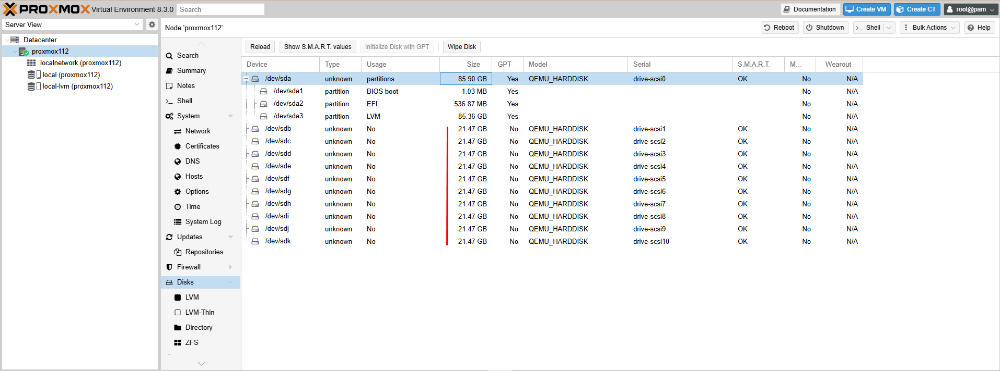
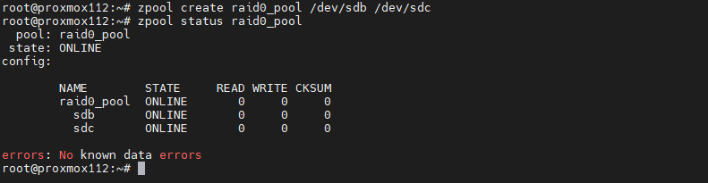
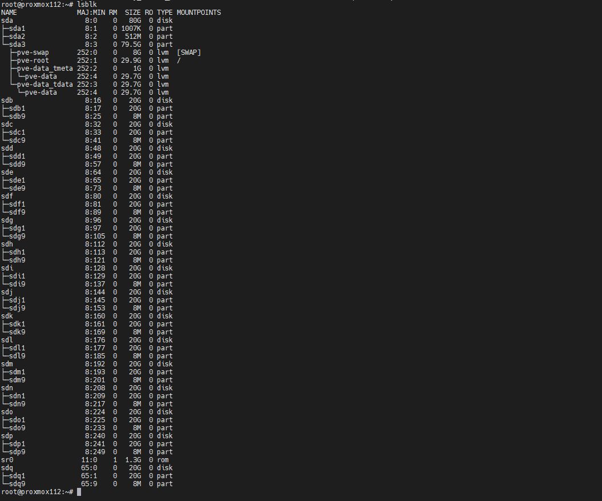

### 1. Chuẩn bị môi trường
#### Yêu cầu phần cứng/ảo hóa:
- Máy chủ cài Proxmox VE (hoặc máy ảo chạy Proxmox).
- Tối thiểu 6 virtual disks (để mô phỏng các ổ đĩa cho các loại RAID khác nhau).
- RAM: Tối thiểu 8GB (khuyến nghị 16GB nếu dùng Dedup hoặc nhiều VM).
- CPU: 4 cores trở lên.

Chúng ta có thể sử dụng máy ảo chạy proxmox cho tiện, thoải mái các điều kiện LAB

  

#### Cấu hình virtual disks trên Proxmox:
1. Tạo virtual disks (qua GUI hoặc CLI):
  - Ví dụ: Tạo 6 virtual disks (mỗi disk 10GB) cho các test case.
  
    qm set <VMID> --scsi1 local-lvm:10,format=raw
    qm set <VMID> --scsi2 local-lvm:10,format=raw
   ... (lặp lại cho đến disk 6)
   
2. Kết nối vào Proxmox Shell để quản lý ZFS.

---

### 2. Cài đặt ZFS trên Proxmox
  - Proxmox mặc định hỗ trợ ZFS. Nếu chưa kích hoạt:
 
    apt update && apt install zfsutils-linux
  
---

Thực ra khi cài Proxmox OS đã tích hợp sẵn ZFS

### 3. Thiết lập các loại RAID ZFS
#### a. RAID 0 (Striping)
- Yêu cầu: 2 ổ đĩa.
- Tạo pool:
 
    zpool create raid0_pool /dev/sdb /dev/sdc
  
- Kiểm tra:
 
    zpool status raid0_pool

  

#### b. RAID 1 (Mirror)
- Yêu cầu: 2 ổ đĩa.
- Tạo pool:
 
    zpool create my_mirror_pooltest mirror /dev/sdd /dev/sde
  
#### c. RAIDZ1
- Yêu cầu: 3 ổ đĩa.
- Tạo pool:
 
    zpool create my_raidz1_pool raidz1 /dev/sdf /dev/sdg /dev/sdh
  
#### d. RAIDZ2
- Yêu cầu: 4 ổ đĩa.
- Tạo pool:
 
    zpool create my_raidz2_pool raidz2 /dev/sdi /dev/sdj /dev/sdk /dev/sdl
  
#### e. RAIDZ3
- Yêu cầu: 5 ổ đĩa.
- Tạo pool:
 
    zpool create my_raidz3_pool raidz3 /dev/sdm /dev/sdn /dev/sdo /dev/sdp /dev/sdq

    

    
---

### 4. Test các trường hợp lỗi

#### a. Mô phỏng lỗi ổ đĩa
- Đưa ổ đĩa offline:
 
    zpool offline <pool_name> /dev/sdX
  
- Kiểm tra trạng thái:
 
    zpool status
  
#### b. Thay thế ổ đĩa
- Thay thế ổ hỏng (giả sử thêm ổ mới /dev/sdg):
 
    zpool replace <pool_name> /dev/sdX /dev/sdg
  
- Theo dõi quá trình rebuild:
 
    zpool status -v
  
---

### 5. Test hiệu suất và tính năng ZFS
#### a. Tạo dataset và kiểm tra nén dữ liệu

  zfs create <pool_name>/test_dataset

  zfs set compression=lz4 <pool_name>/test_dataset

#### b. Snapshot và Clone
- Tạo snapshot:
 
    zfs snapshot <pool_name>/test_dataset@snap1
  
- Clone từ snapshot:
 
    zfs clone <pool_name>/test_dataset@snap1 <pool_name>/clone_dataset
  
#### c. Kiểm tra Dedup (nếu cần)
    zfs set dedup=on <pool_name>/test_dataset
---

