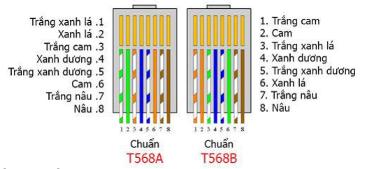

## Các kỹ thuật bấm dây mạng:

  

  Thiết bị máy tính ra đời mang đến cho nhân loại rất nhiều lợi ích khác nhau, nó giải quyết rất nhiều vấn đề mà con người mất rất nhiều thời gian để hoàn thành. Nhưng sử dụng một máy tính với những tính năng cơ bản là điều khiến người dùng cảm thấy nhàm chán vì thế bạn cần kết nối mạng internet. Thông thường một thiết bị máy tính Laptop bạn có thể kết nối mạng internet bằng cách bắt Wifi, với máy tính case nếu muốn sử dụng Wifi bạn cần sử dụng Card Wifi rời. Tuy nhiên, tín hiệu đường truyền không ổn đinh khi sử dụng card Wifi giống như Laptop do vậy thông thường người sử dụng dây cáp mạng cho các máy case để đảm bảo công việc không bị gián đoạn. Thực tế là trong các trường hợp Wifi mang đến sự linh hoạt nhưng khi không cần di chuyển máy tính nhiều thì tốt nhất vẫn là sử dụng dây cáp mạng.
  Sử dụng kết nối mạng internet bằng Wifi bạn chỉ cần nhập mật khẩu chính xác là đã có thể truy cập mạng. Nhưng kết nối internet bằng dây mạng không đơn giản, bạn cần biết cách bấm dây mạng chuẩn cho máy tính
  Hướng dẫn chi tiết cách bấm dây mạng hai chuẩn A ,B
  Trước khi bắt đầu thực hiện các bước bấm dây mạng bạn cần chuẩn bị một số số dụng cụ và thiết bị sau:
  + Kìm bấm cáp
  + Hộp hạt mạng bao gồm các hạt mạng có thể là cat5 hoặc hạt cáp cat6 tùy vào loại dây mà bạn sử dụng là dây mạng cat5e hay dây mạng cat6.
  + Dây cáp phụ thuộc vào vị trí cổng kết nối với thiết bị bạn đặt ở vị trí nào.
  Theo cách bấm dây mạng phổ biến hiện nay thì có hao cách bấm dây mang đó là bấm dây mạng chuẩn A ( T568A ) nối 2 máy vi tính với nhau và bấm dây mạng chuẩn B ( T568B) nối máy vi tính với Hub. Cho nên bạn cần xem trước sơ đồ vị trí các dây chuẩn A, B để có cái nhìn chính xác nhất vị trí cần bấm dây mạng để tránh sai sót.
#### Kỹ thuật bấm chuẩn T568A:
  Sắp xếp các sợi dây trong cáp theo thứ tự: xanh-trắng, xanh, cam-trắng, cam, nâu-trắng, nâu.
  Thường dùng cho cáp trực tiếp (patch cable) và cáp nối dài (extension cable).
#### Kỹ thuật bấm chuẩn T568B:
  Sắp xếp các sợi dây trong cáp theo thứ tự: cam-trắng, cam, xanh-trắng, xanh, nâu-trắng, nâu.
  Chuẩn phổ biến hơn, thường dùng cho cáp trực tiếp và cáp nối dài.
#### Kỹ thuật bấm cáp crossover:
  Sử dụng kết hợp chuẩn T568A ở một đầu và T568B ở đầu kia.
  Cho phép kết nối trực tiếp giữa các thiết bị mạng như switch-switch, router-router, hoặc switch-PC.
## Các loại cáp truyền dẫn cơ bản
#### Cáp quang (Fiber Optic Cable):
  Truyền dữ liệu bằng xung sáng qua sợi thủy tinh hoặc nhựa.
  Các loại cáp quang phổ biến:
  + Single-mode (SM): Chỉ truyền một chùm sáng, dùng cho khoảng cách xa.
  + Multi-mode (MM): Truyền nhiều chùm sáng, dùng cho khoảng cách ngắn.
    + Ưu điểm: Tốc độ cao, miễn nhiễu điện từ, an toàn, khoảng cách truyền xa.
    + Nhược điểm: Cấu hình phức tạp, chi phí lắp đặt cao.
#### Cáp Ethernet (Copper Cable):
  Truyền dữ liệu bằng điện tín hiệu qua dây đồng.
  Các loại cáp Ethernet phổ biến:
  + Cat5/5e, Cat6, Cat6a: Cáp đồng xoắn chuẩn Ethernet.
  + Cáp crossover, cáp trực tiếp (patch cable).
    + Ưu điểm: Chi phí lắp đặt thấp, dễ cấu hình, sử dụng rộng rãi.
    + Nhược điểm: Tốc độ thấp hơn cáp quang, dễ bị nhiễu điện từ.

## Đặc tính, so sánh và kết luận:
#### Cáp quang:
  + Tốc độ truyền dẫn: Cáp quang có khả năng truyền dữ liệu với tốc độ cực cao, lên đến hàng Gbps (Gigabits per second) hoặc Tbps (Terabits per second).
  + Nhu cầu sử dụng: Cáp quang thường được sử dụng trong hạ tầng mạng băng thông rộng, kết nối giữa các trung tâm dữ liệu, kết nối WAN (Wide Area Network) và backbone mạng.
  + Ưu điểm: Miễn nhiễu, an toàn, băng thông rộng, phù hợp cho truyền dẫn dữ liệu lớn và khoảng cách xa.
  + Nhược điểm: Chi phí lắp đặt và bảo trì cao hơn so với cáp đồng.
#### Cáp đồng (cáp Cat):
  + Tốc độ truyền dẫn:
  + Cat5: Tối đa 100 Mbps (Megabits per second).
  + Cat5e: Tối đa 1 Gbps
  + Cat6: Tối đa 10 Gbps
  + Cat6A: Tối đa 10 Gbps (ở khoảng cách xa hơn so với Cat6)
  + Cat7: Tối đa 10 Gbps (với dải tần số rộng hơn)
#### Nhu cầu sử dụng:
  + Cat5e, Cat6: Thường dùng cho mạng LAN (Local Area Network), mạng văn phòng, gia đình.
  + Cat6A, Cat7: Được sử dụng cho các ứng dụng yêu cầu tốc độ cao hơn, như truyền hình, video, backup dữ liệu.
  
#### Ưu điểm: Chi phí lắp đặt và bảo trì thấp hơn so với cáp quang.

#### Nhược điểm: Nhạy cảm với nhiễu điện từ, giới hạn về khoảng cách truyền dẫn

  Tóm lại, cáp quang phù hợp cho các ứng dụng yêu cầu tốc độ truyền dẫn cực cao và khoảng cách xa, trong khi cáp đồng (cáp Cat) thích hợp cho các ứng dụng mạng LAN trong khoảng cách ngắn hơn, với chi phí lắp đặt thấp hơn. Việc lựa chọn loại cáp phù hợp phụ thuộc vào nhu cầu sử dụng và yêu cầu về tốc độ, khoảng cách của mạng.
