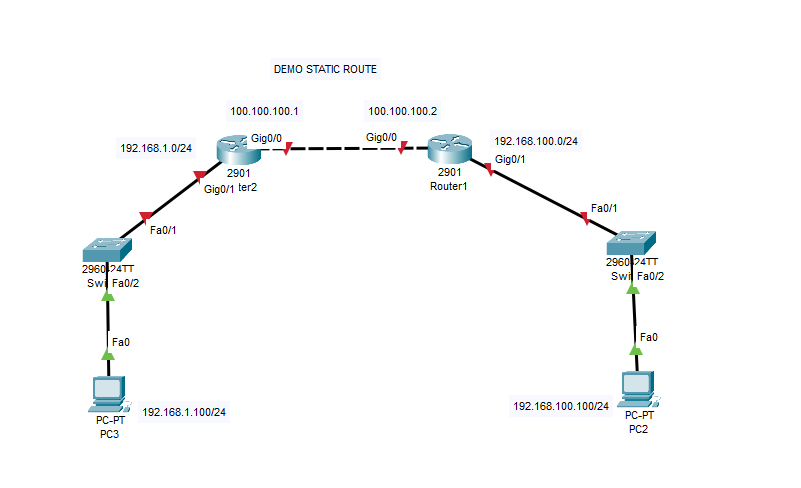
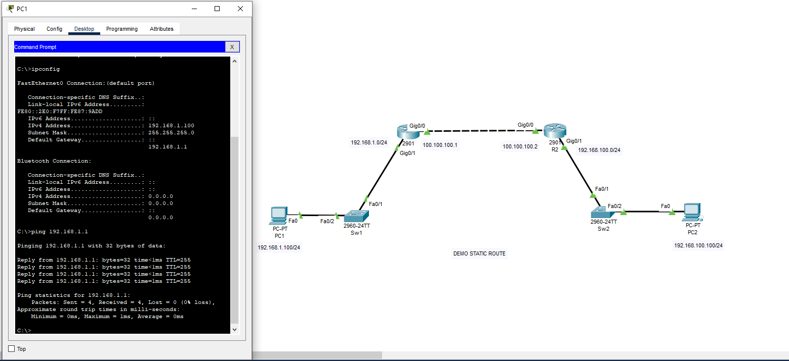
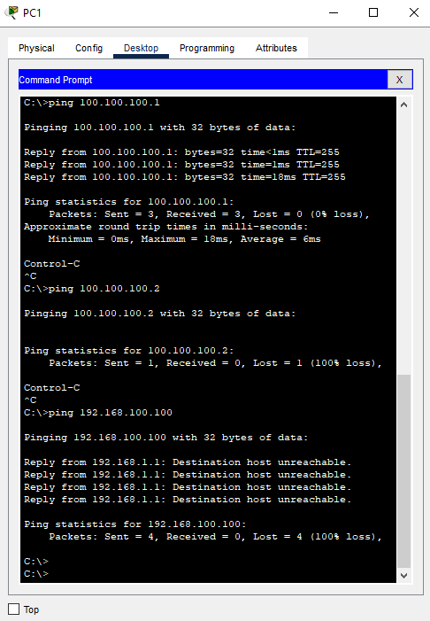
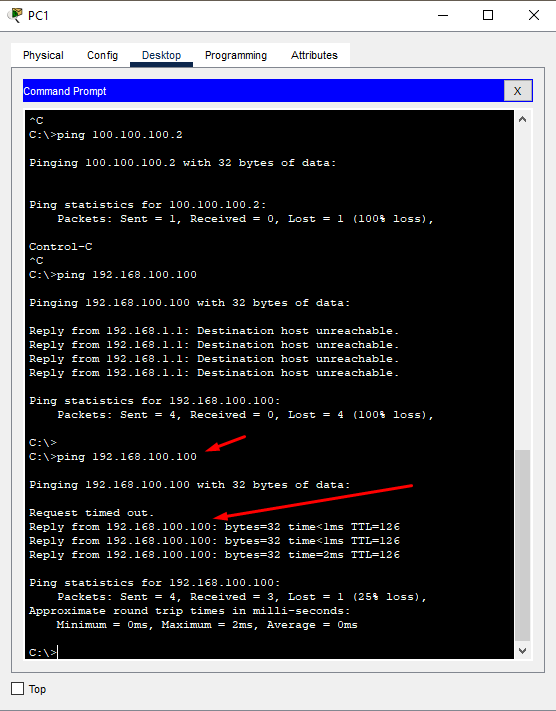
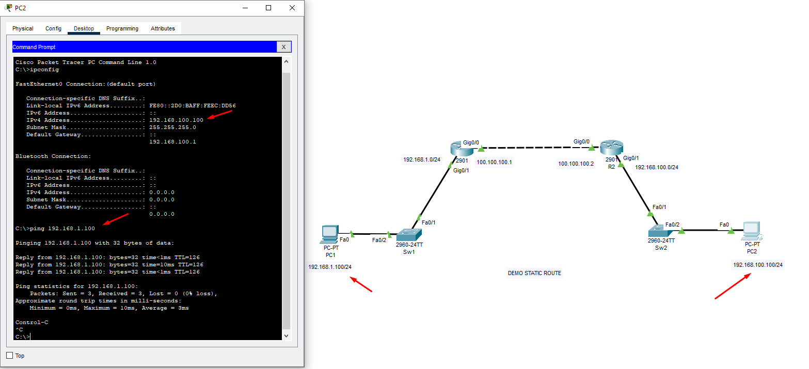

## Demo static route
  Mô phỏng static route bằng phần mềm cisco packet tracer

  

#### Chuẩn bị
  Cho topo như hình trên, dùng cisco packet tracer mô phỏng mạng 192.168.1.0/24 định tuyến với 192.168.100.0/24 thông qua router.
  Để đạt kết quả PC1 ping thông PC2 thông qua Static route giữ R1 và R2 , mô phỏng nhanh gọn 2 PC dùng IP tĩnh.
#### Config R1   
	``Router>enable``
    ``Router#configure terminal``
    ``Router(config)#interface GigabitEthernet 0/0``
    ``Router(config-if)#no shutdown``
    ``Router(config-if)#ip address 100.100.100.1 255.255.255.0``
    ``Router(config-if)exit``
    ``Router(config)#hostname R1
    ``R1(config)#interface GigabitEthernet 0/1
    ``R1(config-if)#no shutdown``
    ``R1(config-if)#ip address 192.168.1.1 255.255.255.0``
    ``R1(config-if)#end``
    ``R1#copy running-config startup-config``
    ``Destination filename [startup-config]?``
    ``Building configuration...``
    ``[OK]``

#### Config R2
    ``Router>enable``
    ``Router#configure terminal``
    ``Router(config)#interface GigabitEthernet 0/0``
    ``Router(config-if)#no shutdown``
    ``Router(config-if)#ip address 100.100.100.2 255.255.255.0``
    ``Router(config-if)#exit``
    ``Router(config)#hostname R2``
    ``R2(config)#interface GigabitEthernet 0/1``
    ``R2(config-if)#no shutdown`` 
    ``R2(config-if)#ip address 192.168.100.1 255.255.255.0``
    ``R2(config-if)#end``
    ``R2#copy running-config startup-config`` 
    ``Destination filename [startup-config]?`` 
    ``Building configuration...``
    ``[OK]``

#### Config switch 1
    ``Switch>enable`` 
    ``Switch#configure terminal`` 
    ``Switch(config)#hostname Sw1``
    ``Sw1(config)#interface range FastEthernet 0/1-24`` 
    ``Sw1(config-if-range)#switchport mode access``
    ``Sw1(config-if-range)#no shutdown``
    ``Sw1(config)#end``
    ``Sw1#copy running-config startup-config`` 
    ``Destination filename [startup-config]?`` 
    ``Building configuration...``
    ``[OK]``

#### Config switch 2

    ``Switch>enable`` 
    ``Switch#configure terminal`` 
    ``Switch(config)#hostname Sw2``
    ``Sw2(config)#interface range FastEthernet 0/1-24`` 
    ``Sw2(config-if-range)#switchport mode access``
    ``Sw2(config-if-range)#no shutdown``
    ``Sw2(config)#end``
    ``Sw2#copy running-config startup-config`` 
    ``Destination filename [startup-config]?`` 
    ``Building configuration...``
    ``[OK]``

#### Config PC1
  Set IP tĩnh trên PC1: 192.168.1.100/24
#### Config PC2
  Set IP tĩnh trên PC2: 192.168.100.100/24

#### Tiến hành ping thử
  Từ PC1 mở CMD

  

  Chúng ta thấy ping được gateway và không thông được mạng bên R2 và bên trong R2

  

#### Tiến hành xử lý static route
    ``R1(config)# ip route 192.168.100.0 255.255.255.0 100.100.100.2``
    ``R1(config)#end``
    ``R1#copy running-config startup-config`` 
    ``Destination filename [startup-config]?`` 
    ``Building configuration...``
    ``[OK]``

    ``R2(config)# ip route 192.168.1.0 255.255.255.0 100.100.100.1``
    ``R2(config)#end``
    ``R2#copy running-config startup-config`` 
    ``Destination filename [startup-config]?`` 
    ``Building configuration...``
    ``[OK]``

#### Tiến hành ping thử
  PC1 đã ping thông PC2

  

  PC2 đã ping thông PC1

  

