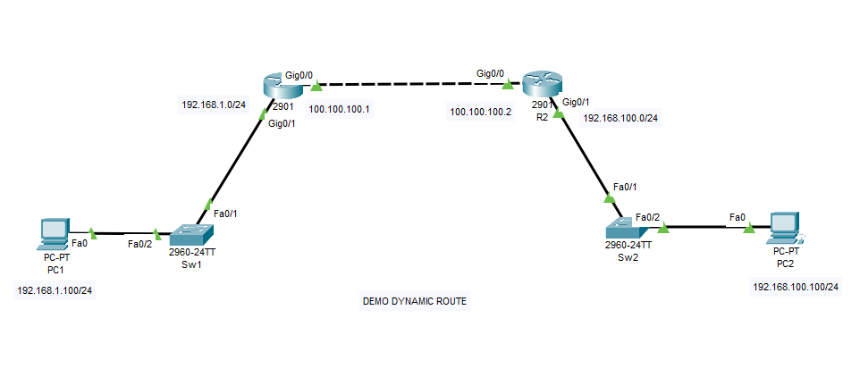
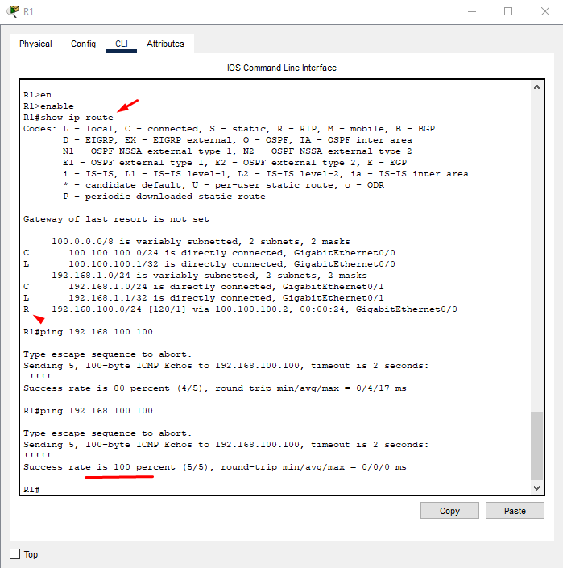
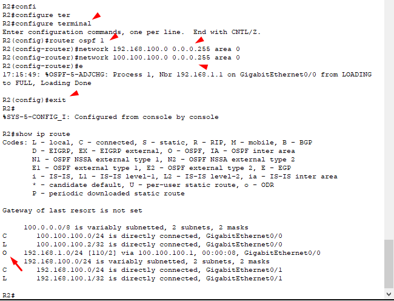
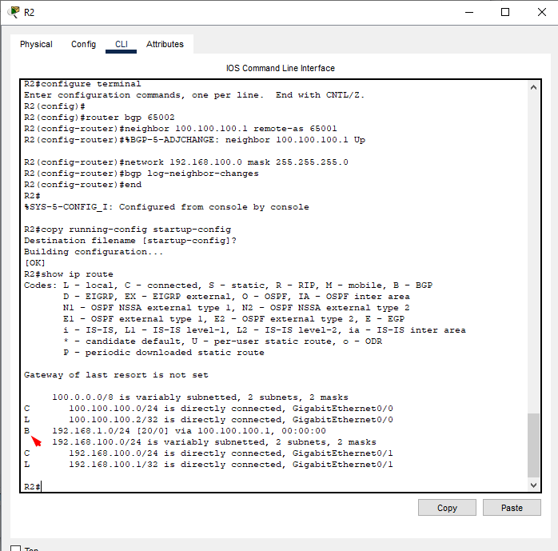
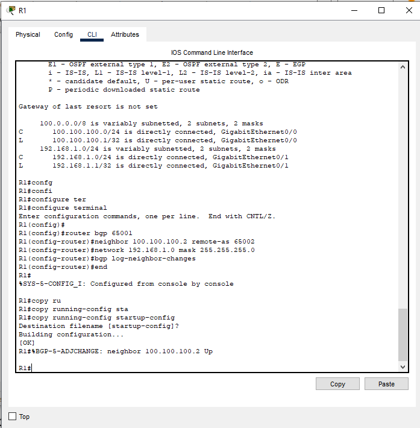

## Demo dynamic route
  Cho hình
  
#### Chuẩn bị
  Cho topo như hình trên, dùng cisco packet tracer mô phỏng mạng 192.168.1.0/24 định tuyến với 192.168.100.0/24 thông qua R1 và R2 sử dụng dynamic route , mô phỏng nhanh 2 PC dùng IP tĩnh.
#### Config R1   
    Router>enable
    Router#configure terminal
    Router(config)#interface GigabitEthernet 0/0
    Router(config-if)#no shutdown
    Router(config-if)#ip address 100.100.100.1 255.255.255.0
    Router(config-if)exit
    Router(config)#hostname R1
    R1(config)#interface GigabitEthernet 0/1
    R1(config-if)#no shutdown
    R1(config-if)#ip address 192.168.1.1 255.255.255.0
    R1(config-if)#end
    R1#copy running-config startup-config
    Destination filename [startup-config]?
    Building configuration...
    [OK]

#### Config R2
    Router>enable
    Router#configure terminal
    Router(config)#interface GigabitEthernet 0/0
    Router(config-if)#no shutdown
    Router(config-if)#ip address 100.100.100.2 255.255.255.0
    Router(config-if)#exit
    Router(config)#hostname R2
    R2(config)#interface GigabitEthernet 0/1
    R2(config-if)#no shutdown 
    R2(config-if)#ip address 192.168.100.1 255.255.255.0
    R2(config-if)#end
    R2#copy running-config startup-config 
    Destination filename [startup-config]? 
    Building configuration...
    [OK]

#### Config switch 1
    Switch>enable 
    Switch#configure terminal 
    Switch(config)#hostname Sw1
    Sw1(config)#interface range FastEthernet 0/1-24 
    Sw1(config-if-range)#switchport mode access
    Sw1(config-if-range)#no shutdown
    Sw1(config)#end
    Sw1#copy running-config startup-config 
    Destination filename [startup-config]? 
    Building configuration...
    [OK]

#### Config switch 2

    Switch>enable 
    Switch#configure terminal 
    Switch(config)#hostname Sw2
    Sw2(config)#interface range FastEthernet 0/1-24 
    Sw2(config-if-range)#switchport mode access
    Sw2(config-if-range)#no shutdown
    Sw2(config)#end
    Sw2#copy running-config startup-config 
    Destination filename [startup-config]? 
    Building configuration...
    [OK]

#### Config PC1
  Set IP tĩnh trên PC1: 192.168.1.100/24
#### Config PC2
  Set IP tĩnh trên PC2: 192.168.100.100/24

#### Ping thử
  Từ PC1 mở CMD
  Chúng ta thấy ping được gateway và không thông được mạng bên R2 và bên trong R2
## Route RIP
#### R1 xóa static route đã tạo trước đó và config route:

    R1(config)#no ip route 192.168.100.0 255.255.255.0 100.100.100.2
    R1(config)#router rip
    R1(config-router)# network 192.168.1.0
    R1(config-router)# network 100.100.100.0
    R1(config-router)# version 2
    R1(config-router)# no auto-summary
    R1(config-router)#end
    R1#copy running-config startup-config

#### R2 xóa static route đã tạo trước đó và config route:
    R2(config)#no ip route 192.168.1.0 255.255.255.0 100.100.100.1
    R2(config)#router rip
    R2(config-router)# network 192.168.100.0
    R2(config-router)# network 100.100.100.0
    R2(config-router)# version 2
    R2(config-router)# no auto-summary
    R2(config-router)#end
    R2#copy running-config startup-config

  

## Route OSPF

#### R1 xóa RIP route đã tạo trước đó và config route:
    R1(config)# no router rip
    R1(config)# router ospf 1
    R1(config-router)# network 192.168.1.0 0.0.0.255 area 0
    R1(config-router)# network 100.100.100.0 0.0.0.255 area 0

#### R2 xóa RIP route đã tạo trước đó và config route:

    R2(config)# no router rip
    R2(config)# router ospf 1
    R2(config-router)# network 192.168.100.0 0.0.0.255 area 0
    R2(config-router)# network 100.100.100.0 0.0.0.255 area 0

  

## Route BGP

#### R1 xóa OSPF route đã tạo trước đó và config route:
    R1(config)#no router ospf 1
    R1(config)#router bgp 65001
    R1(config-router)#neighbor 100.100.100.2 remote-as 65002
    R1(config-router)#network 192.168.1.0 mask 255.255.255.0
    R1(config-router)#bgp log-neighbor-changes
    R1(config-router)#end
    R1#copy running-config startup-config 

#### R2 xóa OSPF route đã tạo trước đó và config route:
    R2(config)#router bgp 65002
    R2(config-router)#neighbor 100.100.100.1 remote-as 65001
    R2(config-router)#network 192.168.100.0 mask 255.255.255.0
    R2(config-router)#bgp log-neighbor-changes
    R2(config-router)#end
    R2#copy running-config startup-config 

  
  

