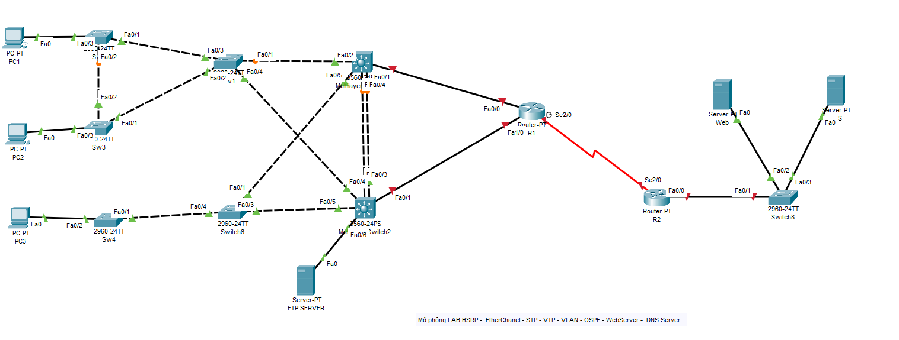

  
#### Đề Bài
  Cho topo như hình, thực hành các kiến thức đã học: Mô phỏng LAB HSRP-EtherChanel-STP-VTP-VLAN-BGP-Dự phòng GATEWAY-DNS Server-Webserver...
  + Các sw1 sw2 sw3 áp dụng STP VLAN Trunking
  + Swcore 1 chạy dự phòng Swcore2 , dự phòng EtherChanel
  + Các PC1,PC2,PC3 thuộc các VLAN tương ứng là 10 20 30 và được cấp IP động từ DHCP server
  + Các máy chủ trong mạng FTP , DHCP thuộc VLAN 50 và làm nhiệm vụ backup cũng như cấp IP cho các VLAN. 
  + Router R1 tạo phiên BGP với Router R2
  + 