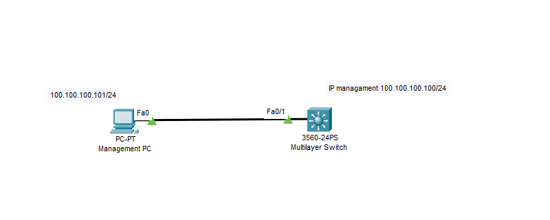

Dưới đây là các bước cơ bản để cấu hình hostname, IP management, đồng bộ thời gian và NTP trên switch Cisco layer 3:

    Switch>enable
    Switch#configure terminal

#### Đặt hostname:

    Switch(config)#hostname swcore1

#### Cấu hình IP management:

  

    swcore1(config)#interface vlan 100
    swcore1(config-if)#ip address 100.100.100.100 255.255.255.0
    swcore1(config-if)#no shutdown 
    swcore1(config)#interface FastEthernet0/1
    swcore1(config-if)#switchport access vlan 100
    swcore1(config-if)#end
    swcore1#copy running-config startup-config 

#### Cấu hình đồng hồ thời gian:
    swcore1#show clock detail
    swcore1#clock set <hh:mm:ss> <dd> <month> <yyyy>

  The options are:
  hh:mm:ss - Specifies the current time in hours (military format), minutes, and seconds. The range are the following:
  + hh - 0 to 23
  + mm - 0 to 59
  + ss - 0 to 59

   Set time thủ công

    swcore1#clock set 13:33:16 19 Feb 2025
    swcore1#configure terminal
    swcore1(config)#clock timezone UTC -7
    swcore1(config)#exit
    swcore1#show clock
    6:43:41.339 UTC Wed Feb 19 2025

  + zone - The acronym of the time zone. The range is up to four characters.
  + hours-offset - The hours difference from UTC. The range is from -12 to +13.
  + minutes-offset - (Optional) The minutes difference from UTC. The range is from 0 to 59.
  + day - Specifies the current day of the month. The range is from 1 to 31.
  + month - Specifies the current month using the first three letters of the month name. The range is from Jan (January) to Dec (December).
  + year - Specifies the current year. The range is from year 2000 up to 2037.

#### Cấu hình NTP (Network Time Protocol):

  + ntp server <ntp_server_ip_address>

  Thực hiện

    swcore1(config)#ntp server 14.248.82.194 //để chỉ định địa chỉ IP của NTP server.

    swcore1(config)#ntp update-calendar //để cập nhật đồng hồ hệ thống từ NTP.

