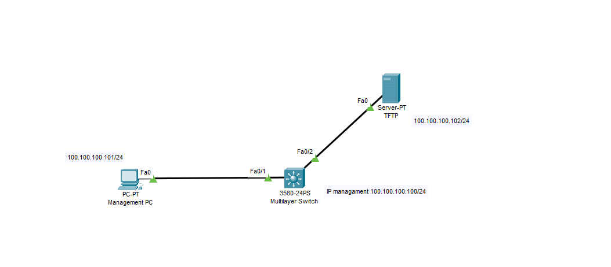

## QoS
  Config QoS băng thông trên các port sw cisco 3650, có các giới hạn như QoS100  giới hạn 100Mbps, QoS200 giới hạn 200Mbps, QoS300 giới hạn 300Mbps , sau đó áp dụng vào interface Gi0/1 giới hạn QoS100

  

  Ta có thể cấu hình QoS với các giới hạn băng thông cụ thể trên switch Cisco 3650 như sau:

  Truy cập vào giao diện CLI (Command Line Interface) của switch.
  Vào chế độ cấu hình toàn cục (global configuration mode):

    switch(config)#

  Định nghĩa các class-map để phân loại lưu lượng:

    switch(config)#class-map match-all QoS100
    switch(config-cmap)#match any
    switch(config-cmap)#exit

    switch(config)#class-map match-all QoS200
    switch(config-cmap)#match any
    switch(config-cmap)#exit

    switch(config)#class-map match-all QoS300
    switch(config-cmap)#match any
    switch(config-cmap)#exit

  Định nghĩa các policy-map với các giới hạn băng thông tương ứng:

    switch(config)#policy-map CUSTOM_POLICY
    switch(config-pmap)#class QoS100
    switch(config-pmap-c)#police cir 100000000 bc 31250 be 31250 conform-action transmit exceed-action drop
    switch(config-pmap-c)#exit

    switch(config-pmap)#class QoS200 
    switch(config-pmap-c)#police cir 200000000 bc 62500 be 62500 conform-action transmit exceed-action drop
    switch(config-pmap-c)#exit

    switch(config-pmap)#class QoS300
    switch(config-pmap-c)#police cir 300000000 bc 93750 be 93750 conform-action transmit exceed-action drop
    switch(config-pmap-c)#exit
    switch(config-pmap)#exit

  Ở đây, mỗi class-map tương ứng với một mức giới hạn băng thông: 100Mbps, 200Mbps và 300Mbps.
  Áp dụng policy-map "CUSTOM_POLICY" vào interface Gi0/1:

    switch(config)#interface GigabitEthernet0/1
    switch(config-if)#service-policy input CUSTOM_POLICY
    switch(config-if)#exit

  Lưu cấu hình:

    switch#copy running-config startup-config

  Sau khi hoàn tất các bước trên, interface Gi0/1 sẽ được áp dụng policy-map "CUSTOM_POLICY", theo đó lưu lượng trên interface sẽ được giới hạn băng thông theo các mức QoS100 (100Mbps), QoS200 (200Mbps) và QoS300 (300Mbps).
  
  Lưu ý rằng, cấu hình QoS và quản lý băng thông trên switch Cisco 3650 có thể phức tạp hơn, tùy thuộc vào các yêu cầu cụ thể của môi trường mạng. Bạn nên tham khảo tài liệu hướng dẫn chi tiết từ Cisco để biết thêm thông tin.