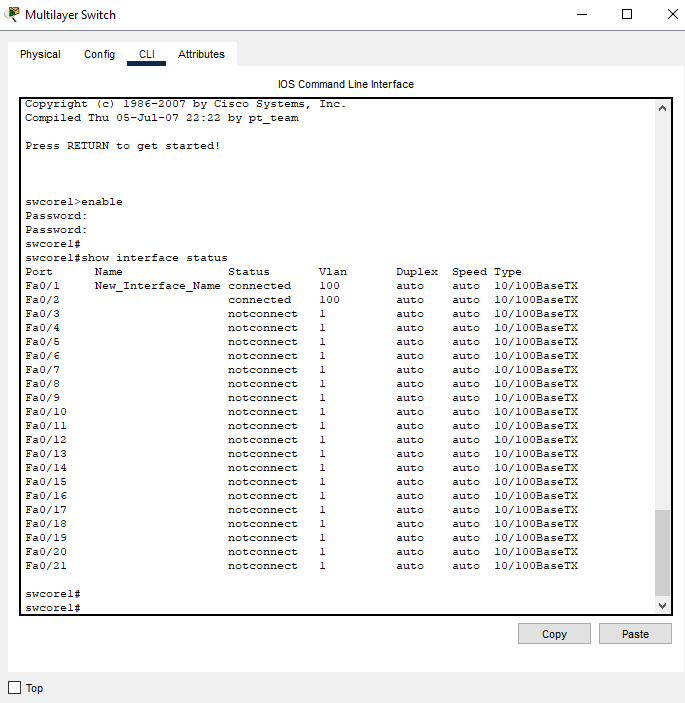

## Rename interface hay tạo description
  Truy cập vào giao diện CLI (Command Line Interface) của switch.

  Vào chế độ cấu hình toàn cục (global configuration mode):

    swcore1(config)#

  Truy cập vào cấu hình của interface cần đổi tên:

    swcore1(config)#interface gigabitethernet 0/1

  Sử dụng lệnh description để đặt tên mới cho interface:

    swcore1(config-if)#description New_Interface_Name

  Trong đó, New_Interface_Name là tên mới bạn muốn đặt cho interface.
  
  Lưu cấu hình:

    swcore1#copy running-config startup-config
   
    swcore1#show interface status    

    