## Hướng dẫn add interface LAN

Do firewall pfsense mình tạo là máy ảo trong KVM node

Nên mình sẽ thêm 1 interface LAN để cấu hình dải mạng local

Tại quản trị node KVM webvirt cloud, mình add thêm các bridge đã được khai báo trong yaml netplan

Để chắc chắn các bridge này hoạt động đúng, ``start`` và ``khởi động`` cùng hệ thống, sau khi thêm các bridge bạn nên khởi động lại máy KVM node , có thể kiểm tra thêm tại quản trị ``virt-manager``

  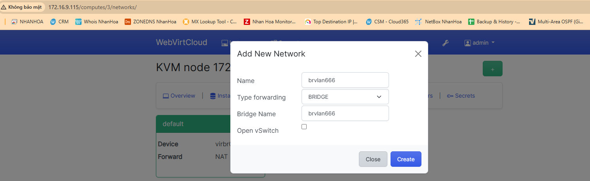

  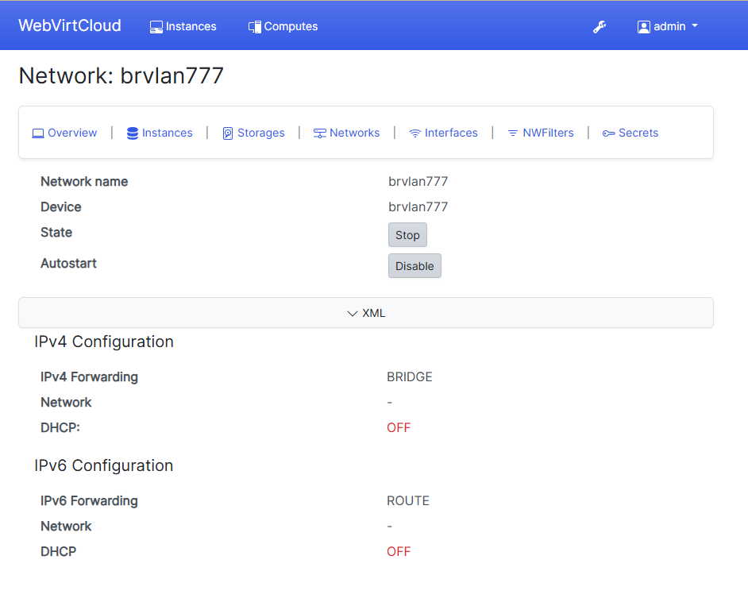

  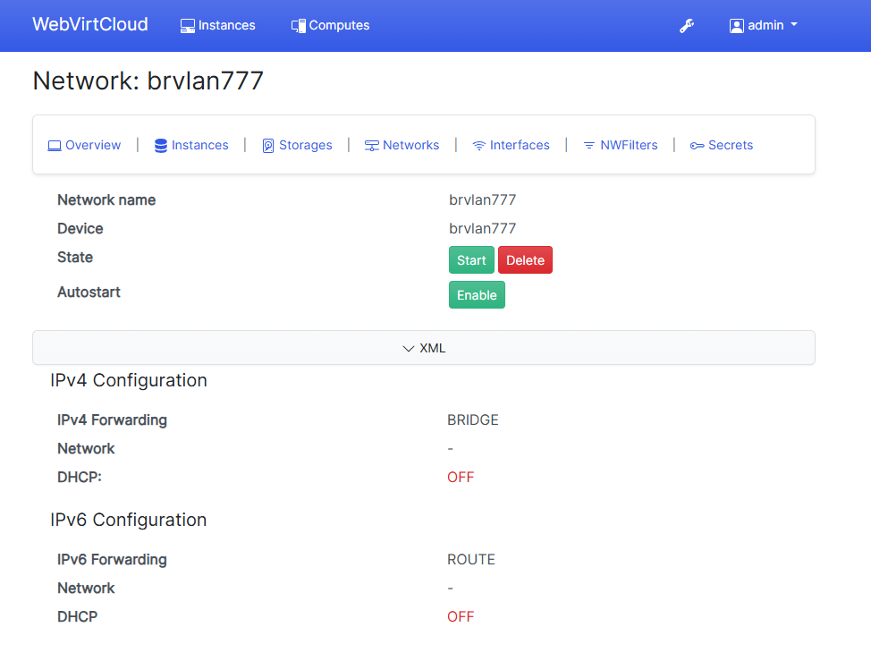

  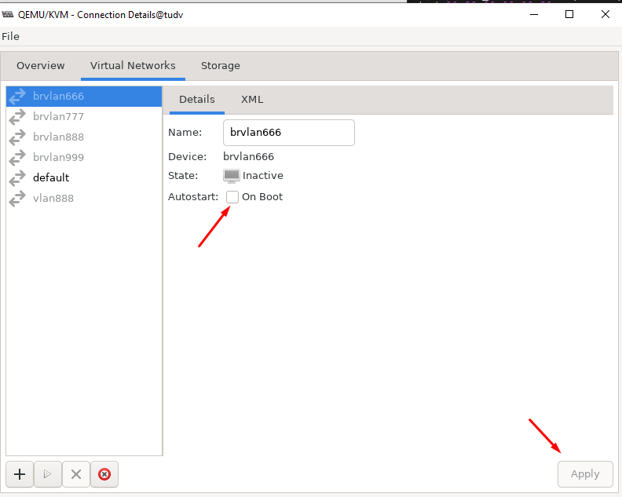

  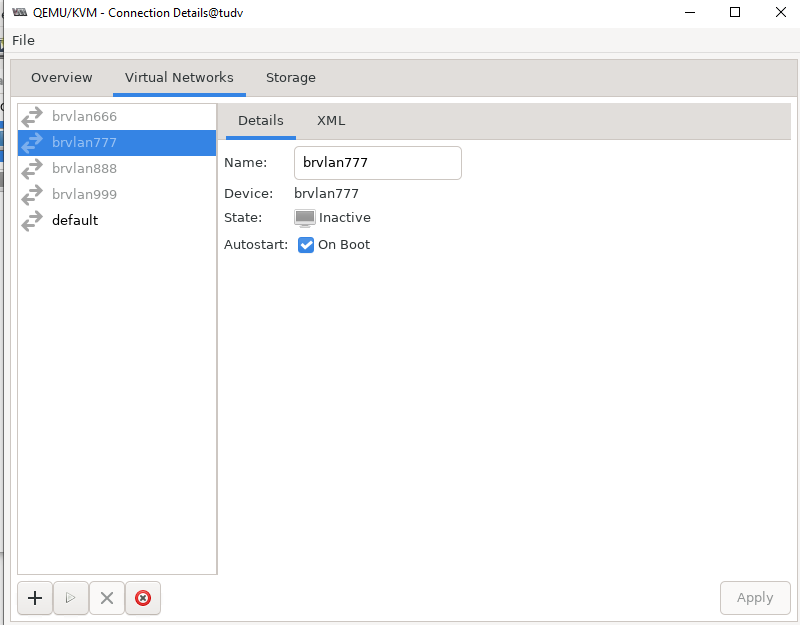

  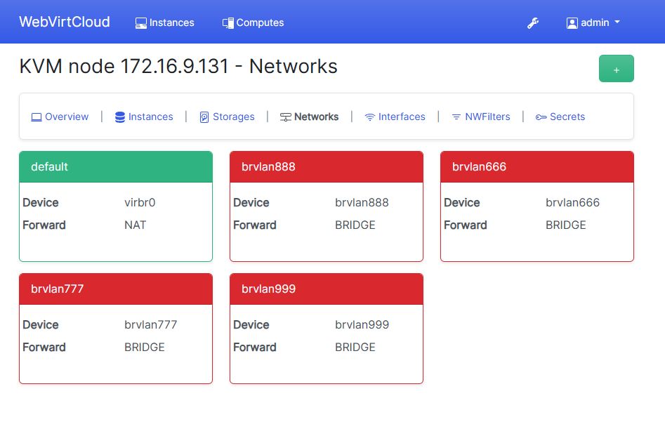

    init 6

  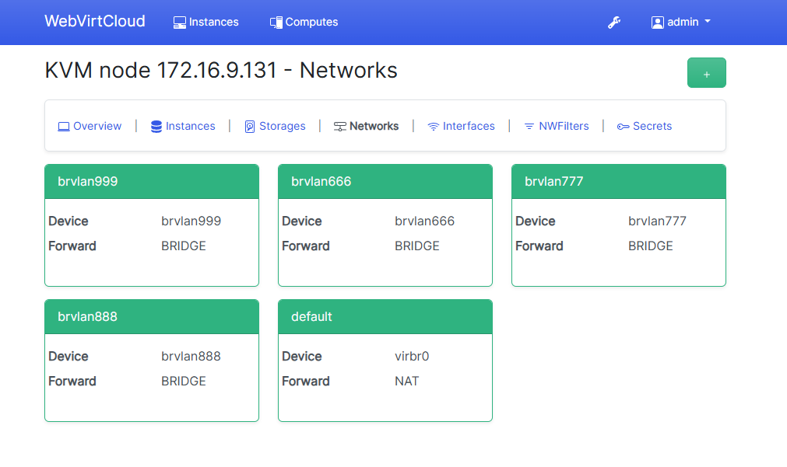

## Tiếp theo chúng ta thêm các interface bridge cho pfSense

  

  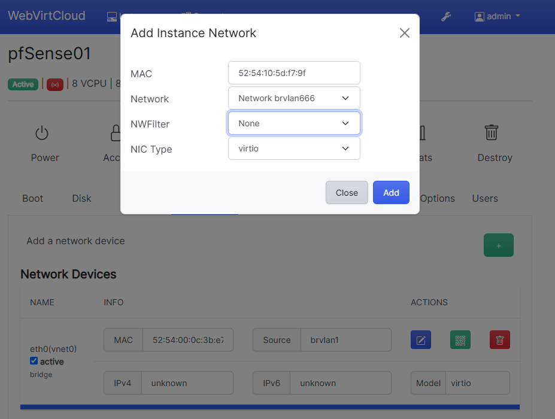

  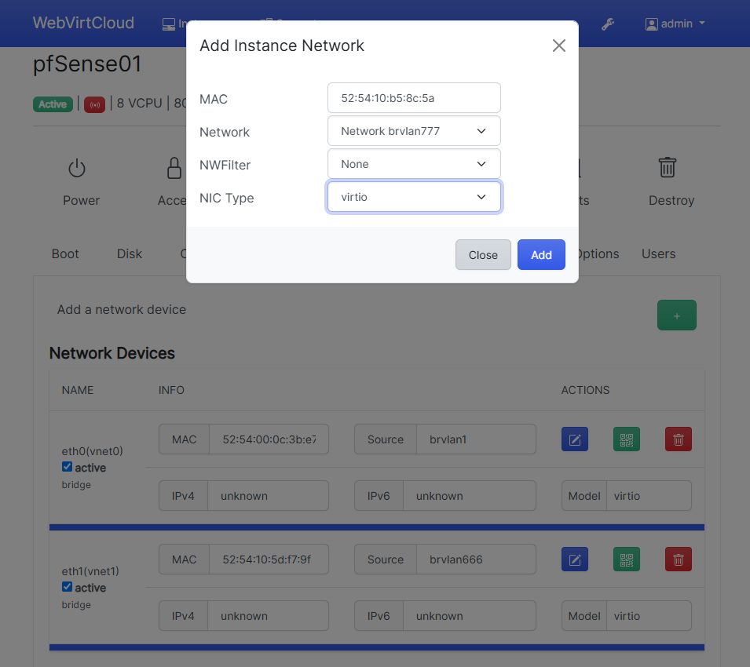

  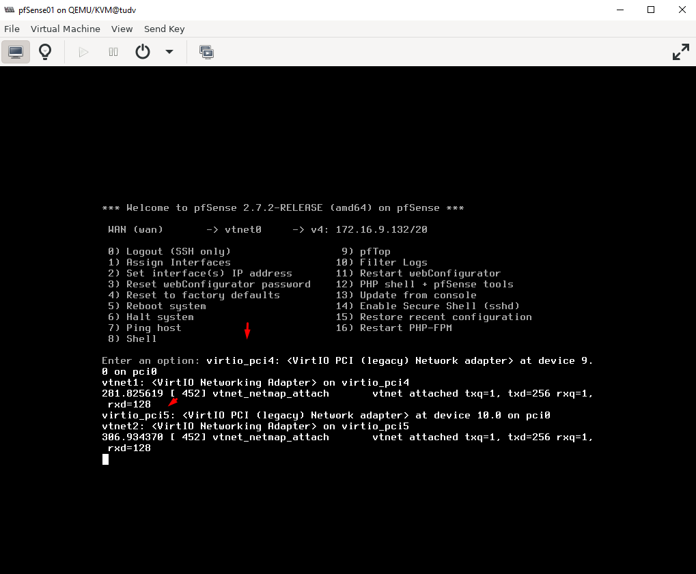

Chúng ta qua giao diện pfSense

  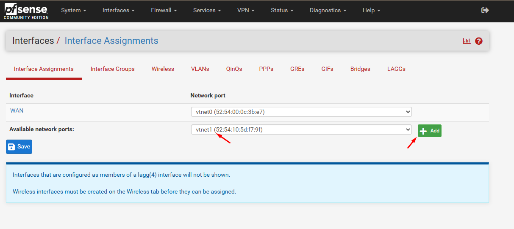

  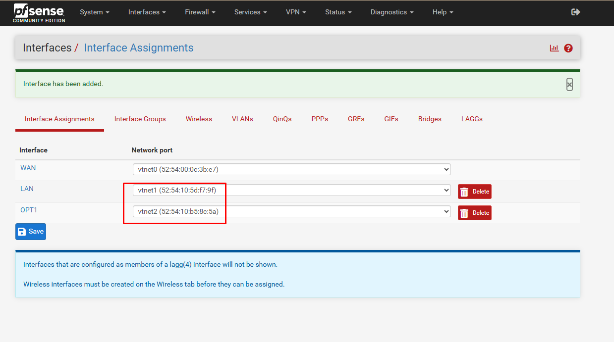

## Đến bước này pfSense sẽ không lắng nghe port 80 qua IP 172.16.9.131 nữa, mà lắng nghe qua IP 10.10.66.2

Nếu muốn chuyển qua 172.16.9.131 listen 80, chúng ta cần tạo rule ở đường WAN.

  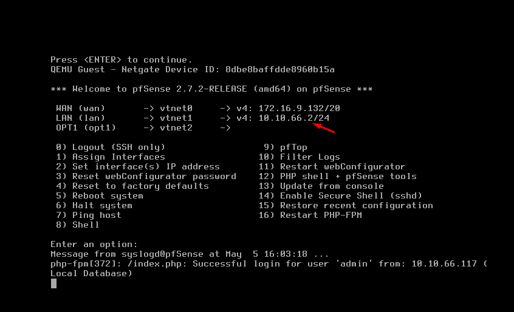

Chúng ta có thể qua giao diện để sửa tên cho dễ nhận dạng dải mạng sau này config

  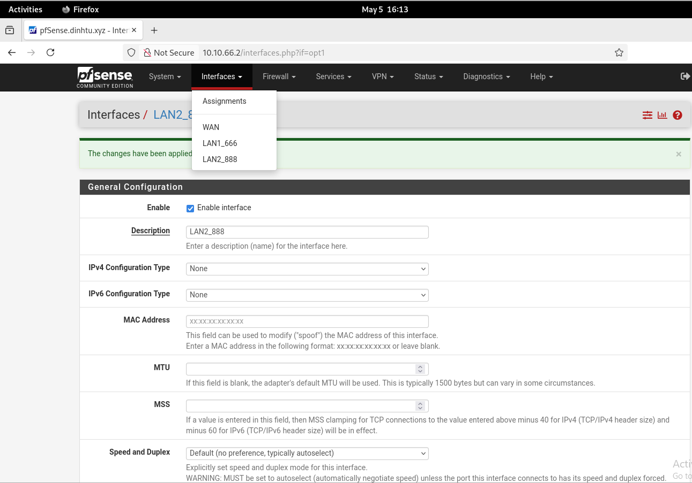