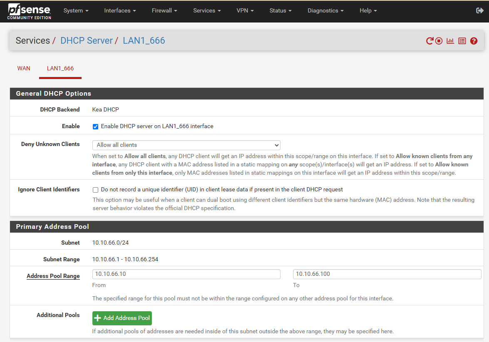

# Hướng Dẫn Cấu Hình DHCP Cho pfSense

Bài viết này sẽ hướng dẫn bạn cấu hình DHCP cho các VLAN trên pfSense. Việc cấu hình DHCP giúp cung cấp địa chỉ IP tự động cho các thiết bị trong mạng.

Chúng ta có 2 cách để kích hoạt DHCP server trên interface mạng LAN

Cách thứ nhất là thông qua console pfSense, khi đặt IP LAN và cách thứ 2 là lựa chọn config qua giao diện.

Dưới đây là cách thức config qua giao diện

## Bước 1: Kích Hoạt DHCP Trên LAN1_666
1. Truy cập vào **Services > DHCP Server**.
2. Chọn tab **LAN1_666**.
3. Đánh dấu chọn **Enable DHCP server on LAN1_666 interface** để kích hoạt DHCP.
4. Thiết lập các thông số tùy chọn khác nếu cần, ví dụ:
   - **Deny Unknown Clients**: Giữ mặc định là "Allow all clients".

  

## Bước 2: Thiết Lập Dải Địa Chỉ IP
1. Trong mục **Primary Address Pool**, thiết lập dải địa chỉ IP mà DHCP sẽ cấp phát.
   - **Address Pool Range**: Nhập khoảng IP từ `10.10.66.10` đến `10.10.66.100`.

  

## Bước 3: Cấu Hình DNS Và WINS Server
1. Trong mục **Server Options**, cấu hình các máy chủ DNS và WINS nếu cần.
   - **DNS Servers**: Nhập các địa chỉ DNS như `8.8.8.8` và `8.8.4.4`.

  

## Bước 4: Các Tùy Chọn Khác Cho DHCP
1. Trong mục **Other DHCP Options**, thiết lập các tùy chọn khác như:
   - **Gateway**: Nhập địa chỉ `10.10.66.2` làm gateway.
   - **Domain Name**: Nhập tên miền như `nhanhoa.com.vn`.
   - **Default Lease Time** và **Maximum Lease Time**: Thiết lập thời gian thuê IP mặc định và tối đa.

## Test thử

Chúng ta hãy add 1 interface tên brvlan666 vào 1 máy ảo để xem sự cấp IP động 

  

  

## Kết Luận
Sau khi hoàn thành các bước trên, dịch vụ DHCP sẽ tự động cấp phát địa chỉ IP cho các thiết bị trong VLAN80. Bạn có thể thực hiện tương tự cho các VLAN khác (VLAN81, VLAN82) nếu cần.

Việc cấu hình đúng DHCP giúp hệ thống mạng hoạt động ổn định và tự động hóa quá trình cấp phát địa chỉ IP cho các thiết bị kết nối.

