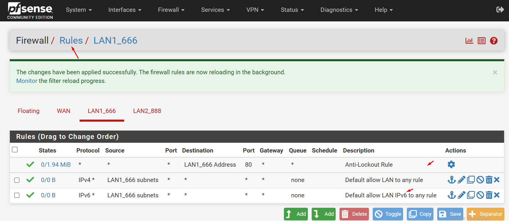
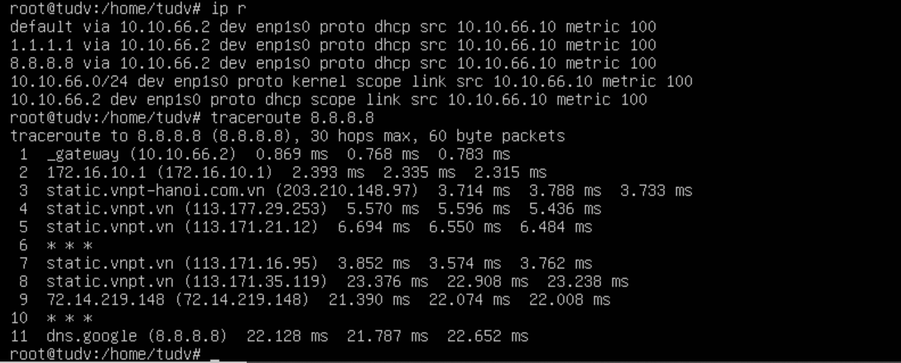
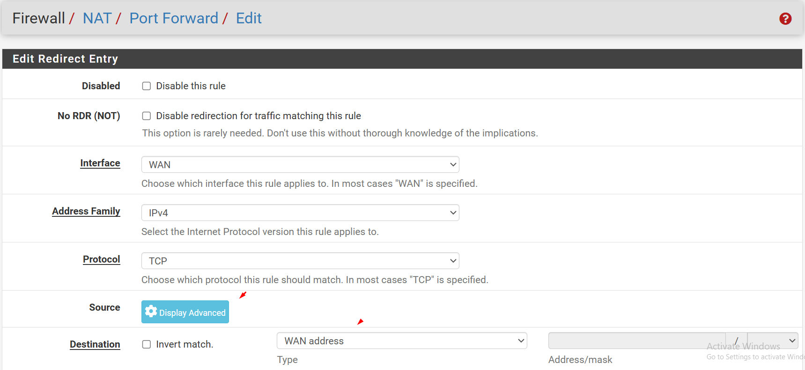
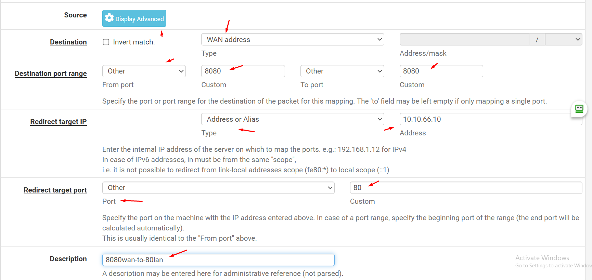
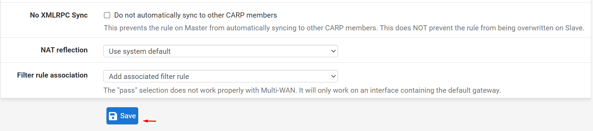
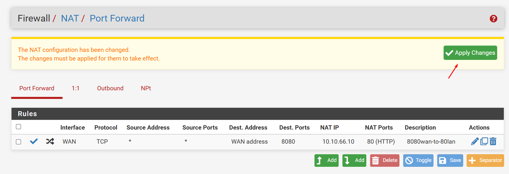
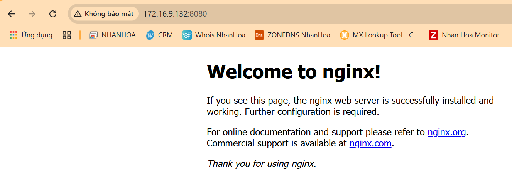

Khi chúng ta thêm 1 subnet tại link ``LAN1_666`` thì có 2 rule NAT cho IPv4 và IPv6 được tạo ra

  
  

Rule này là loại ``Outbound NAT``, các IP local của VM chuyển dịch sang IP public và đi ra internet 

### **1. Outbound NAT (NAT ra ngoài)**
- **Mục đích**: Dịch địa chỉ IP nội bộ (private) sang IP công cộng (public) khi các thiết bị trong mạng truy cập Internet.  
- **Cơ chế**:  
  - **Automatic Outbound NAT (Mode Hybrid)**: Tự động tạo rule NAT cho tất cả traffic ra Internet.  
  - **Manual Outbound NAT**: Cho phép tùy chỉnh rule NAT theo nhu cầu (ví dụ: chọn IP nguồn/đích cụ thể).  
- **Ví dụ**:  
  - Máy nội bộ `10.10.66.10` truy cập Google → IP WAN của pfSense (`172.16.9.132`) được sử dụng làm IP nguồn.  

---

### **2. Inbound NAT (Port Forwarding)**
- **Mục đích**: Chuyển tiếp traffic từ Internet vào dịch vụ cụ thể trong mạng nội bộ.  
- **Cơ chế**:  
  - Ánh xạ một **port** trên IP WAN của pfSense đến IP và port của máy chủ nội bộ.  
- **Ví dụ**:  
  - Mở port `8080` trên IP WAN, chuyển tiếp đến máy chủ web nội bộ `10.10.66.10:80`.  

  
  
  
  
  

---

### **3. 1:1 NAT (Static NAT)**  

Về loại này bạn cần đảm bảo máy chủ VM có các dịch vụ sử dụng port khác với các port sẵn có của WAN

>> Thường dùng cho NAT email server

https://docs.netgate.com/pfsense/en/latest/nat/1-1.html

- **Mục đích**: Ánh xạ **một IP public** tĩnh đến **một IP private** (toàn bộ port).  
- **Cơ chế**:  
  - Traffic đến IP public sẽ được chuyển thẳng đến IP private tương ứng (và ngược lại).  
- **Ví dụ**:  
  - IP WAN `172.16.9.132` được ánh xạ 1:1 với máy chủ nội bộ `10.10.66.10` (tất cả port).  

---

### **4. NAT Reflection (NAT Loopback)**  
- **Mục đích**: Cho phép thiết bị trong mạng nội bộ truy cập dịch vụ public (qua IP WAN) như thể đang từ Internet.  
- **Cơ chế**:  
  - pfSense "phản chiếu" traffic nội bộ để tránh mâu thuẫn khi truy cập qua IP WAN.  
- **Ví dụ**:  
  - Máy `192.168.1.100` truy cập `http://203.0.113.10` → pfSense chuyển tiếp đến máy chủ web nội bộ `192.168.1.200`.  

---

### **5. NPt (Network Prefix Translation) - IPv6**  
- **Mục đích**: Dịch địa chỉ IPv6 giữa các mạng (thường dùng để kết nối mạng riêng với ISP).  
- **Cơ chế**:  
  - Thay đổi prefix IPv6 của gói tin (ví dụ: từ `2001:db8::/64` sang `2001:db9::/64`).  

---

### **6. Hybrid Outbound NAT**  
- **Mục đích**: Kết hợp giữa **Automatic** và **Manual NAT**, cho phép tạo rule thủ công trong khi vẫn giữ các rule tự động mặc định.  
- **Ví dụ**:  
  - Tự động NAT cho tất cả traffic, nhưng riêng máy `192.168.1.10` dùng IP WAN `203.0.113.30`.  

---

### **Bảng Tóm Tắt**
| Loại NAT              | Mục Đích                              | Ví Dụ Ứng Dụng                     |
|-----------------------|---------------------------------------|-------------------------------------|
| **Outbound NAT**      | Truy cập Internet từ mạng nội bộ.     | Máy tính ra Internet qua IP WAN.    |
| **Inbound NAT**       | Chuyển tiếp dịch vụ từ Internet vào.  | Web server, game server.            |
| **1:1 NAT**           | Ánh xạ toàn bộ IP public → private.   | Máy chủ chuyên dụng cần mọi port.   |
| **NAT Reflection**    | Truy cập nội bộ qua IP WAN.           | Test dịch vụ từ mạng LAN.           |
| **NPt (IPv6)**        | Dịch prefix IPv6.                     | Kết nối IPv6 với ISP.               |
| **Hybrid NAT**        | Kết hợp rule tự động và thủ công.      | Tùy chỉnh NAT cho một số IP.        |

---

### **Khi Nào Dùng Loại NAT Nào?**
- **Outbound NAT**: Mặc định cho tất cả traffic ra Internet.  
- **Inbound NAT (Port Forwarding)**: Khi cần mở dịch vụ (web, email) từ Internet.  
- **1:1 NAT**: Khi cần ánh xạ trực tiếp một IP public cho máy chủ nội bộ.  
- **NAT Reflection**: Khi thiết bị nội bộ cần truy cập dịch vụ qua IP WAN.  
- **Hybrid NAT**: Khi cần tùy chỉnh rule NAT đặc biệt nhưng vẫn giữ cơ chế tự động. 