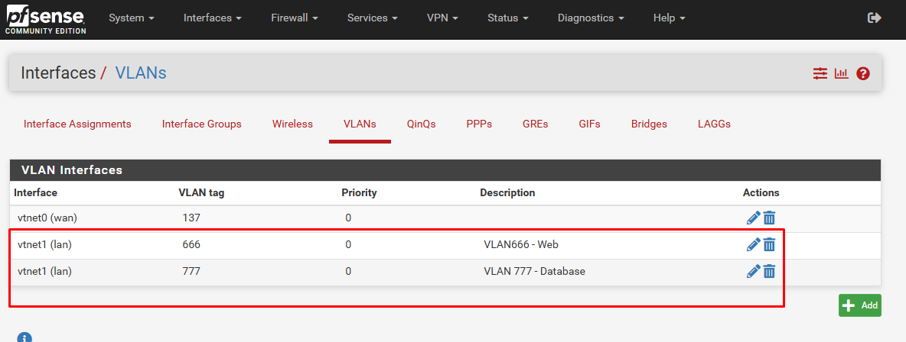
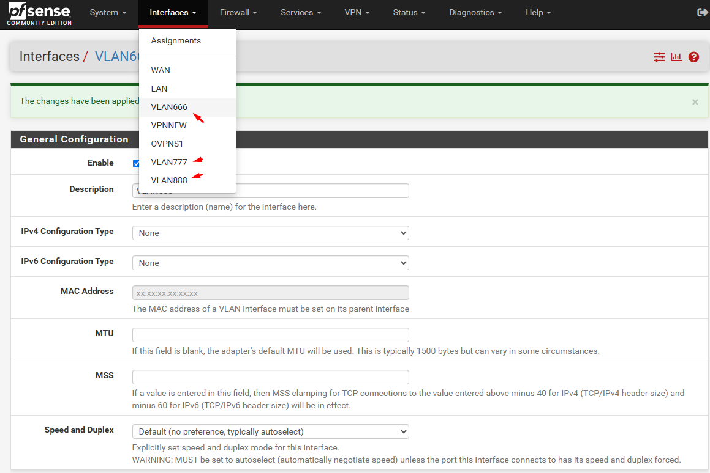

### **1. VLAN (Virtual Local Area Network)**  
- **Khái niệm**: VLAN là công nghệ chia một mạng vật lý thành các mạng logic độc lập. Mỗi VLAN hoạt động như một broadcast domain riêng, giúp phân đoạn lưu lượng mạng và tăng cường bảo mật.  
- **Ứng dụng trong pfSense**:  
  - **Tạo VLAN**:  
    - Vào **Interfaces > Assignments > VLANs**, thêm VLAN bằng cách chọn **Add**.  
    - Chọn interface vật lý (ví dụ: `vtnet1`) và nhập **VLAN Tag** (ví dụ: `666`).  
  - **Gán VLAN vào interface**:  
    - Sau khi tạo VLAN, vào **Interfaces > Assignments**, chọn VLAN mới và gán nó vào một interface (ví dụ: `LAN`).  
  - **Ví dụ**:  
    - VLAN 666: Mạng nội bộ (IP: `10.10.66.0/24`).  
    - VLAN 777: Mạng khách (IP: `10.10.77.0/24`).  

  
---

### **2. Trunking Cổng LAN**  
- **Khái niệm**: Trunking là kỹ thuật cho phép nhiều VLAN sử dụng chung một cổng vật lý trên switch hoặc firewall. Cổng trunk sẽ mang lưu lượng của tất cả VLAN được cấu hình.  
- **Cấu hình trong pfSense và Switch**:  
  - **Trên Switch**:  
    - Cấu hình cổng kết nối đến pfSense làm **trunk port** (ví dụ: Cisco: `switchport mode trunk`, UniFi: `All` hoặc `Tagged`).  
    - Cho phép các VLAN cụ thể đi qua (ví dụ: VLAN 666, 777).  
  - **Trên pfSense**:  
    - Đảm bảo interface vật lý (ví dụ: `vtnet1`) được gán làm trunk port trong phần VLAN settings.  

  
---

### **3. Inter-VLAN Routing**  
- **Khái niệm**: Là khả năng định tuyến lưu lượng giữa các VLAN khác nhau thông qua router hoặc firewall.  
- **Cấu hình trong pfSense**:  
  1. **Gán IP cho từng VLAN interface**:  
     - Vào **Interfaces > [VLAN Interface]**, đặt IP tĩnh (ví dụ: `10.10.66.1` cho VLAN 666).  
  2. **Firewall Rules**:  
     - Mặc định, các VLAN không thể giao tiếp với nhau.  
     - Tạo rules trong **Firewall > Rules > [VLAN Interface]** để cho phép lưu lượng giữa các VLAN:  
       - **Action**: Pass.  
       - **Source/Destination**: Chọn subnet của VLAN cần liên thông.  
       - **Ví dụ**: Cho phép VLAN 666 truy cập VLAN 777.  
  3. **Kiểm tra kết nối**:  
     - Sử dụng lệnh `ping` từ các thiết bị thuộc VLAN khác nhau để xác nhận.  

---

### **4. Ví dụ Thực Tế**  
- **Mục đích**: Tách biệt mạng nội bộ (VLAN 666) và mạng camera giám sát (VLAN 777).  
- **Các bước**:  
  1. Trên switch, cấu hình cổng kết nối pfSense làm trunk port (cho phép VLAN 666 và 777).  
  2. Trên pfSense, tạo VLAN 10 và 30, gán vào các interface riêng.  
  3. Đặt IP cho từng VLAN interface (VLAN 666: `10.10.66.2/24`, VLAN 777: `10.10.77.2/24`).  
  4. Tạo firewall rules để:  
     - Cho phép VLAN 666 truy cập Internet.  
     - Chặn VLAN 777 truy cập vào VLAN 666 (trừ camera management IP).  

---

### **5. Lưu Ý Quan Trọng**  
- **Bảo mật**:  
  - Sử dụng firewall rules để hạn chế quyền truy cập giữa các VLAN.  
  - VLAN mặc định (VLAN 1) nên được cách ly hoặc hạn chế.  
- **Hiệu suất**:  
  - Trunking yêu cầu switch hỗ trợ VLAN tagging (IEEE 802.1Q).  
  - Đảm bảo băng thông đủ để xử lý lưu lượng giữa các VLAN.  

---

**Tóm lại**:  
- VLAN giúp phân đoạn mạng, trunking cổng LAN cho phép nhiều VLAN chung một kết nối vật lý.  
- Inter-VLAN routing trên pfSense đòi hỏi cấu hình interface IP và firewall rules chi tiết.  
- Kết hợp VLAN và pfSense giúp tối ưu hóa quản lý mạng, tăng tính linh hoạt và bảo mật.