### Hướng dẫn PFSense OpenVPN mode TAP
### Thực hiện trên PFSense
### Tạo User và Certificate

- Tại tab System/Certificate Manager/CA, tạo CA cho OpenVPN, CA này sẽ xác thực tất cả các certificate của server VPN và user VPN khi kết nối tới PFSense OpenVPN
- Tiếp tục tạo certificate cho user
- Tại tab System/UserManager, tạo user được VPN
- Sau khi user được tạo, click vào nút "Edit user"

- Edit user vừa tạo, add certificate cho user đó

 Chọn cert vừa tạo ở trên

Nhìn cái tên ``TAP mode`` chúng ta liên tưởng đến loại VPN mode này chỉ tác dụng thông 2 mạng LAN, không có định tuyến, chuyển trafic

Hướng dẫn này sẽ giúp bạn thiết lập **OpenVPN** chế độ **TAP (Layer 2)** trên pfSense, cho phép các client từ xa kết nối như thể đang ở cùng một mạng LAN.

Chúng ta sẽ tạo CA , tạo chứng chỉ cho máy chủ và tạo user trước

Tại tab ``Authorities``

  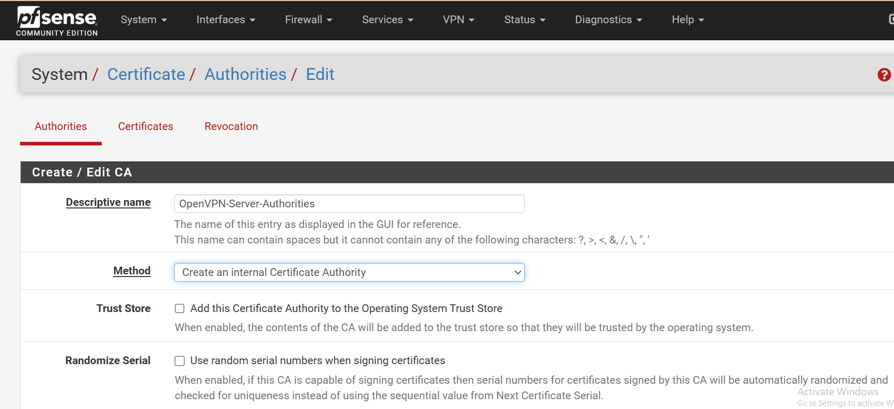

  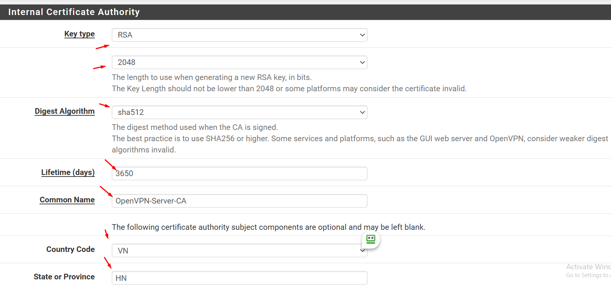

  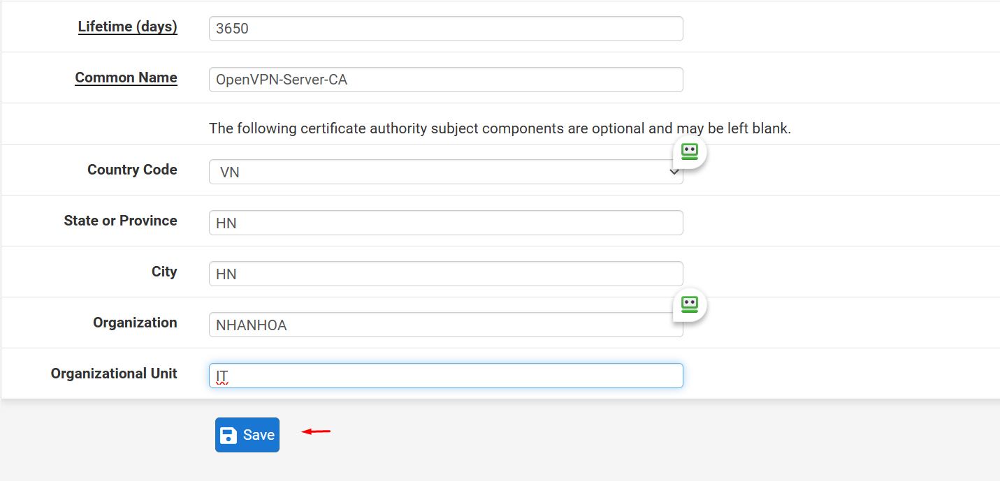

  

Chuyển qua tab ``Certificates``

  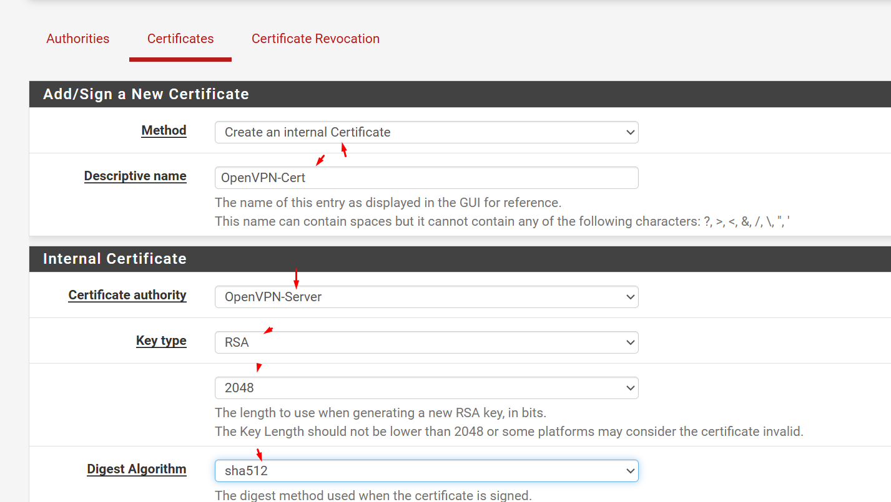

  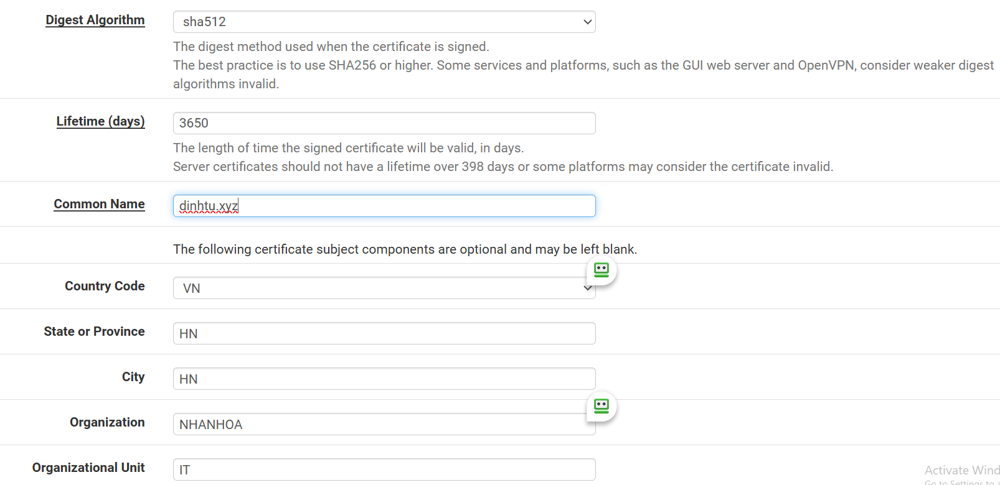

  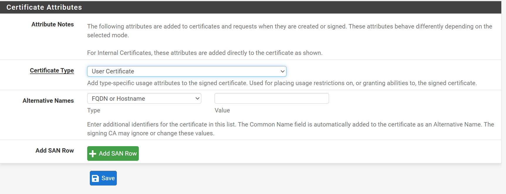

Thêm 1 User:

  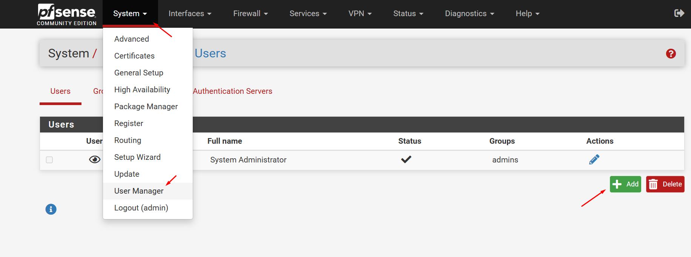
  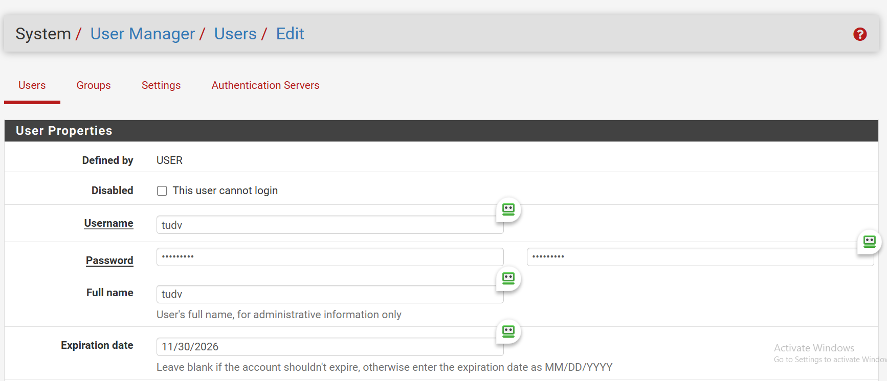
  
  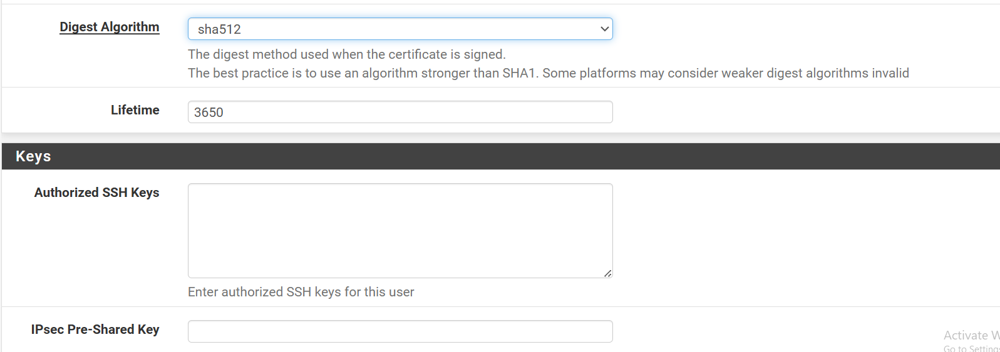
  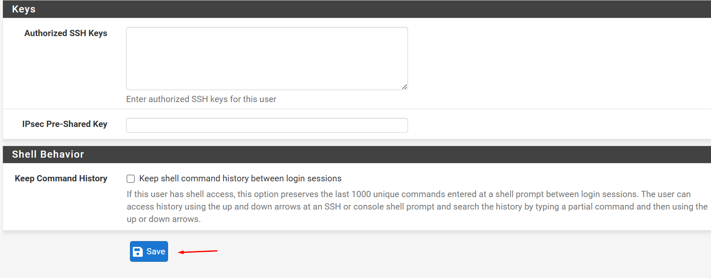

### Tạo VPN Server
- Tại tab System/Package Manager, cài đặt Plugin openvpn-client-export
-  Tại tab VPN/OpenVPN/Servers, click "Add" để tạo VPN server
  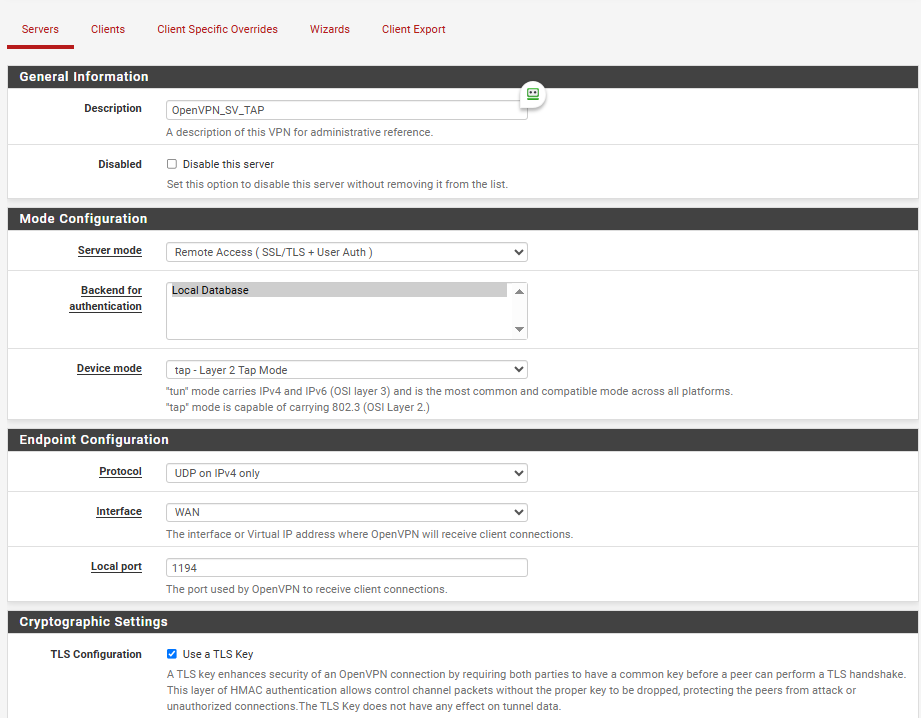
-  Khai báo các thông tin về mode kết nối:
  - Server mode: Remote Access (SSL/TLS + User Auth)
  - Device mode: tap
  - Interface: WAN
  - Local port: 1194   
  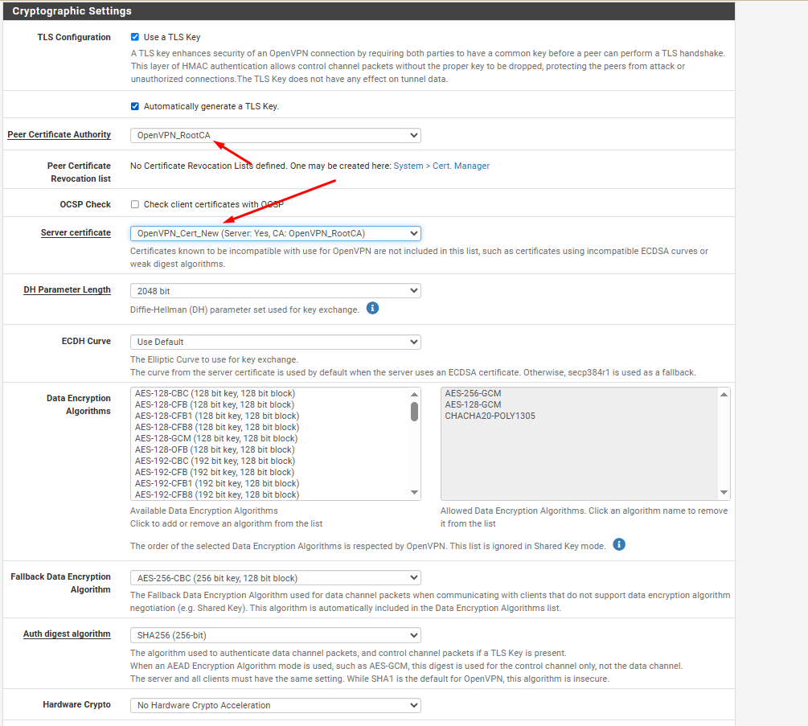

 - Khai báo các thông tin về mã hóa
  - TLS Configuration: chọn sử dụng TLS key
  - Peer Certificate Authority: chọn CA cho hệ thống đã tạo trước đó (server-ca)
  - Server certificate: chọn cert cho server được tạo (server-cert)
 
  - Auth digest algorithm: lựa chọn giải thuật xác thực kênh truyền là SHA256

 - Khai báo các thông tin về tap
  - Bridge DHCP: cho phép client nhận IP trong LAN thông qua DHCP Server
  - Bridge Interface: lựa chọn LAN được kết nối qua VPN
  - IPv4 local Network: khai báo dải mạng được truy cập thông qua VPN (LAN2)
  - Concurrent Connection: khai báo số lượng client được kết nối VPN đồng thời

  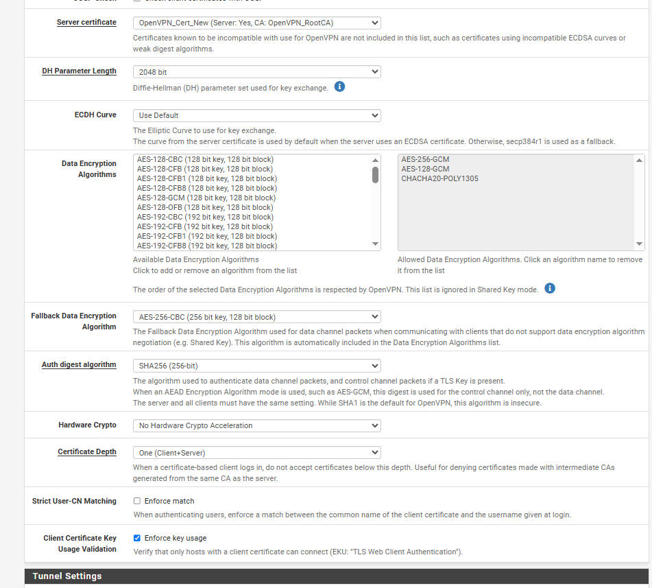
  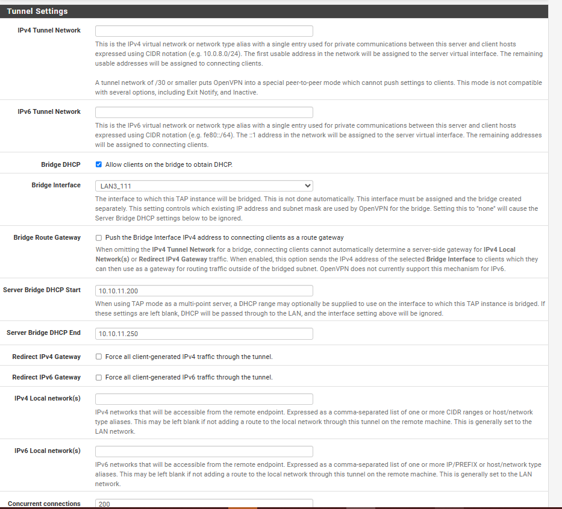
  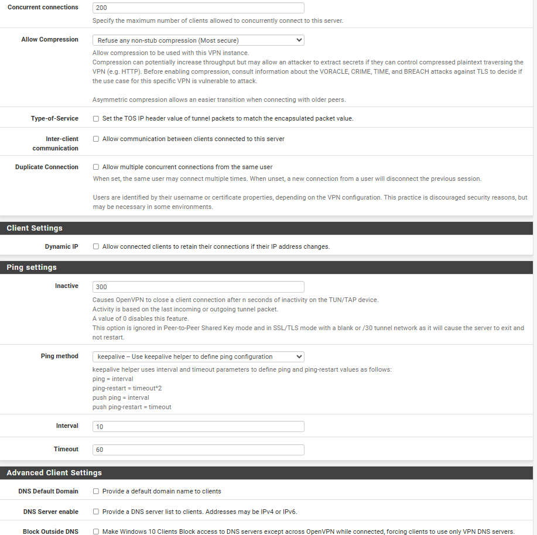
  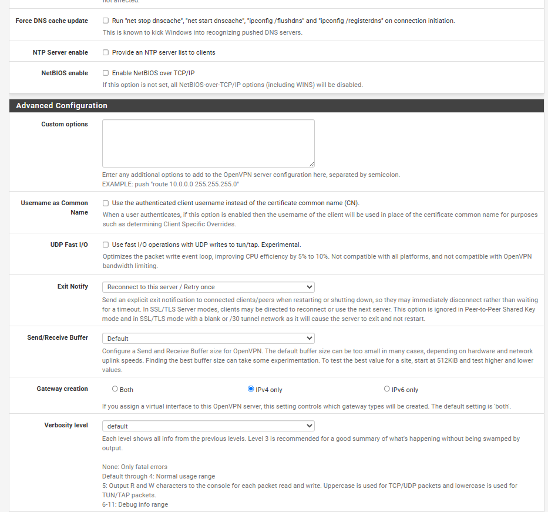
  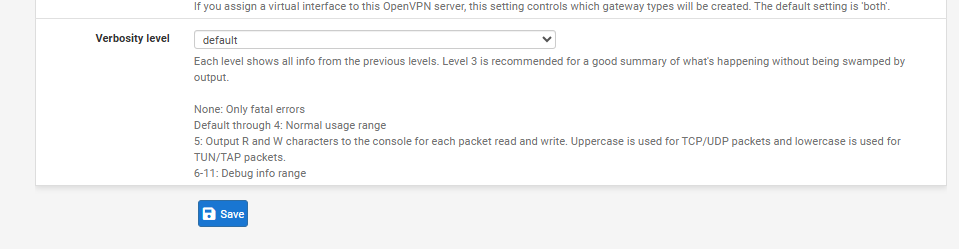
  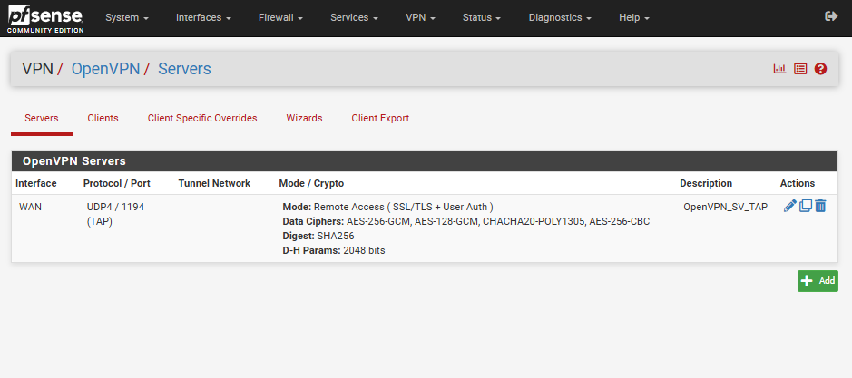

  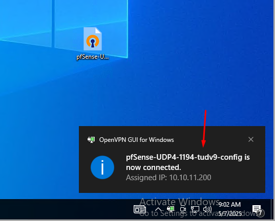