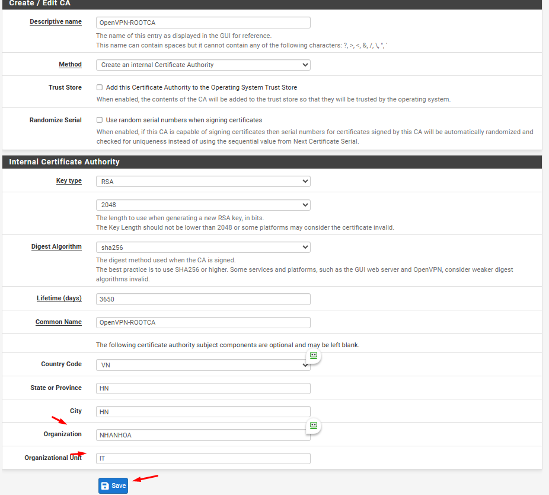
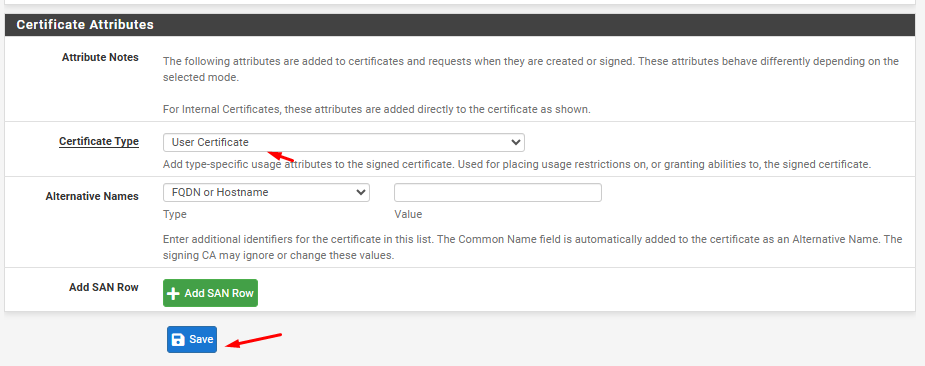
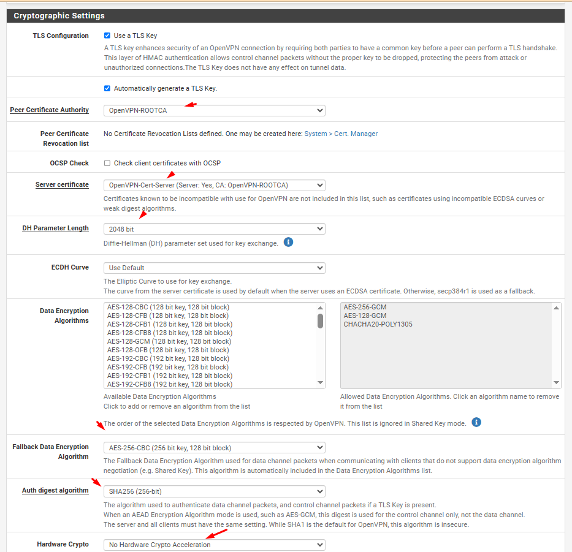
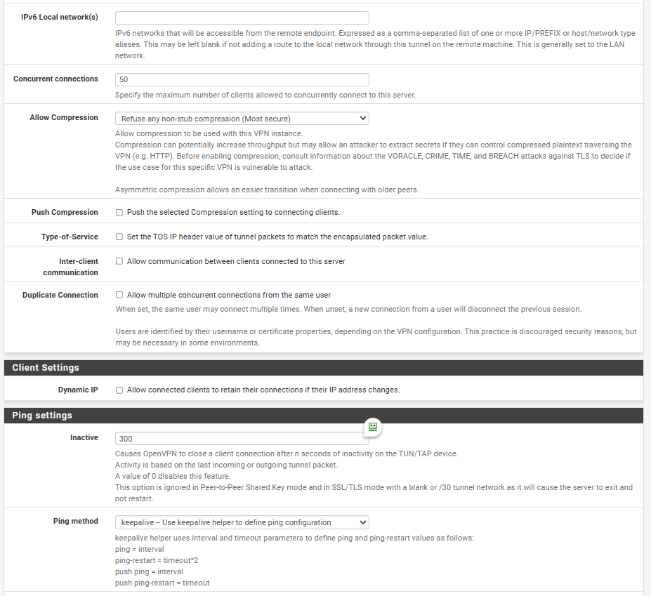
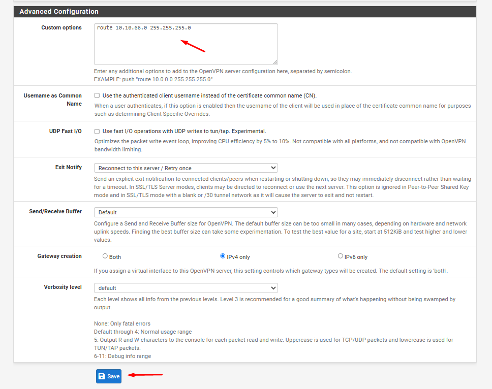
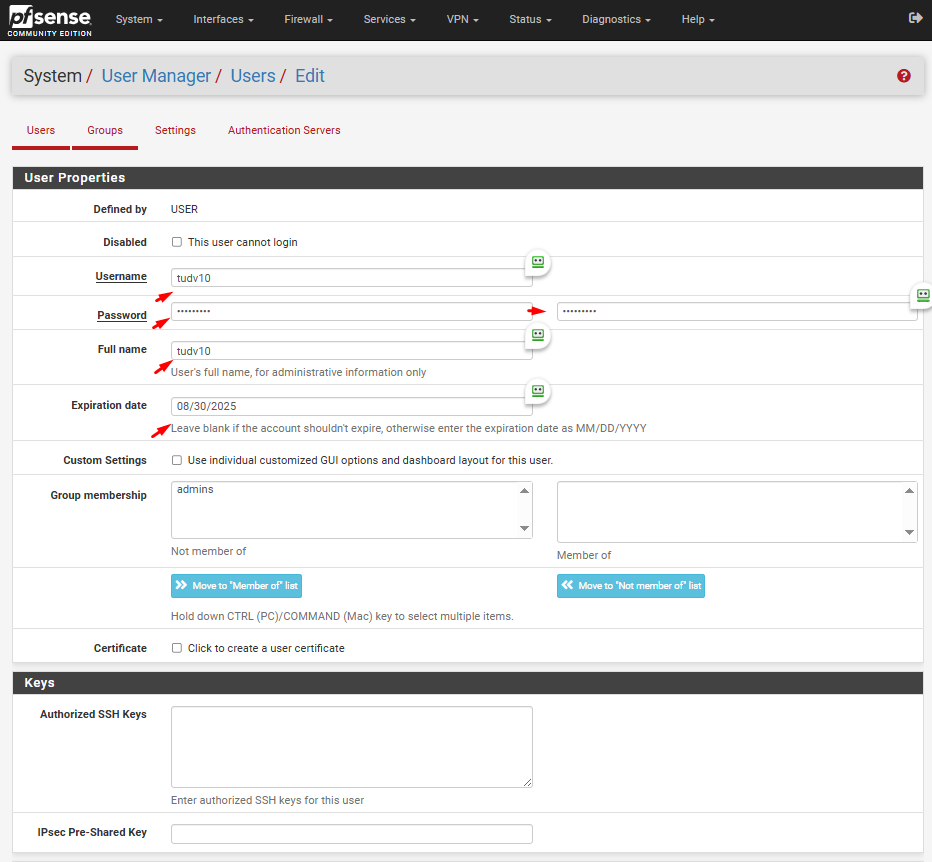
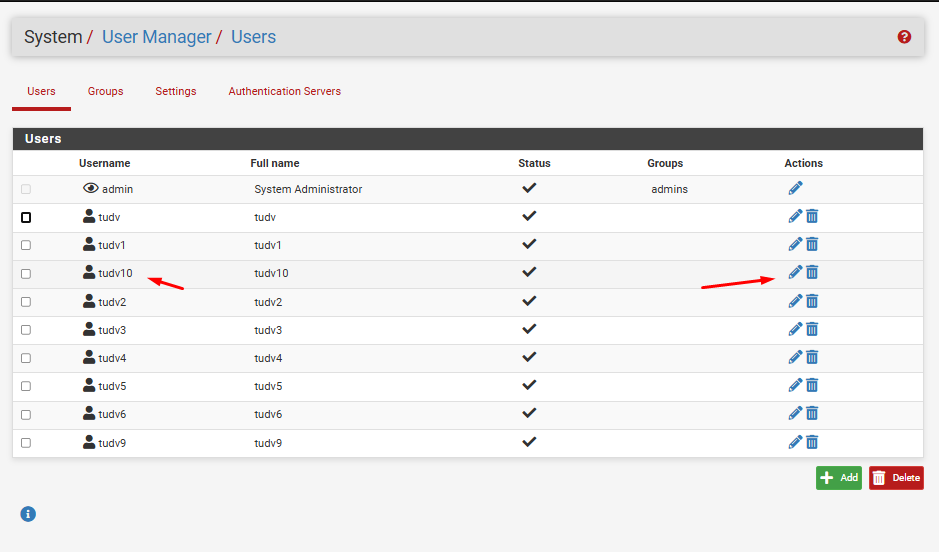

### **1. Cấu hình OpenVPN Server (TAP Mode)**  
1. **Tạo Certificate Authority (CA) và Certificates**:  
   - Vào ``System``>``Certificate``>``Authorities`` để tạo ROOT CA ,CA này sẽ xác thực tất cả các certificate của server VPN và user VPN khi kết nối tới PFSense OpenVPN

  
  
  

Tiếp tục tạo certificate cho server và user

   - Vào ``System``>``Certificates``>``Certificates``

Tạo certificate cho server

  
  

Tạo certificate cho user

  
  

  

2. **Tạo OpenVPN Server**:  

   - Tại tab **System/Package Manager**, cài đặt Plugin **openvpn-client-export**

  

   - Vào **VPN > OpenVPN > Servers > Add**.  
   - **General Settings**:  
     - **Server Mode**: "Peer to Peer (Shared Key)" hoặc "Remote Access (SSL/TLS) + User Auth" tùy nhu cầu.  
     - **Device Mode**: **tap** (thay vì tun).  
     - **Interface**: Chọn interface WAN hoặc LAN tùy vào nơi OpenVPN lắng nghe.  
     - **Protocol**: UDP hoặc TCP.  
     - **Local Port**: Cổng mặc định 1194.
   - **Cryptography Settings**:  

     + Khai báo các thông tin về mã hóa

     + TLS Configuration: chọn sử dụng TLS key

     + Peer Certificate Authority: chọn CA cho hệ thống đã tạo trước đó (OpenVPN-ROOTCA)

     + Server certificate: chọn cert cho server được tạo (OpenVPN-Cert-Server)

     + Auth digest algorithm: lựa chọn giải thuật xác thực kênh truyền là SHA256   

   - **Tunnel Settings**:  
     - **IPv4 Tunnel Network**: Để trống (vì sử dụng bridge).  
     - **Bridge DHCP**: Tích chọn **Bridge Interface** và chọn interface LAN muốn bridge (ví dụ: LAN4_777). 

     + Khai báo các thông tin về tap

     + Bridge DHCP: cho phép client nhận IP trong LAN thông qua DHCP Server

     + Bridge Interface: lựa chọn LAN được kết nối qua VPN

     + IPv4 local Network: khai báo dải mạng được truy cập thông qua VPN (LAN2)

     + Concurrent Connection: khai báo số lượng client được kết nối VPN đồng thời 

  
  
  
  
  
  
  

Tiếp tục tạo certificate cho user
Tại tab System/UserManager, tạo user được VPN
-Sau khi user được tạo, click vào nút "Edit user" 

  
  
  
  
  
  
 
3. **Lưu và kích hoạt dịch vụ**.  

Sửa tên interface cho dễ nhìn

---

### **2. Bridge OpenVPN TAP Interface với LAN4_777**  
1. **Tạo Bridge Interface**:  
   - Vào **Interfaces > Assignments > Bridges > Add**.  
   - **Member Interfaces**: Chọn interface LAN và OpenVPN TAP interface (ví dụ: `ovpns3`).  
   - Lưu cấu hình.  
  
  
  
2. **Cấu hình DHCP trên Bridge Interface**:  
   - Đảm bảo DHCP server trên interface LAN đang hoạt động để cấp IP cho client VPN.  
   - Nếu cần, vào **Services > DHCP Server > [LAN]** để điều chỉnh dải IP.  

  
  
  
---

### **3. Định tuyến (Routing) giữa các mạng LAN**  

Trước đó chúng ta có cấu hình dải IP mạng VPN đến sẽ connect được subnet 10.10.66.0/24

Chúng ta lấy file .ovpn tải về sau đó cài vào 1 máy và VPN thử

  
  
  

  

  
