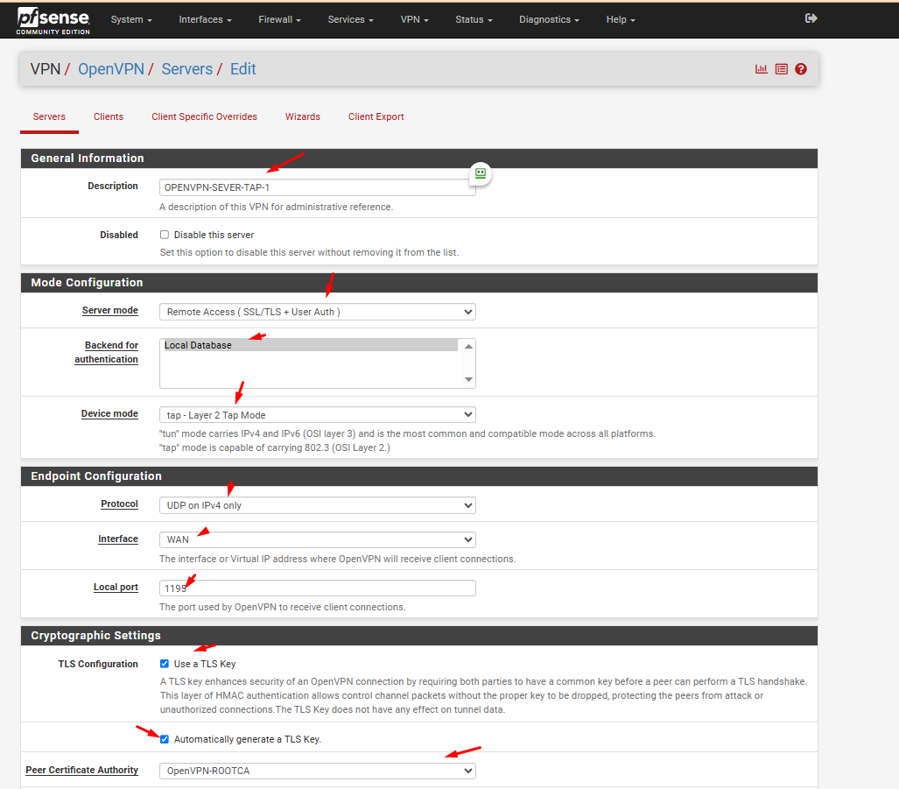
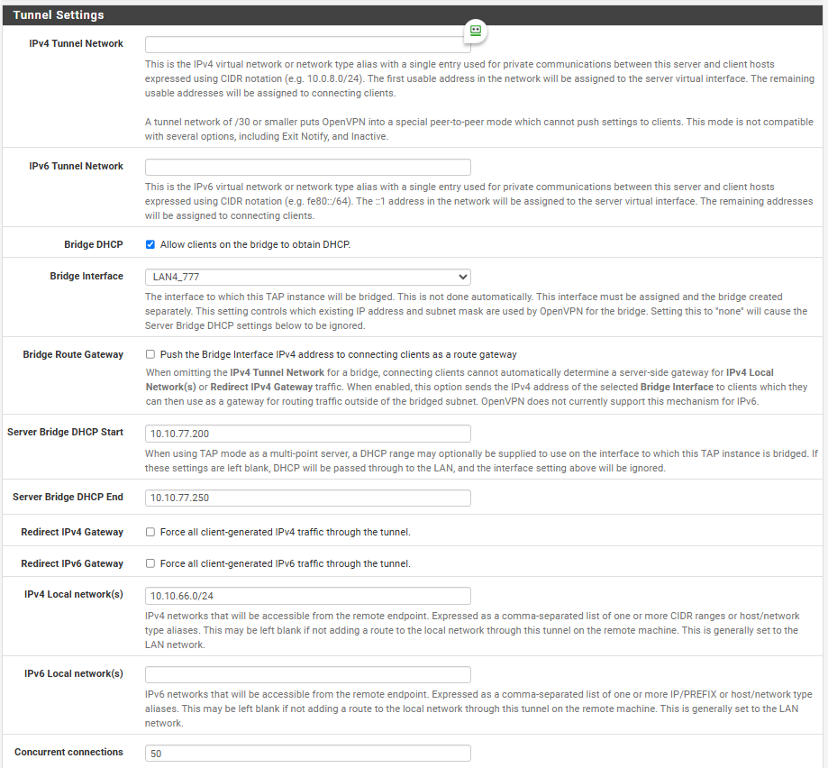

### **1. Cấu hình OpenVPN Server (TAP Mode)**  
1. **Tạo Certificate Authority (CA) và Certificates**:  
   - Vào ``System``>``Certificate``>``Authorities`` để tạo ROOT CA ,CA này sẽ xác thực tất cả các certificate của server VPN và user VPN khi kết nối tới PFSense OpenVPN

  
  
  

Tiếp tục tạo certificate cho server và user

   - Vào ``System``>``Certificates``>``Certificates``

Tạo certificate cho server

  
  

Tạo certificate cho user

  
  

  

2. **Tạo OpenVPN Server**:  

   - Tại tab **System/Package Manager**, cài đặt Plugin **openvpn-client-export**

  

   - Vào **VPN > OpenVPN > Servers > Add**.  
   - **General Settings**:  
     - **Server Mode**: "Peer to Peer (Shared Key)" hoặc "Remote Access (SSL/TLS) + User Auth" tùy nhu cầu.  
     - **Device Mode**: **tap** (thay vì tun).  
     - **Interface**: Chọn interface WAN hoặc LAN tùy vào nơi OpenVPN lắng nghe.  
     - **Protocol**: UDP hoặc TCP.  
     - **Local Port**: Cổng mặc định 1194.
   - **Cryptography Settings**:  

     + Khai báo các thông tin về mã hóa

     + TLS Configuration: chọn sử dụng TLS key

     + Peer Certificate Authority: chọn CA cho hệ thống đã tạo trước đó (OpenVPN-ROOTCA)

     + Server certificate: chọn cert cho server được tạo (OpenVPN-Cert-Server)

     + Auth digest algorithm: lựa chọn giải thuật xác thực kênh truyền là SHA256   

   - **Tunnel Settings**:  
     - **IPv4 Tunnel Network**: Để trống (vì sử dụng bridge).  
     - **Bridge DHCP**: Tích chọn **Bridge Interface** và chọn interface LAN muốn bridge (ví dụ: LAN4_777). 

     + Khai báo các thông tin về tap

     + Bridge DHCP: cho phép client nhận IP trong LAN thông qua DHCP Server

     + Bridge Interface: lựa chọn LAN được kết nối qua VPN

     + IPv4 local Network: khai báo dải mạng được truy cập thông qua VPN (LAN2)

     + Concurrent Connection: khai báo số lượng client được kết nối VPN đồng thời 

  
  
  
  
  
  
  

Tiếp tục tạo certificate cho user
Tại tab System/UserManager, tạo user được VPN
-Sau khi user được tạo, click vào nút "Edit user" 

  
  
  
  
  
  
 
3. **Lưu và kích hoạt dịch vụ**.  

---

### **2. Bridge OpenVPN TAP Interface với LAN**  
1. **Tạo Bridge Interface**:  
   - Vào **Interfaces > Assignments > Bridges > Add**.  
   - **Member Interfaces**: Chọn interface LAN và OpenVPN TAP interface (ví dụ: `ovpns1`).  
   - Lưu cấu hình.  
2. **Cấu hình DHCP trên Bridge Interface**:  
   - Đảm bảo DHCP server trên interface LAN đang hoạt động để cấp IP cho client VPN.  
   - Nếu cần, vào **Services > DHCP Server > [LAN]** để điều chỉnh dải IP.  

---

### **3. Định tuyến (Routing) giữa các mạng LAN**  
1. **Firewall Rules cho phép lưu lượng giữa các LAN**:  
   - Vào **Firewall > Rules > [OpenVPN Interface]**.  
   - Tạo rule mới:  
     - **Action**: Pass.  
     - **Protocol**: Any.  
     - **Source**: `OpenVPN clients subnet` (ví dụ: `192.168.1.0/24`).  
     - **Destination**: `LAN Subnet` hoặc các mạng LAN khác (ví dụ: `10.0.0.0/24`).  
   - Lặp lại rule tương tự cho các interface LAN khác.  
2. **Static Routes (nếu cần)**:  
   - Nếu các mạng LAN khác không cùng subnet với pfSense, thêm static route trên pfSense:  
     - Vào **System > Routing > Static Routes > Add**.  
     - **Destination Network**: Nhập subnet của mạng LAN cần kết nối (ví dụ: `10.0.2.0/24`).  
     - **Gateway**: Chọn gateway tương ứng.  

---

### **4. Kiểm tra và Khắc phục sự cố**  
1. **Kiểm tra IP của client VPN**:  
   - Client kết nối VPN phải nhận IP từ dải LAN được bridge (ví dụ: `192.168.1.100`).  
2. **Ping thử giữa các mạng**:  
   - Từ client VPN, ping đến một thiết bị trong LAN bridge và các LAN khác.  
3. **Xem logs OpenVPN**:  
   - Vào **Status > System Logs > OpenVPN** để kiểm tra lỗi kết nối.  

---

### **5. Lưu ý quan trọng**  
- **Hiệu suất**: Chế độ TAP (lớp 2) có thể gây overhead do xử lý broadcast traffic. Đảm bảo phần cứng đủ mạnh.  
- **Bảo mật**:  
  - Giới hạn quyền truy cập bằng firewall rules.  
  - Sử dụng certificate-based authentication thay vì shared key.  
- **Tránh broadcast storms**: Kích hoạt **Spanning Tree Protocol (STP)** trên switch vật lý nếu bridge nhiều interface.  

---

### **Ví dụ Minh Họa**  
- **Mạng LAN bridge**: `192.168.1.0/24` (interface LAN của pfSense).  
- **Mạng LAN khác**: `10.0.2.0/24` (kết nối qua interface OPT1).  
- **Cấu hình Firewall Rules**:  
  - Cho phép `192.168.1.0/24` → `10.0.2.0/24` trên interface OPT1.  
  - Cho phẽp `10.0.2.0/24` → `192.168.1.0/24` trên interface OpenVPN.  

---

**Kết quả**: Client VPN kết nối qua TAP sẽ có IP thuộc dải `192.168.1.0/24` và có thể giao tiếp với tất cả các mạng LAN được định tuyến qua pfSense.