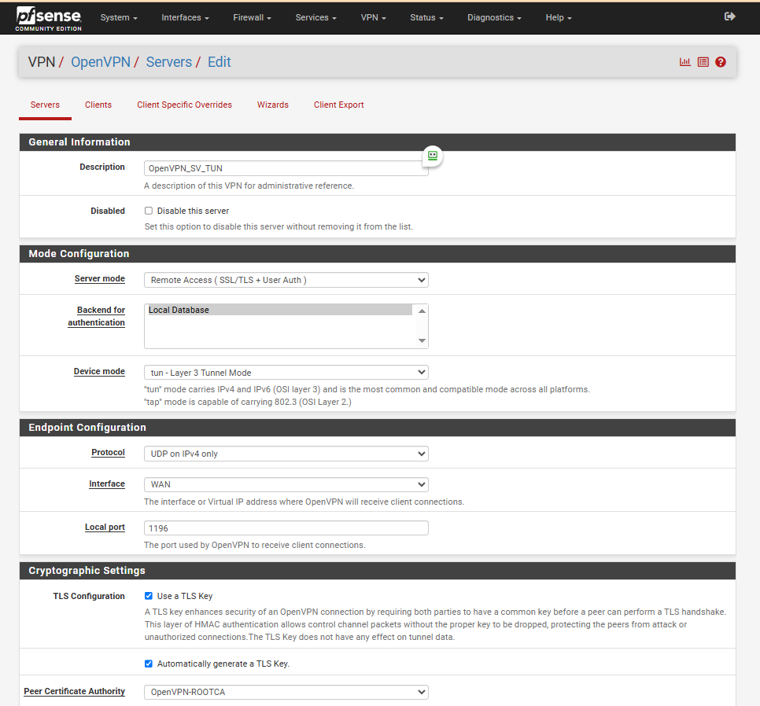
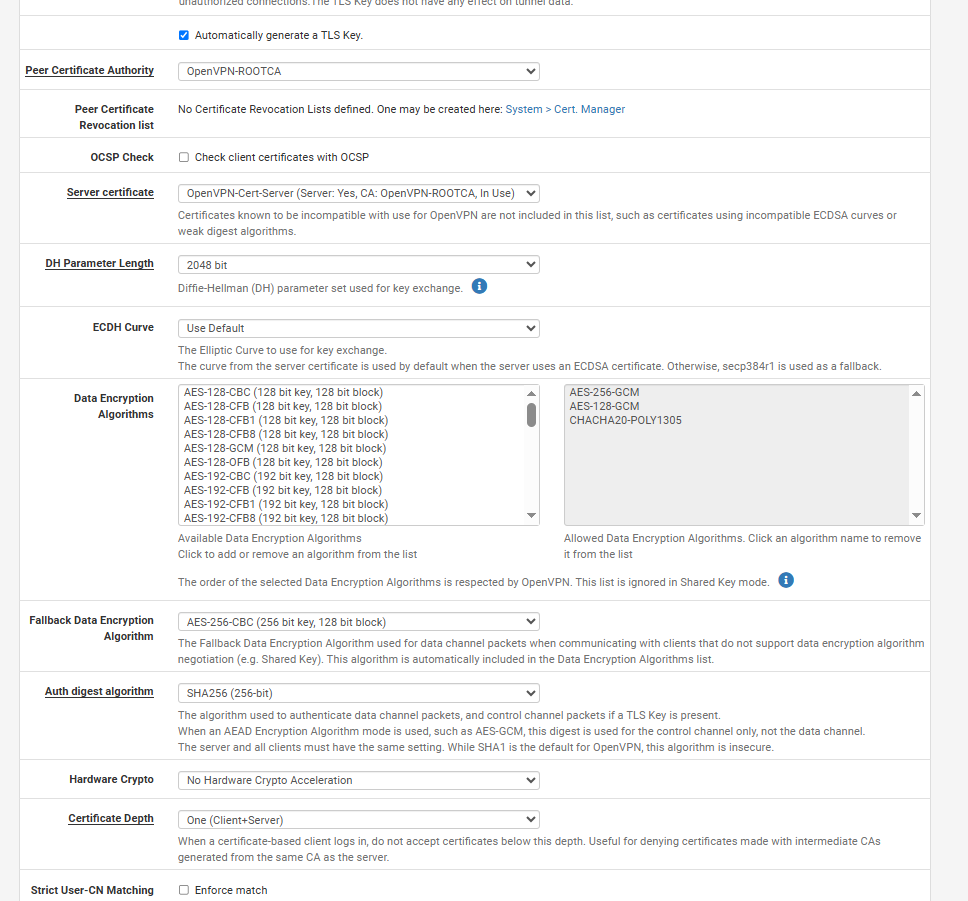
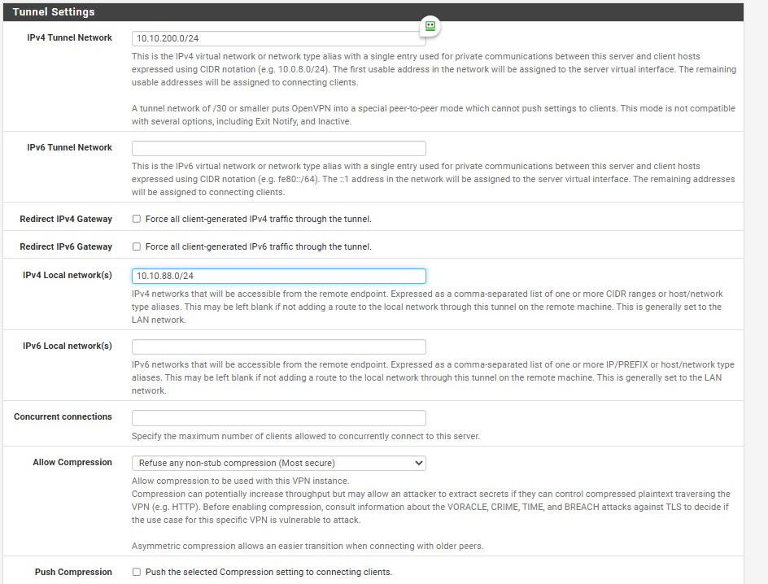
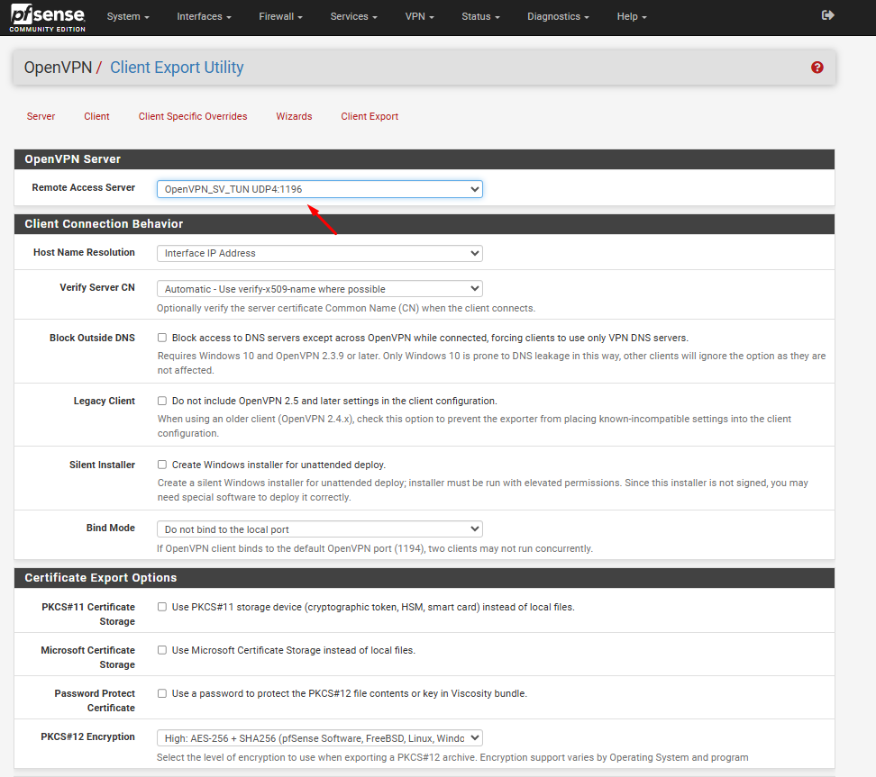
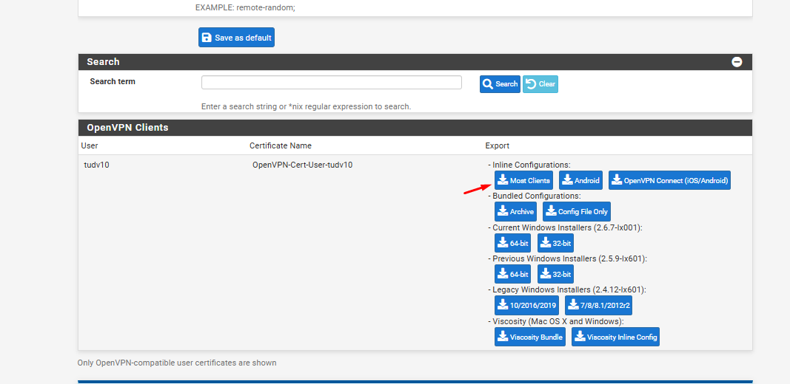
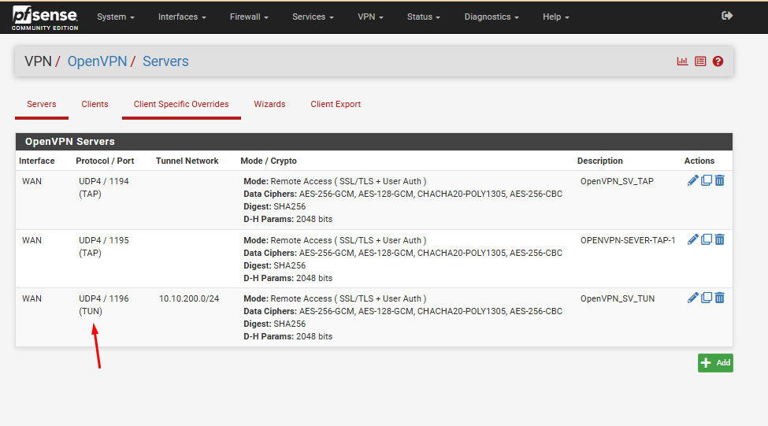
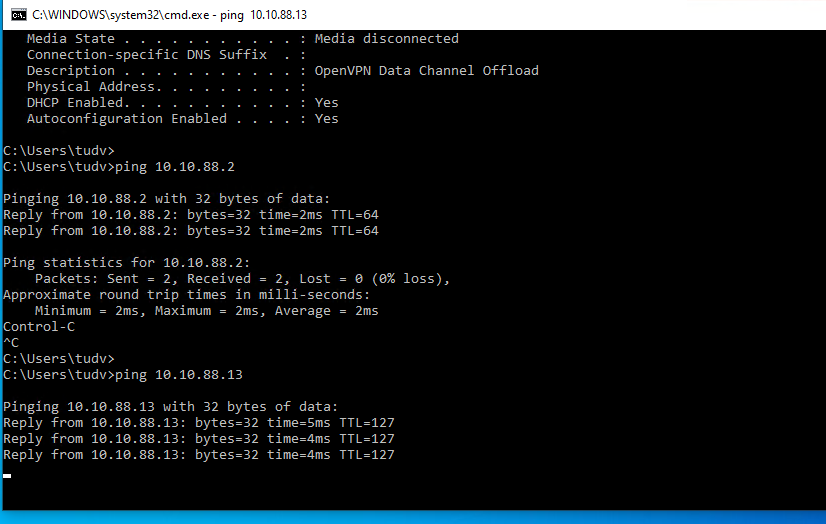
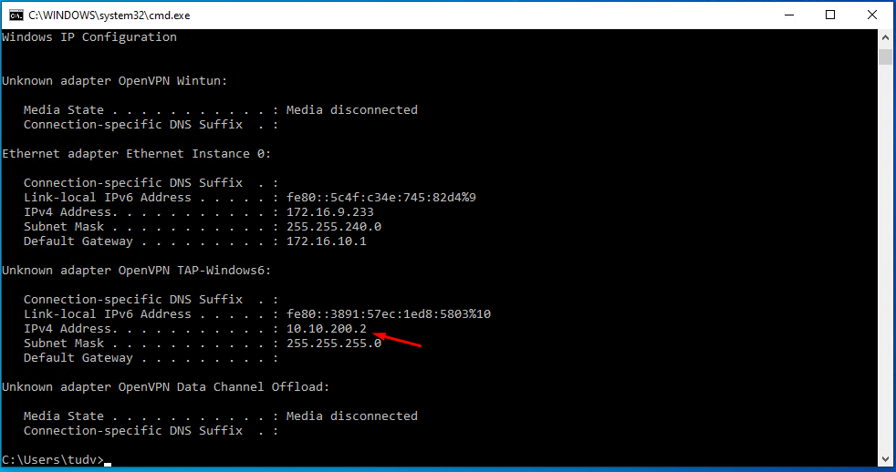
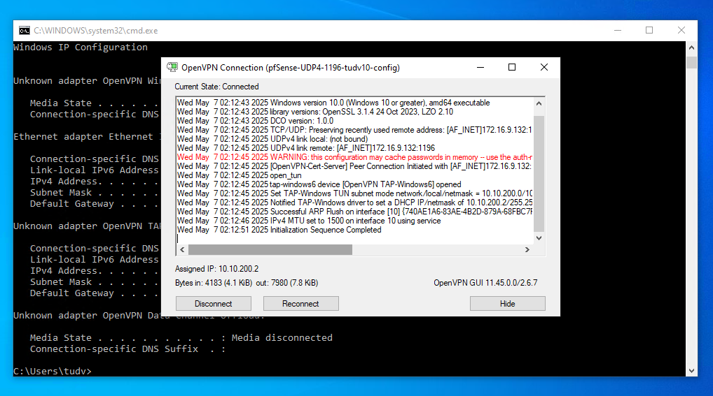

## Hướng dẫn nhanh PFSense OpenVPN Turn

Các bước tạo CA ROOT, SERVER CERT , USER CERT cũng tương tự TAP mode

Dưới đây là hình ảnh hướng dẫn tạo nhanh,

   
   
   
   
   
   
   
   
   

### 1. IPv4 Tunnel Network  
- Định nghĩa:  
  Đây là dải địa chỉ IP được sử dụng để cấp phát cho các máy khách (clients) khi họ kết nối vào OpenVPN server. Dải IP này tạo thành một mạng riêng ảo (VPN subnet) giữa server và clients.  
- Ví dụ:  
  - Nếu cấu hình IPv4 Tunnel Network là 10.10.200.0/24, các client sẽ nhận IP như 10.10.200.2, 10.10.200.3, v.v.  
  - Server OpenVPN thường giữ IP 10.10.200.1 (địa chỉ gateway của mạng tunnel).  

---

### 2. IPv4 Local Network  
- Định nghĩa:  
  Đây là dải địa chỉ IP của mạng nội bộ (LAN) mà OpenVPN server đang kết nối. Khái niệm này dùng để chỉ định các mạng mà client VPN có thể truy cập sau khi kết nối.  
- Ví dụ:  
  - Nếu server OpenVPN nằm trong mạng 10.10.88.0/24, bạn có thể cấu hình IPv4 Local Network là 10.10.88.0/24.  
  - Client VPN sẽ có thể giao tiếp với các thiết bị trong mạng này thông qua VPN.  

---

### 3. Client VPN nhận IP gì?  
- Khi kết nối, client sẽ nhận một địa chỉ IP từ dải IPv4 Tunnel Network (ví dụ: 10.10.200.2).  
- Để client truy cập vào các mạng khác (như IPv4 Local Network), bạn cần:  
  1. Cấu hình route trên OpenVPN server:  
     - Thêm push "route 10.10.88.0 255.255.255.0" vào file cấu hình server (để client biết đường đến mạng 10.10.88.0/24).  
  2. Firewall Rules trên pfSense:  
     - Cho phép lưu lượng từ 10.10.200.0/24 (Tunnel Network) đến 10.10.88.0/24 (Local Network).  

## Thực hiện trên PFSense

### Tạo User và Certificate

- Tại tab System/Certificate Manager/CA, tạo CA cho OpenVPN, CA này sẽ xác thực tất cả các certificate của server VPN và user VPN khi kết nối tới PFSense OpenVPN

 Sau đó chọn "Save", kết quả;

- Tại tab System/Certificate Manager/Certificate, tạo certificate cho server VPN

- Tiếp tục tạo certificate cho user

- Tại tab System/UserManager, tạo user được VPN

- Khai báo Username, password của User. 
- add certificate cho user đó

### Tạo VPN Server

- Tại tab System/Package Manager, cài đặt Plugin openvpn-client-export

- Tại tab VPN/OpenVPN/Servers, click "Add" để tạo VPN server

- Khai báo các thông tin về mode kết nối:
  - Server mode: Remote Access (SSL/TLS + User Auth)
  - Device mode: tun
  - Interface: WAN
  - Local port: 1196 (tùy ý lựa chọn port)   

- Khai báo các thông tin về mã hóa
  - TLS Configuration: chọn sử dụng TLS key
  - Peer Certificate Authority: chọn CA cho hệ thống đã tạo trước đó (CA)
  - Server certificate: chọn cert cho server được tạo (server)
  - Enable NCP: lựa chọn sử dụng mã hóa đường truyền giữa Client và Server, sử dụng các giải thuật mặc định là AES-256-GCM và AES-128-GCM
  - Auth digest algorithm: lựa chọn giải thuật xác thực kênh truyền là SHA256

- Khai báo các thông tin về tun
  - IPv4 Tunnel Network: khai báo network tunnel, VPN client sẽ được route tới Private LAN thông qua network này
  - IPv4 local Network: khai báo các dải Private LAN được truy cập thông qua VPN
  - Concurrent Connection: khai báo số lượng client được kết nối VPN đồng thời

- Khai báo Private LAN được route thông qua tunnel network
  

- Click "Save" để tạo VPN Server

### Cấu hình Firewall

- Tại tab Firewall/Rules/WAN, add thêm rule cho phép client kết nối tới port 1195 của VPN
  Khai báo các thông số như hình
- Tại tab Firewall/Rules/LAN, add rule cho phép lưu lượng đi qua 

### Export OpenVPN config
  - Tại tab VPN/OpenVPN/ClientExport, khai báo các thông số:
    - Remote Access Server: lựa chọn OpenVPN server
    - Hostname Resolution: lựa chọn khai báo IP của WAN
    - Sau đó export

  - Tải gói cài đặt Openvpn config cho windows, có tên "openvpn-pfSense-udp-1196-tudv10-install-2.4.4-I601.exe"

## Thực hiện trên Client, kết nối VPN (hướng dẫn cho Client sử dụng Windows OS Vista trở về sau)

 
  - Kết nối VPN, nhập password của user sammy, sau khi quay VPN thành công, client nhận IP của dải mạng LAN của pfSense là 

  - Từ client, đã có thể ping đến dải mạng LAN

