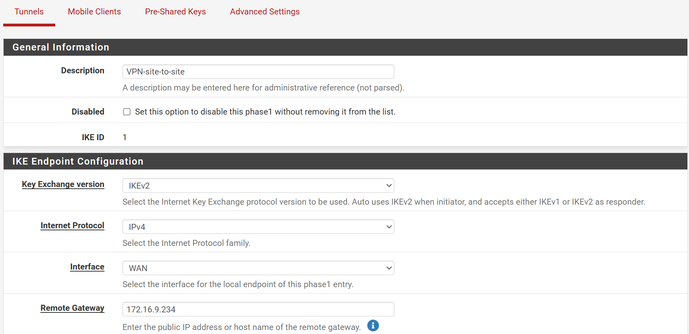
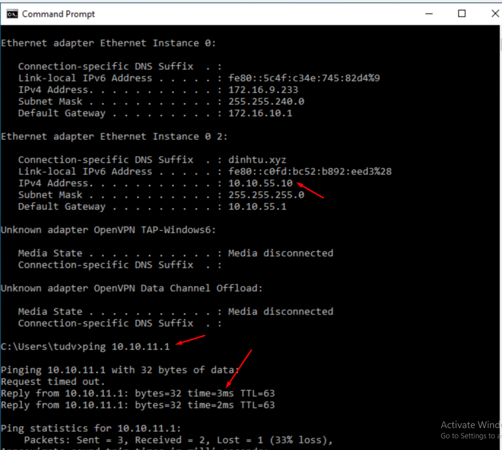

**Cấu hình VPN Site-to-Site giữa hai pfSense sử dụng IPSec**

---

### **1. Chuẩn bị thông tin**  
- **Firewall A (Site 1)**:  
  - Địa chỉ WAN: `172.16.9.132`  
  - Mạng LAN: `10.10.11.0/24`  
- **Firewall B (Site 2)**:  
  - Địa chỉ WAN: `172.16.9.234`  
  - Mạng LAN: `10.10.55.0/24`  
- **Pre-shared Key (PSK)**: `YourSecretKey123`  

---

### **2. Cấu hình IPSec trên Firewall A**  
1. **Phase 1 (Thiết lập kênh bảo mật)**:  
   - Vào **VPN > IPSec > Add P1**.  
   - **General Information**:  
     - **Key Exchange Version**: IKEv2 (hoặc IKEv1 tùy nhu cầu).  
     - **Remote Gateway**: `172.16.9.234` (WAN của Firewall B).  
   - **Authentication**:  
     - **Authentication Method**: Mutual PSK.  
     - **Pre-Shared Key**: `YourSecretKey123`.  
   - **Encryption Algorithm**:  
     - **Encryption**: AES-256.  
     - **Hash**: SHA256.  
     - **DH Group**: 14 (2048-bit).  
   - **Lifetime**: 28800 giây (mặc định).  

   

   

2. **Phase 2 (Thiết lập kênh dữ liệu)**:  
   - Vào **VPN > IPSec > Add P2** (sau P1). 
   - **General Information**:  
     - **Mode**: Tunnel IPv4.  
   - **Local Network**:  
     - **Type**: LAN subnet.  
     - **Address**: `10.10.11.0/24`.  
   - **Remote Network**:  
     - **Type**: Network.  
     - **Address**: `10.10.55.0/24`.  
   - **Encryption**:  
     - **Protocol**: ESP.  
     - **Encryption Algorithms**: AES-256.  
     - **Hash Algorithms**: SHA256.  
   - **Lifetime**: 3600 giây.  

   
   

---

### **3. Cấu hình IPSec trên Firewall B**  
1. **Phase 1**:  
   - **Remote Gateway**: `172.16.9.132` (WAN của Firewall A).
   - **Pre-Shared Key**: lấy bên A  
   - Các tham số khác giống Firewall A (PSK, Encryption, Hash, DH Group).  
  
  
  

2. **Phase 2**:  
   - **Local Network**: `10.10.55.0/24`.  
   - **Remote Network**: `10.10.11.0/24`.  
   - Các tham số mã hóa giống Firewall A.  
  
  
  
  
---

  

  

  

### **4. Firewall Rules** (Nếu cần) 
- **Trên cả hai pfSense**:  
  - Vào **Firewall > Rules > IPSec**.  
  - Tạo rule cho phép lưu lượng từ Remote LAN đến Local LAN:  
    - **Action**: Pass.  
    - **Protocol**: Any.  
    - **Source**: Remote LAN subnet (ví dụ: `10.10.11.0/24` trên Firewall B).  
    - **Destination**: Local LAN subnet (ví dụ: `10.10.55.0/24` trên Firewall B).  
  
---

### **5. Kiểm tra kết nối**  
1. **Khởi động IPSec**:  
   - Vào **VPN > IPSec > Status**, chọn **Connect** cho cả hai Phase 1.  
2. **Kiểm tra trạng thái**:  
   - Trong **Status > IPSec**, xác nhận cả hai Phase 1 và Phase 2 đều hiển thị **ESTABLISHED**.  
3. **Ping thử nghiệm**:  
   - Từ một máy trong LAN Firewall A (`192.168.1.10`), ping đến máy trong LAN Firewall B (`10.0.2.20`).  

---

### **6. Khắc phục sự cố**  
- **Logs**: Kiểm tra **Status > System Logs > IPSec** để xem lỗi xác thực hoặc mã hóa.  
- **PSK và địa chỉ**: Đảm bảo PSK và địa chỉ Remote Gateway khớp trên cả hai firewall.  
- **Firewall/NAT**: Kiểm tra rule NAT không chặn cổng UDP 500 (IKE) và 4500 (NAT-T).  

---

### **7. Lưu ý**  
- **Tính nhất quán**: Cấu hình Phase 1 và Phase 2 phải giống nhau trên cả hai đầu.  
- **Bảo mật**: Sử dụng PSK mạnh và cập nhật thuật toán mã hóa định kỳ.  
- **Hiệu suất**: Chọn DH Group phù hợp (ví dụ: Group 14 hoặc 20).  

**Kết quả**: Hai mạng LAN (`10.10.11.0/24` và `10.10.55.0/24`) có thể giao tiếp an toàn qua VPN Site-to-Site sử dụng IPSec.