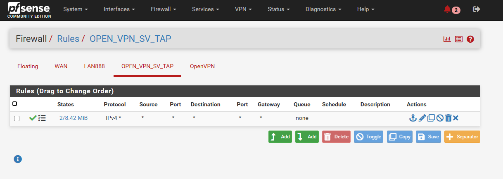

Bài này mình chỉ làm **HA LAN**, do môi trường là **LAB** là 2 **pfSense** trong 1 **KVM** nên **HA WAN** không cần thiết

Dưới đây là mô hình **HA pfSense** với **pfSense Master** và **pfSense Backup**, đồng bộ qua **Switch riêng**, hỗ trợ HA cho cả **WAN** và **LAN**, dựa trên thông số IP của bạn:

---

### **Sơ Đồ Mô Hình**  
```
                            +-------------------------+
                            |        Internet         |
                            +------------+------------+
                                         |
                                         | 
                            +------------+------------+
                            |         Switch WAN      |
                            +------------+------------+
                                         |
                            +-------------------------+
                            |       pfSense1          |
                            | (WAN: 172.16.9.179/20)  |
                            | (LAN: 10.10.11.252/24)  |
                            |                         |
                            +------------+------------+
                            |                  ↑      |    
                            |     CARP/XMLRPC/pfsync  |
                            |     ↓                   |
                            +------------+------------+
                            |       pfSense2          |
                            | (WAN: 172.16.9.180/20)  |
                            | (LAN: 10.10.11.253/24)  |
                            |                         |
                            +------------+------------+
                            |            |            |
                            | (LAN VIP: 10.10.11.1/24)|
			    |            |            |   
                            +------------+------------+
                            |         Switch LAN      |
                            +------------+------------+
                                         |
                            +-------------------------+
                            |   Internal Network      |
                            |    (10.10.11.0/24)      |
                            +-------------------------+
```

    
    

---

### **Giải Thích Chi Tiết**  

#### **1. Các Thành Phần Chính**  
- **pfSense1 (Master)** và **pfSense2 (Backup)**:  
  - **WAN Interface**:  
    - pfSense1: `172.16.9.179/20`  
    - pfSense2: `172.16.9.180/20`  
  - **LAN Interface**:  
    - pfSense1: `10.10.11.252/24`  
    - pfSense2: `10.10.11.253/24`  
    - **LAN VIP (CARP)**: `10.10.11.1/24` (gateway cho mạng nội bộ).  
  - **Sync Interface**:  
    - Kết nối qua WAN.  
    - pfSense1: `172.16.9.179/20`  
    - pfSense2: `172.16.9.180/20`  

- **Giao Thức**:  
  - **CARP**: Quản lý VIP cho WAN và LAN.  
  - **XMLRPC**: Đồng bộ cấu hình (firewall rules, NAT).  
  - **pfsync**: Đồng bộ trạng thái kết nối (state table) qua Sync Interface ( ở đây dùng WAN).

#### **2. Cấu Hình CARP**  
- **Trên pfSense1 (Master)**: 

  - **LAN VIP**:  
    - Virtual IP: `10.10.11.1/24`  
    - CARP Password: `<shared-secret>`  
    - Advertising frequency Skew** đặt `0`

- **Trên pfSense2 (Backup)**:  
  - Cấu hình tương tự, nhưng **Advertising frequency skew** đặt `100` (cao hơn Master).  

    
    

#### **3. Đồng Bộ Cấu Hình (XMLRPC)**  
- **Trên pfSense1 (Master)**:  
  - Vào **System > High Availability > Settings**:  
    - Enable **XMLRPC Sync**.  
    - Thêm IP của pfSense2 (`172.16.9.180`) vào mục **Synchronize to IP**.  
    - Nhập **Shared Secret** và chọn các cấu hình cần đồng bộ (Rules, NAT, VPN, v.v.).  

- **Trên pfSense2 (Backup)**:  
  - Cấu hình tương tự, đồng bộ về IP của pfSense1 (`172.16.9.179`).  

#### **4. Đồng Bộ Trạng Thái (pfsync)**  
- **Trên cả hai node**:  
  - Vào **System > High Availability > pfsync**:  
    - **Synchronize Interface**: Chọn Sync Interface (ví dụ: `WAN`).  
    - **Peer IP**: Nhập IP của node đối tác (`172.16.9.180` trên pfSense1, `172.16.9.179` trên pfSense2).  
    - **Sync Frequency**: Đặt `1` giây để đồng bộ nhanh.  

#### **5. Firewall Rules**  
- **Trên Sync Interface**:  
  - Cho phép traffic CARP (proto 112) và pfsync (proto PFSYNC).  
  - Ví dụ rule:  
    ```
    Protocol: CARP (112)  
    Source: Any  
    Destination: Any  
    Action: Allow  
    ```  

- **Trên WAN/LAN**:  
  - Đảm bảo CARP traffic được phép (nếu cần).  

---

### **Kiểm Tra Hoạt Động**  
1. **Kiểm tra Virtual IP**:  
   - Trên giao diện web pfSense, vào **Status > CARP**, xác nhận cả WAN VIP và LAN VIP đều ở trạng thái **MASTER** trên pfSense1. 

    

     

2. **Test Failover**:  
   - Tắt pfSense1, kiểm tra xem pfSense2 có tiếp quản VIP và traffic LAN/WAN không gián đoạn không. 

Đây là hình ảnh tắt **LAN MASTER** - **pfSense179** , ping gateway VLAN111 có rớt 1 gói, sau đó **Trafic Tracer** đã đổi **pfSense**

    

3. **Kiểm tra đồng bộ**:  
   - Thêm một rule firewall trên pfSense1, xác nhận rule này xuất hiện trên pfSense2 sau vài giây.  

---

### **Lưu Ý Quan Trọng**  
- Đảm bảo **Switch riêng** - Nếu cần thiết cho Sync Interface không bị nghẽn hoặc lỗi.    
