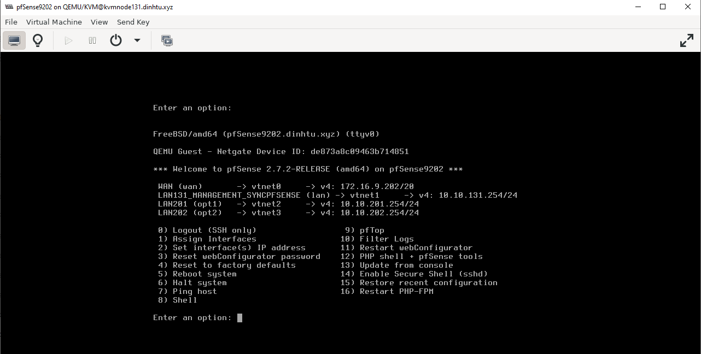

## LAB HA pfSense + VPN IPSEC

Tóm tât quy trình gồm những bước sau:

  + Tạo cụm HA pfSense site A, cấu hình add các interface như interface sync,interface LAN, đặt ip LAN, cài đặt đồng bộ pfsync, tạo các Virtual IP,đồng bộ config HA.
  + Tạo kết nối IPsEC giữa 2 site trên 2 VIP WAN

**1. Cho mô hình như sau:**

    

**2. Giải thích thêm về mô hình:**

  - Máy chủ KVM9131 có 4 card mạng dạng bridgle là brvlan1,brvlan131,brlan201,brvlan202,các card này bridge tương ứng như trong file network netplan

  - Máy chủ pfSense9201 sử dụng 4 card mạng brvlan1,brvlan131,brlan201,brvlan202

  - Máy chủ pfSense9202 sử dụng 4 card mạng brvlan1,brvlan131,brlan201,brvlan202

  - Máy chủ KVM9133 có 4 card mạng dạng bridgle là  brvlan1,brvlan133,brlan203,brvlan204,các card này bridge tương ứng như trong file network netplan

  - Máy chủ pfSense9203 sử dụng 4 card mạng brvlan1,brvlan133,brlan203,brvlan204

  - Máy chủ pfSense9202 sử dụng 4 card mạng brvlan1,brvlan131,brlan203,brvlan204

**3. Vai trò của các bridge được giải thích như sau:**

  - brvlan1 : ra internet tên WAN trên tât cả các pfSense

  - brvlan131 : sync pfSense9201 và pfSense9202 tương ứng với các interface trong pfSense9201 và pfSense9202 là LAN131 - sử dụng làm mạng quản lý, mạng syncpfSense , mạng monitor...

  - brvlan133 : sync pfSense9203 và pfSense9204 tương ứng với các interface trong pfSense9203 và pfSense9204 là LAN133 - sử dụng làm mạng quản lý, mạng syncpfSense , mạng monitor

  - brlan201,brvlan202 : sẽ tạo thành các mạng con trong pfSense tương ứng với các interface trong pfSense9201 và pfSense9202 là LAN201,LAN202 - sử dụng với vai trò mạng dành cho nội bộ các VM thông nhau , mạng storage (ví dụ),

  - brlan203,brvlan204 : sẽ tạo thành các mạng con trong pfSense tương ứng với các interface trong pfSense9203 pfSense9204 là LAN203,LAN204 - sử dụng với vai trò mạng dành cho nội bộ các VM thông nhau , mạng storage (ví dụ),

**4. Cấu hình IP và add interface vào các pfSense**

Thực tế có thể 1 số bridge mạng không cần gán IP nhưng ở đây mình đặt cho dễ hình dung và đoán mạng,kể cả ở KVM node mình cũng đặt IP cho các bridge, thực tế thì không cần.

    

Đặt IP static cho các LAN trên các pfSense

**5. Thao tác trên pfSense9201**: 

  + WAN: 172.16.9.201/20 gateway 172.16.10.1/20

 

  + LAN131: IP 10.10.131.253/24

  + LAN201: IP 10.10.201.253/24

  + LAN202: IP 10.10.202.253/24

 

 

Tạo các virtual IP của các VLAN 131,201,202 sẽ là IP gateway mạng.

 

    

    

**5. Thao tác rên pfSense9202**: 

Thêm các interface giống pfSense9201 và đặt IP như trong Exel **19_IP_Planing _HApfSense_IPSEC** 

    
    
    
    

    

**6. Cấu hình DHCP SERVER trên các VLAN 131 201 202 trên cả 2 pfSense**

#### 6.1 Thao tác trên pfSense9201

  + Với LAN131 sẽ có gateway 10.10.131.1

 

 

  + Với LAN201 sẽ có gateway 10.10.201.1

 

 

  + Với LAN202 sẽ có gateway 10.10.202.1

 

 

#### 6.1 Thao tác trên pfSense9202

  + Với LAN131 sẽ có gateway 10.10.131.1

 

  + Với LAN201 sẽ có gateway 10.10.201.1

 
 

  + Với LAN202 sẽ có gateway 10.10.202.1

 
 

