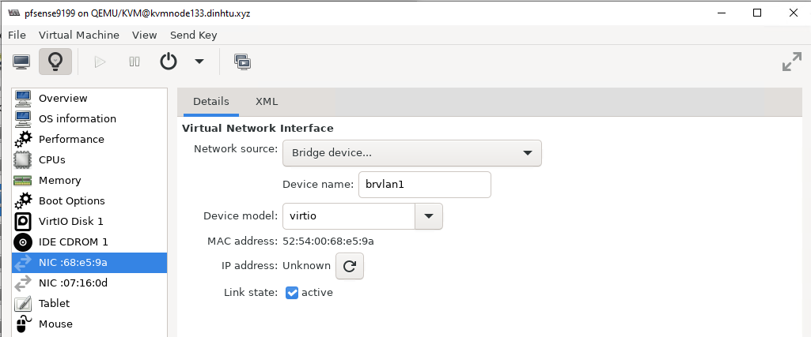
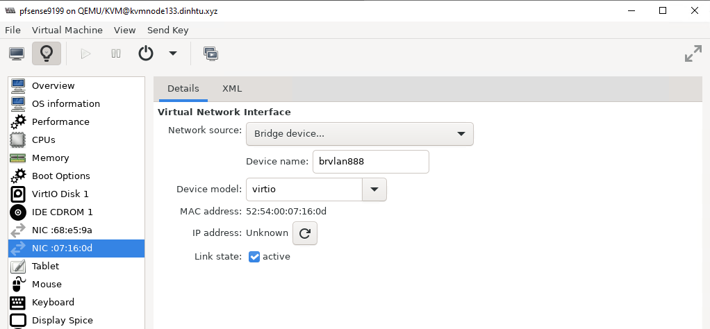
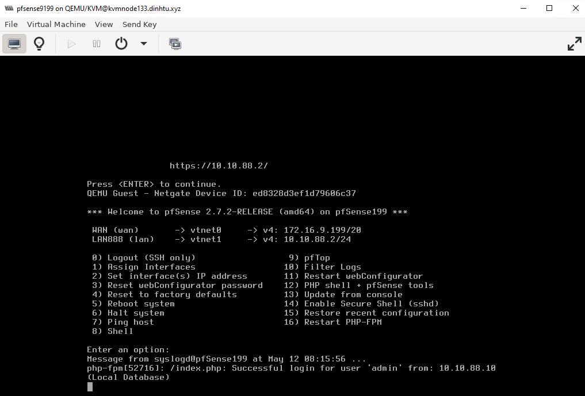
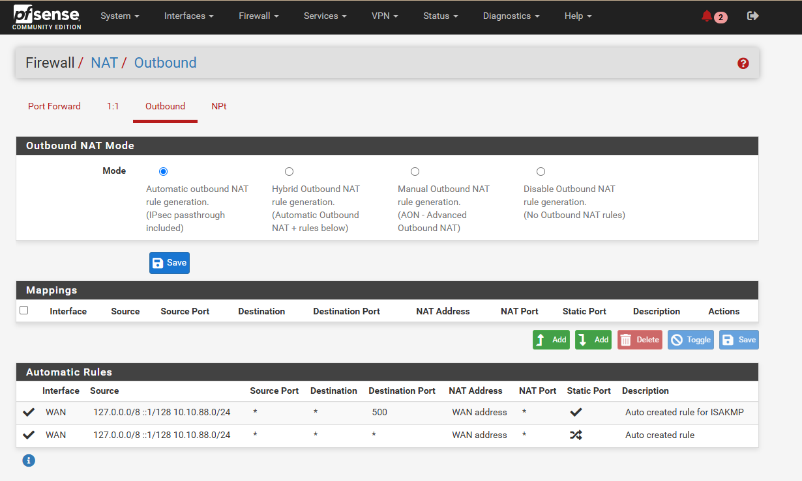
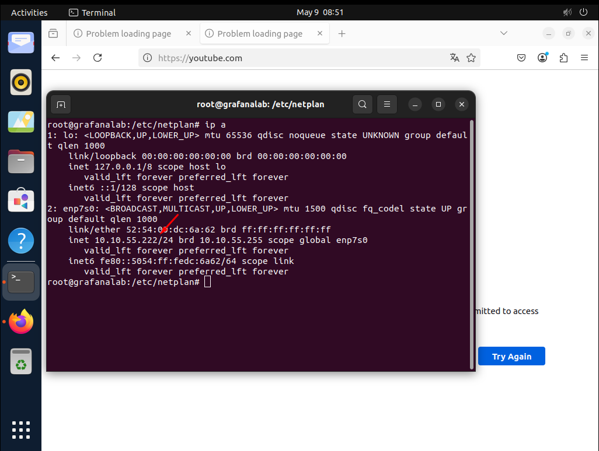
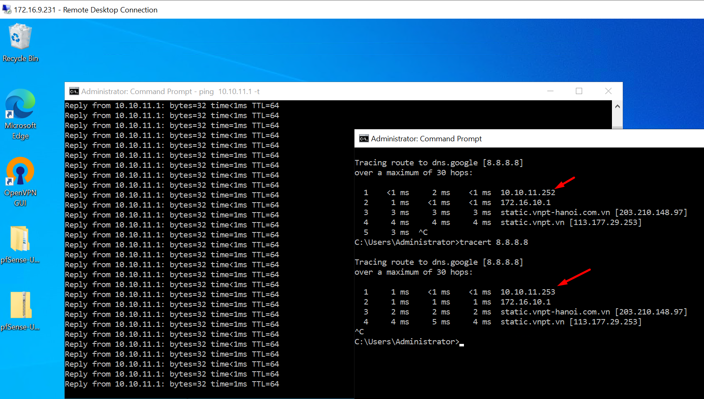
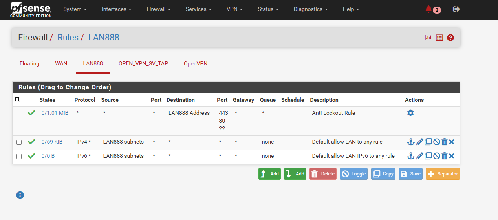
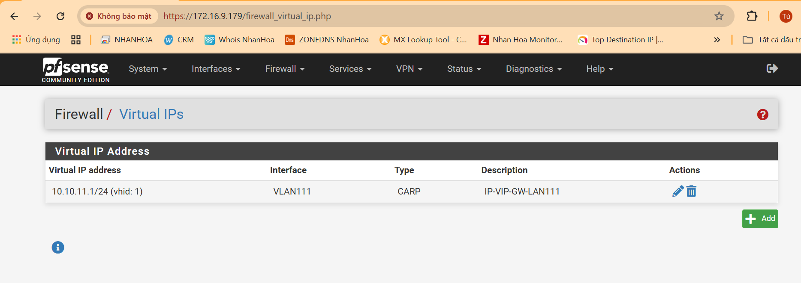
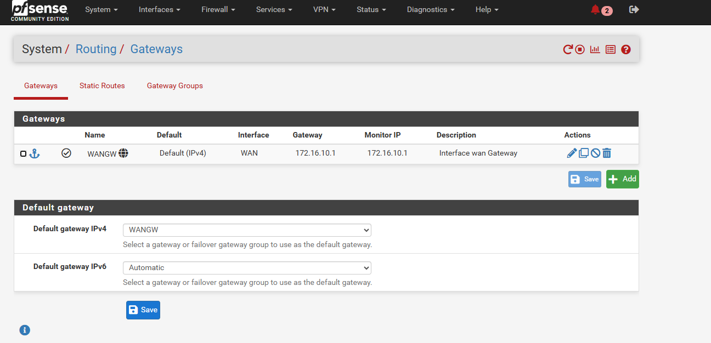

Quy trình xử lý tuần tự setup cụm:

  + Cấu hình KVM node với các bridge,VLAN

  + Tạo và Cấu hình máy ảo pfSense , cấu hình DHCP 

  + Cấu hình Open VPN loại Tap hoặc Tun thông KVM node

  + Cho KVM không dùng IP public mà dùng IP local của pfSense

  + pfSense làm gateway của local IP KVM

```Bash
Internet
│
└───[Firewall Public] (Chặn mọi traffic trừ VPN)
    │
    └───[VPN Gateway] (OpenVPN/WireGuard)
        │
        └───[Mạng Quản Trị Nội Bộ] (10.10.88.0/24)
            │
            ├───[KVM Host] (SSH, VNC, Libvirt)
            └───[Mạng Ảo KVM] (10.10.88.133/24)
                ├───[VM 1]
                └───[VM 2]
```
Chức năng các interface được giải thích như sau:

KVM có ``eno1`` là card vật lý, bridge tên ``brvlan1`` qua ``eno1`` ra internet, nhưng không set IP,chỉ cấu hình để bridge brvlan1 start và khởi động cùng hệ thống khi KVM node reboot,cho KVM node dùng IP local từ LAN888, từ ngoài kết nối đến KVM node sử dụng OPEN VPN

``pfSense`` được add 2 card : WAN là ``brvlan1`` và LAN là ``brvlan111``
 
    
    
    

    
    
    
    
    
    

Dưới đây là cấu hình netplan của KVM node

```Bash

# /etc/netplan/50-cloud-init.yaml
network:
  version: 2
  renderer: networkd
  ethernets:
    # Cấu hình card vật lý eno1 (cho br0 và VLAN1)
    eno1:
      dhcp4: no
      accept-ra: no
      optional: true
    # Cấu hình card vật lý enp65s0f0 (cho VLANxxx và VLANyyy)
    enp65s0f0:
      dhcp4: no
      accept-ra: no
      optional: true
    # Cấu hình card vật lý enp65s0f1 (cho VLAN888)
    enp65s0f1:
      dhcp4: no
      accept-ra: no
      optional: true
  vlans:       
    # VLAN888 trên enp65s0f1
    vlan888:
      id: 888
      link: enp65s0f1
  bridges:
    # Bridge chính cho VLAN1
    brvlan1:
      interfaces: [eno1]
      dhcp4: no    
    # Bridge cho VLAN888
    brvlan888:
      interfaces: [vlan888]
      dhcp4: no
      addresses: [10.10.88.133/24]
      routes:
        - to: default
          via: 10.10.88.2 //Mình đặt đây là gateway của subnet LAN888
          metric: 100
      nameservers:
        addresses: [8.8.8.8, 8.8.4.4]
      parameters:
        stp: true
        forward-delay: 4

```
Phía VM ra mạng internet có 2 kiểu

  + Nat
  + Sử dụng card bridge brvlan1 ( qua eno1 )