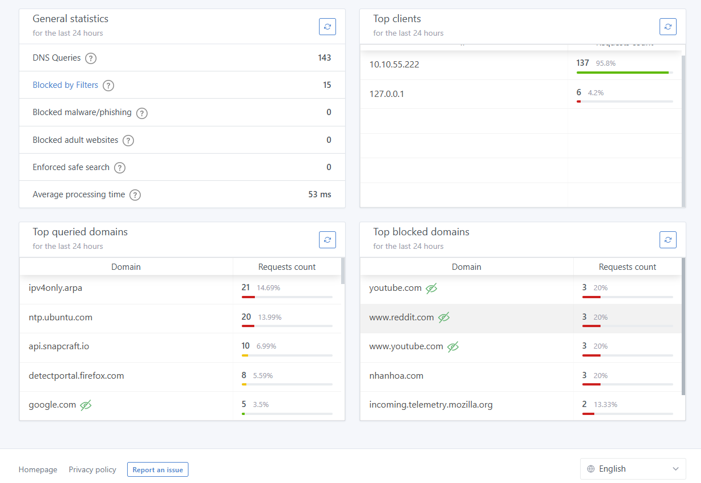
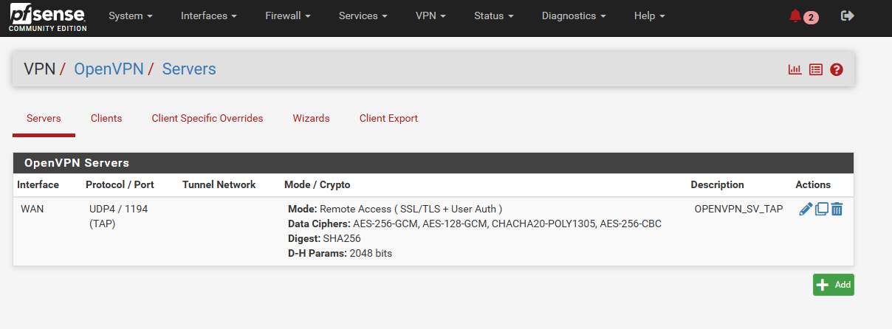
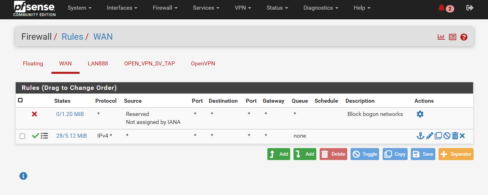

Quy trình xử lý tuần tự setup cụm:

  + Cấu hình pfSense

  + Cấu hình Open VPN loại Tap hoặc Tun thông KVM node

  + Cho KVM không dùng IP public mà dùng IP local của pfSense

  + pfSense làm gateway của local IP KVM

```Bash
Internet
│
└───[Firewall Public] (Chặn mọi traffic trừ VPN)
    │
    └───[VPN Gateway] (OpenVPN/WireGuard)
        │
        └───[Mạng Quản Trị Nội Bộ] (10.10.11.0/24)
            │
            ├───[KVM Host] (SSH, VNC, Libvirt)
            └───[Mạng Ảo KVM] (10.10.11.133/24)
                ├───[VM 1]
                └───[VM 2]
```
Với chức năng được giải thích như sau:

``eno1`` là card bridge ra internet, nhưng không setIP cho KVM node, mà cho KVM node dùng IP local, kết nối đến KVM node sử dụng OPEN VPN

pfSense được add 2 card WAN là ``brvlan1`` và LAN là ``brvlan111``

    
    
    
    
    

    
    
    
    
    
    

Dưới đây là cấu hình netplan của KVM node

```Bash

# /etc/netplan/50-cloud-init.yaml
network:
  version: 2
  renderer: networkd
  ethernets:
    # Cấu hình card vật lý eno1 (cho br0 và VLAN1)
    eno1:
      dhcp4: no
      accept-ra: no
      optional: true
    # Cấu hình card vật lý enp65s0f0 (cho VLAN666 và VLAN777)
    enp65s0f0:
      dhcp4: no
      accept-ra: no
      optional: true
    # Cấu hình card vật lý enp65s0f1 (cho VLAN888)
    enp65s0f1:
      dhcp4: no
      accept-ra: no
      optional: true
  vlans:       
    # VLAN888 trên enp65s0f1
    vlan888:
      id: 888
      link: enp65s0f1
  bridges:
    # Bridge chính cho VLAN1
    brvlan1:
      interfaces: [eno1]
      dhcp4: no    
    # Bridge cho VLAN888
    brvlan888:
      interfaces: [vlan888]
      dhcp4: no
      addresses: [10.10.88.133/24]
      routes:
        - to: default
          via: 10.10.88.2
          metric: 100
      nameservers:
        addresses: [8.8.8.8, 8.8.4.4]
      parameters:
        stp: true
        forward-delay: 4

```
