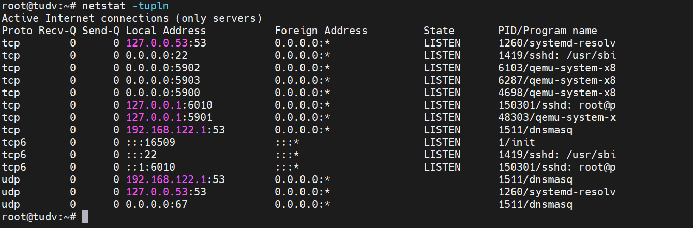

Để cách ly máy chủ KVM khỏi Internet và tăng cường bảo mật, bạn cần thực hiện các biện pháp lý thuyết sau dựa trên phân tích các dịch vụ đang lắng nghe từ kết quả `netstat`:

  

---

### **1. Phân Tích Rủi Ro Từ Các Dịch Vụ Đang Mở**
- **SSH (Port 22/TCP, IPv4/IPv6)**: Lỗ hổng nếu bị tấn công brute-force hoặc khai thác qua Internet.
- **VNC (Port 5900-5903, 5901/TCP)**: Giao thức không mã hóa, dễ bị nghe lén nếu tiếp xúc Internet.
- **DNS/DHCP (Port 53/UDP, 67/UDP)**: Dịch vụ `dnsmasq` và `systemd-resolved` có thể bị khai thác nếu mở ra ngoài.
- **Libvirt (Port 16509/TCP, IPv6)**: Giao tiếp quản lý máy ảo, cần hạn chế truy cập.

---

### **2. Biện Pháp Bảo Mật và Cách Ly**
#### **a. Network Segmentation (Phân Tách Mạng)**
- **Tạo mạng quản trị riêng**: 
  - Đặt KVM host trong mạng nội bộ (VD: `192.168.1.0/24`), không gán IP public trực tiếp.
  - Sử dụng **VLAN** hoặc **physical network separation** để tách biệt traffic quản trị và traffic máy ảo.
- **Giới hạn dịch vụ cho mạng ảo**: 
  - Dịch vụ `dnsmasq` (port 53, 67) chỉ phục vụ mạng ảo KVM (`192.168.122.0/24`), không liên quan đến Internet.

#### **b. Firewall và Access Control**
- **Chặn mọi inbound traffic từ Internet**:
  - Chỉ cho phép kết nối từ các IP nội bộ đã biết.
  - Đóng cổng không cần thiết (VD: 5900-5903, 16509) trên interface hướng Internet.
- **Áp dụng default-deny policy**:
  - Mặc định chặn tất cả traffic đến/đi, chỉ mở những gì cần thiết.
- **Sử dụng stateful firewall**:
  - Chỉ cho phép traffic đã được xác thực (ESTABLISHED, RELATED).

#### **c. Ràng Buộc Dịch Vụ Vào Interface Nội Bộ**
- **SSH**:
  - Cấu hình SSH chỉ lắng nghe trên interface quản trị (VD: `192.168.1.100`), không phải `0.0.0.0`.
  - Vô hiệu hóa phiên bản IPv6 nếu không sử dụng.
- **VNC**:
  - Bind VNC vào địa chỉ IP nội bộ (VD: `192.168.1.100:5900`), không phải `0.0.0.0`.
  - Sử dụng **SSH tunneling** hoặc **VPN** để truy cập VNC từ xa.
- **Libvirt**:
  - Giới hạn dịch vụ libvirt (port 16509) chỉ lắng nghe trên interface quản trị hoặc localhost.

#### **d. Hardening Dịch Vụ**
- **SSH**:
  - Sử dụng **key-based authentication**, tắt xác thực bằng mật khẩu.
  - Vô hiệu hóa đăng nhập trực tiếp bằng user `root`.
- **DNS/DHCP**:
  - Tắt `systemd-resolved` nếu không cần thiết.
  - Cấu hình `dnsmasq` chỉ phục vụ mạng ảo KVM, không forward ra Internet.

#### **e. Sử Dụng VPN để Quản Lý**
- **Triển khai VPN (OpenVPN/WireGuard)**:
  - Cho phép quản trị viên kết nối vào mạng nội bộ qua VPN trước khi truy cập SSH/VNC.
  - Ẩn hoàn toàn các cổng quản trị khỏi Internet.

#### **f. Vô Hiệu Hóa IPv6 (Nếu Không Dùng)**
- Tắt IPv6 trên các interface không cần thiết để giảm surface attack.
- Đảm bảo các dịch vụ (SSH, libvirt) không lắng nghe trên IPv6.

#### **g. Giám Sát và Cập Nhật**
- **Theo dõi log**: Phát hiện các kết nối bất thường từ `sshd`, `dnsmasq`, hoặc libvirt.
- **Cập nhật hệ thống**: Áp dụng bản vá bảo mật cho KVM host và các máy ảo định kỳ.

---

### **3. Mô Hình Triển Khai Lý Tưởng**
```
Internet
│
└───[Firewall Public] (Chặn mọi traffic trừ VPN)
    │
    └───[VPN Gateway] (OpenVPN/WireGuard)
        │
        └───[Mạng Quản Trị Nội Bộ] (192.168.1.0/24)
            │
            ├───[KVM Host] (SSH, VNC, Libvirt)
            └───[Mạng Ảo KVM] (192.168.122.0/24)
                ├───[VM 1]
                └───[VM 2]
```

---

### **4. Lợi Ích Chính**
- **Giảm Rủi Ro Từ Internet**: Các dịch vụ quản trị (SSH, VNC) không tiếp xúc trực tiếp với Internet.
- **Kiểm Soát Truy Cập**: Chỉ thiết bị trong mạng nội bộ hoặc qua VPN mới kết nối được.
- **Bảo Mật Đa Lớp**: Kết hợp firewall, VPN, và hardening để bảo vệ toàn diện.

---

Những biện pháp này đảm bảo KVM host chỉ giao tiếp trong phạm vi mạng được kiểm soát, loại bỏ nguy cơ tấn công từ Internet.
