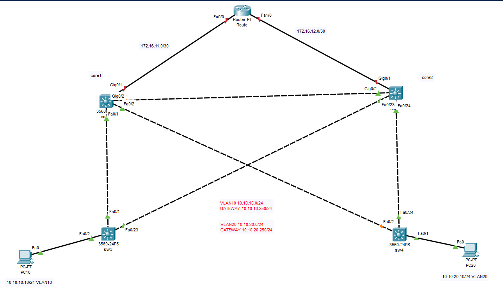

## Mô phỏng HSRP
  Cho topo và đề bài như sau:

    

#### Yêu cầu
  Giả lập Sw Layer 3 dùng c3650

  Cấu hình SPT

  PC1 thuộc vlan 10 đi internet qua L3-Sw1 (đường Sw1 với L3-Sw2 bị block)
  
  PC2 thuộc vlan 20 đi internet qua L3-Sw2 (đường Sw2 với L3-Sw1 bị block)

  Nếu đường Sw1 với L3-Sw1 bị đứt thì PC1 vẫn đi internet được

  Nếu đường Sw2 với L3-Sw2 bị đứt thì PC1 vẫn đi internet được

  Cấu hình HSRP giữa Sw1 và Sw2 để

  L3-Sw 1 bị chết thì PC1 vẫn đi internet bình thường

  L3-Sw 2 bị chết thì PC2 vẫn đi internet bình thường

  Khi đường R1 với L3-Sw1 bị đứt thì PC1 vẫn đi Internet được

  Khi đường R1 với L3-Sw2 bị đứt thì PC2 vẫn đi Internet được

#### R1

R1(config)#interface fastEthernet 0/0
R1(config-if)#no shutdown 
R1(config-if)#ip address 172.16.11.1 255.255.255.252
R1(config-if)#exit
R1(config)#interface fastEthernet 1/0
R1(config-if)#ip address 172.16.12.1 255.255.255.252
R1(config-if)#no shutdown 
R1(config-if)#exit
R1(config)#interface serial 2/0
R1(config-if)#ip address 100.100.100.1 255.255.255.0

#### Routing R1

R1(config)#ip sla 10

R1(config-ip-sla)#icmp-echo 172.16.11.2

R1(config-ip-sla-echo)#frequency 5

R1(config)#ip sla schedule 10 life forever start-time now

R1(config)#track 10 rtr 10

R1(config)#ip sla 20

R1(config-ip-sla)#icmp-echo 172.16.12.2

R1(config-ip-sla-echo)#frequency 5

R1(config)#ip sla schedule 20 life forever start-time now

R1(config)#track 20 rtr 20

R1(config)#ip route 0.0.0.0 0.0.0.0 192.168.10.2 254

R1(config)#ip route 10.123.10.0 255.255.255.0 172.16.11.2 track 10

R1(config)#ip route 10.123.10.0 255.255.255.0 172.16.12.2 10

R1(config)#ip route 10.123.20.0 255.255.255.0 172.16.12.2 track 20

R1(config)#ip route 10.123.20.0 255.255.255.0 172.16.11.2 10
