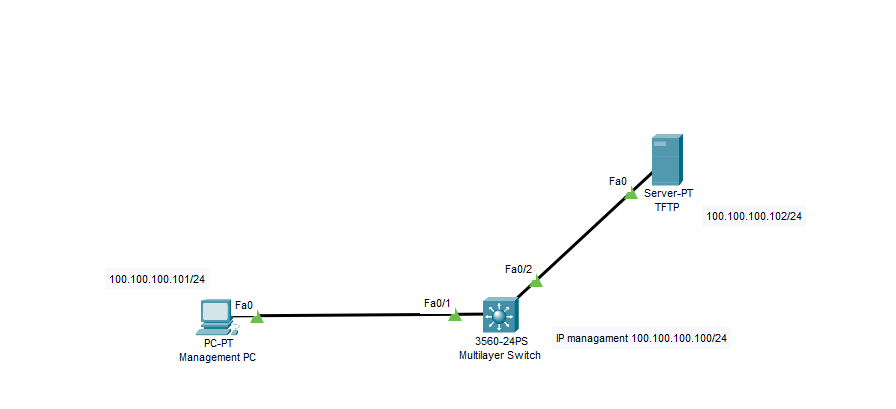
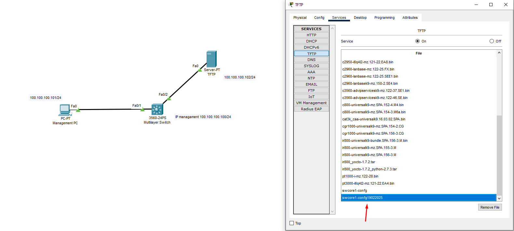
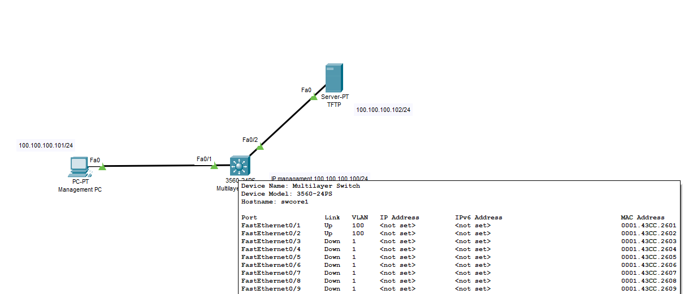

## Sao lưu (Backup) cấu hình switch:

  

  Kết nối switch với máy tính thông qua giao diện console.
  Truy cập giao diện dòng lệnh (CLI) của switch.
  Sử dụng lệnh copy running-config tftp để sao lưu cấu hình đang chạy (running-config) lên một máy chủ TFTP.

    switch# copy running-config tftp
    Address or name of remote host []? <ip_address_tftp_server>
    Destination filename [switch-config]? <filename>

  Để backup file image từ bộ nhớ flash của router ra tftp server ta dùng lệnh:

    switch#copy flash: tftp

  Nhập địa chỉ IP của máy chủ TFTP và tên tệp tin cấu hình, sau đó bấm Enter để bắt đầu quá trình sao lưu.
  Ví dụ:

    swcore1#copy running-config tftp
    Address or name of remote host []? 100.100.100.102
    Destination filename [swcore1-confg]? 
    Writing running-config...!!
    [OK - 1633 bytes]
    1633 bytes copied in 0 secs

    swcore1#copy running-config tftp
    Address or name of remote host []? 100.100.100.102
    Destination filename [swcore1-confg]? swcore1-confg19022025
    Writing running-config...!!
    [OK - 1633 bytes]
    1633 bytes copied in 0 secs

  

  Sau khi backup được 2 file cấu hình của tftp tôi đã cấu hình thêm Ethernet0/3 allow VLAN 888, mục đích để kiểm thử restore
   
  

## Khôi phục (Restore) cấu hình switch:

  Kết nối switch với máy tính thông qua giao diện console.
  Truy cập giao diện dòng lệnh (CLI) của switch.
  Sử dụng lệnh copy tftp running-config để khôi phục cấu hình từ máy chủ TFTP.

    switch# copy tftp running-config
    Address or name of remote host []? <ip_address_tftp_server>
    Source filename []? <filename>

  Nhập địa chỉ IP của máy chủ TFTP và tên tệp tin cấu hình, sau đó bấm Enter để bắt đầu quá trình khôi phục.
  Sau khi quá trình khôi phục hoàn tất, bạn có thể sử dụng lệnh show running-config để xác nhận cấu hình đã được khôi phục thành công.
  Ví dụ:

#### Để Upgrade file cấu hình từ tftp server vào bộ nhớ RAM của sw ta dùng lệnh:
    swcore1#copy tftp: running-config
    Address or name of remote host []? 100.100.100.102
    Source filename []? swcore1-confg19022025
    Destination filename [running-config]? 
    Accessing tftp://100.100.100.102/swcore1-confg19022025...
    Loading swcore1-confg19022025 from 100.100.100.102: !
    [OK - 1633 bytes]
    1633 bytes copied in 0 secs

#### Để Upgrade file cấu hình từ tftp server vào bộ nhớ NVRAM của sw ta dùng lệnh:

    swcore1#copy tftp: startup-config
    Address or name of remote host []? 100.100.100.102
    Source filename []? swcore1-confg19022025
    Destination filename [startup-config]? 
    Accessing tftp://100.100.100.102/swcore1-confg19022025...
    Loading swcore1-confg19022025 from 100.100.100.102: !
    [OK - 1633 bytes]
    1633 bytes copied in 0 secs

  
  
#### Lưu ý:

  Đảm bảo switch và máy chủ TFTP ở cùng mạng LAN hoặc có đường kết nối mạng phù hợp.
  Nếu sử dụng giao thức HTTPS thay vì TFTP, các lệnh tương ứng sẽ là copy running-config https và copy https running-config.
  Sau khi khôi phục cấu hình, bạn nên kiểm tra lại toàn bộ cấu hình để đảm bảo hoạt động đúng.
  Quá trình sao lưu và khôi phục cấu hình switch là rất quan trọng để có thể dễ dàng phục hồi cấu hình khi cần thiết.