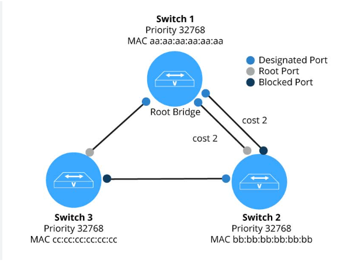
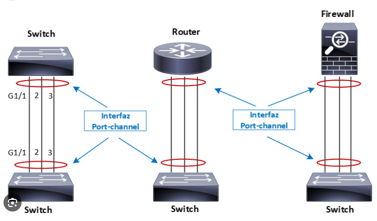

## STP (Spanning Tree Protocol):
  STP là một giao thức mạng dùng để ngăn chặn vòng lặp trong mạng LAN có nhiều đường dẫn.

    

#### Nguyên lý hoạt động của STP:
  + Tìm ra cây khung (spanning tree) trong mạng, bao gồm các đường dẫn chính và dự phòng.
  + Tắt các cổng không cần thiết để ngăn chặn vòng lặp.
  + Cho phép chuyển đổi nhanh chóng giữa các đường dẫn dự phòng khi đường chính bị lỗi.
#### Các trạng thái cổng STP:
  + Blocking: Ngăn chặn vòng lặp, không chuyển tiếp dữ liệu.
  + Listening: Lắng nghe và học các thông tin cần thiết để tham gia vào cây khung.
  + Learning: Học các địa chỉ MAC, nhưng vẫn không chuyển tiếp dữ liệu.
  + Forwarding: Chuyển tiếp dữ liệu bình thường.
#### Các giao thức STP: 
  + PVST+
  + RPVST+
  + MSTP.
## EtherChannel:
  EtherChannel là một kỹ thuật kết hợp nhiều đường truyền Ethernet vật lý thành một kênh logic duy nhất.

    

#### Các lợi ích của EtherChannel:
  + Tăng băng thông: Tổng băng thông của EtherChannel bằng tổng băng thông của các đường truyền thành viên.
  + Tăng khả năng chịu lỗi: Nếu một đường truyền thất bại, các đường truyền khác sẽ tiếp tục hoạt động.
  + Cân bằng tải: Các kết nối có thể được phân phối đều trên các đường truyền thành viên.
#### Các chế độ EtherChannel:
  + Static: Cấu hình cứng các đường truyền thành viên.
  + LACP (Link Aggregation Control Protocol): Các đường truyền tự động thương lượng và tham gia EtherChannel.
