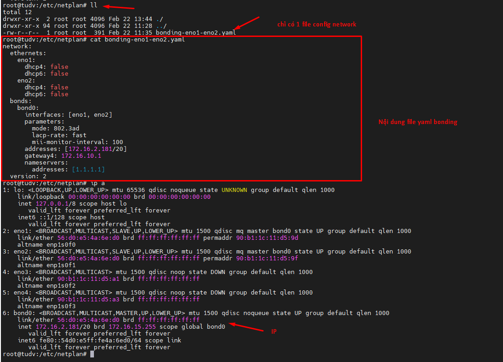
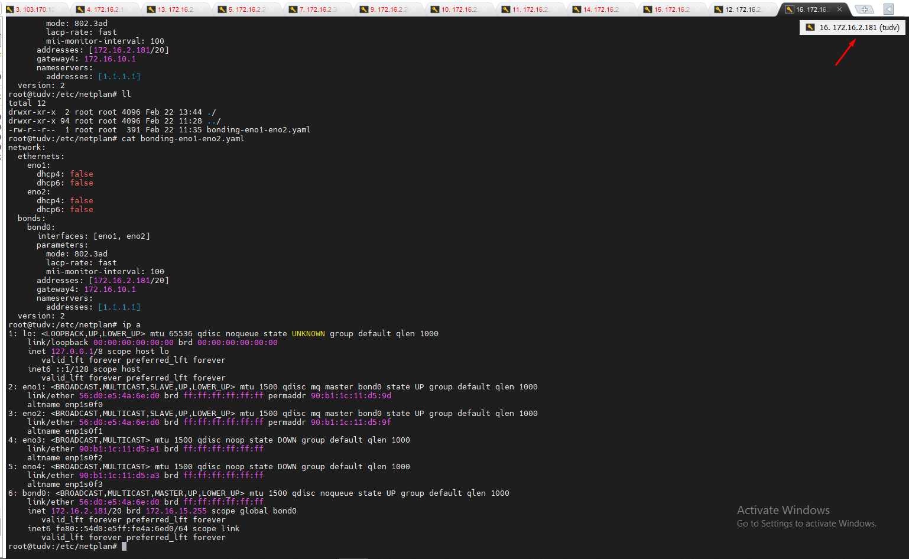
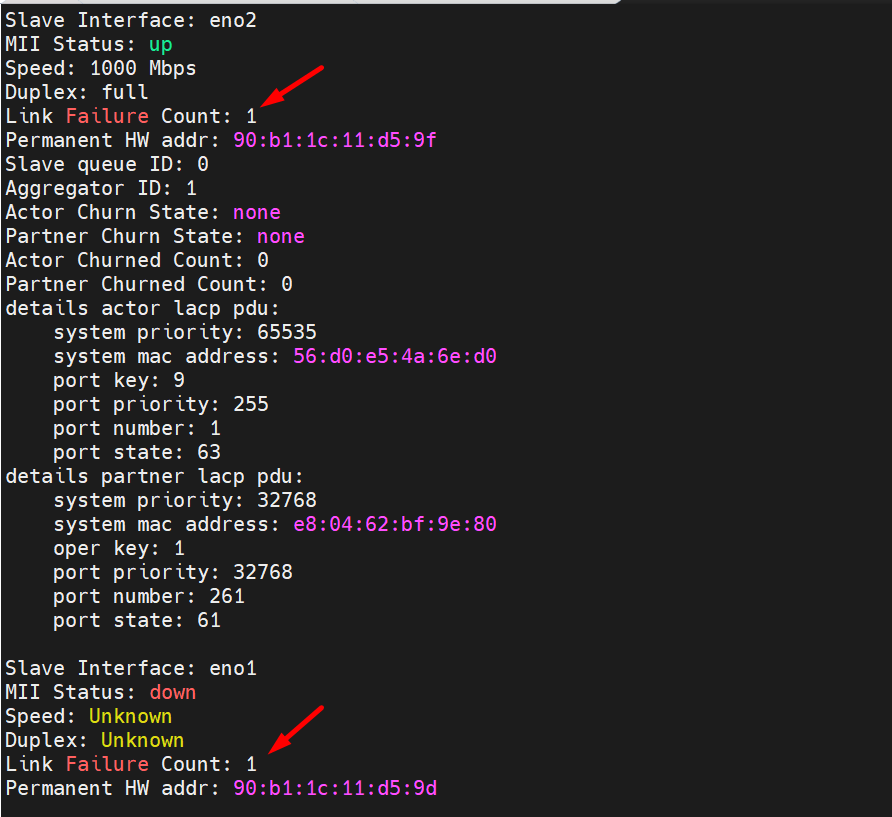
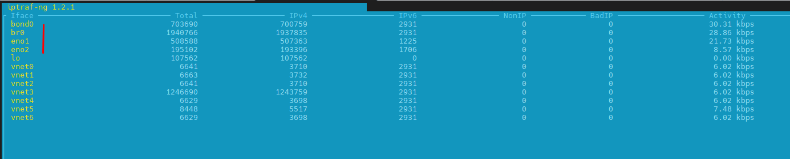
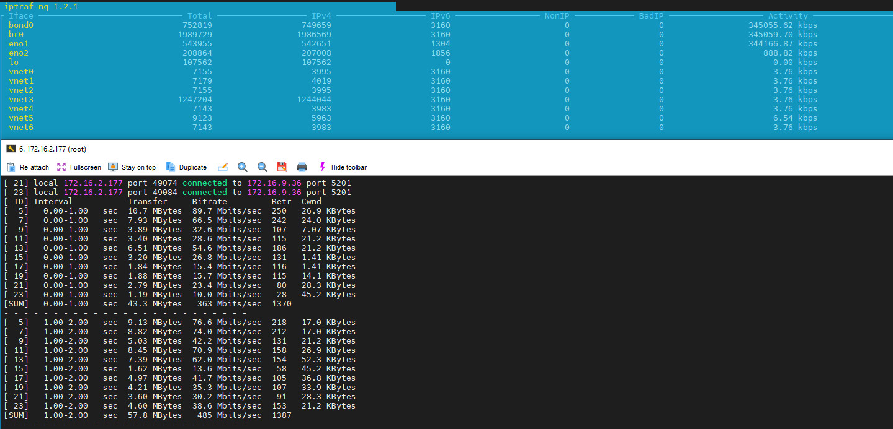

## Tìm hiểu các mode bonding trên Linux - các khái niệm - thực hành

#### Frame

Trong mạng máy tính, khái niệm "frame" đề cập đến một đơn vị dữ liệu cơ bản được truyền trên một mạng, đặc biệt là ở lớp liên kết dữ liệu (data link layer) của mô hình OSI.

Một frame bao gồm các thành phần chính sau:

  + Tiêu đề (Header): Chứa các thông tin cần thiết để định tuyến và xử lý khung dữ liệu, như địa chỉ nguồn, địa chỉ đích, kiểm tra lỗi, v.v.

  + Tải (Payload): Là dữ liệu thực tế cần được truyền, ví dụ như gói tin IP, khung Ethernet, v.v.

  + Đuôi (Trailer): Chứa thông tin để kiểm tra lỗi, như checksum hoặc FCS (Frame Check Sequence).

Các đặc điểm chính của frame:

  + Kích thước: Khung dữ liệu có kích thước tối đa và tối thiểu nhất định, tùy thuộc vào giao thức mạng. Ví dụ, khung Ethernet có kích thước tối đa là 1500 byte.

  + Định dạng: Định dạng của frame phụ thuộc vào giao thức mạng, ví dụ như Ethernet, Wi-Fi, PPP, v.v.

  + Kiểm tra lỗi: Frame thường chứa các cơ chế kiểm tra lỗi, như checksum hoặc FCS, để phát hiện và xử lý các lỗi truyền dẫn.

  + Địa chỉ: Frame chứa địa chỉ nguồn và đích để định tuyến và chuyển tiếp dữ liệu đến đúng nơi.

Khái niệm frame là rất quan trọng trong hoạt động của các giao thức mạng, vì nó xác định cách dữ liệu được đóng gói và truyền qua mạng. Hiểu rõ về frame giúp ta có thể hiểu và phân tích hoạt động của các giao thức mạng một cách hiệu quả hơn.

#### Mode 0 (balance-rr - Round-Robin):

    Phân phối các frame luân phiên qua các slave interface.

    Chính sách vòng tròn: Truyền các gói theo thứ tự tuần tự từ slave đầu tiên khả dụng đến slave cuối cùng. Chế độ này cung cấp khả năng cân bằng tải và khả năng chịu lỗi.

    Cân bằng tải tốt, nhưng không đảm bảo thứ tự các frame.

#### Mode 1 (active-backup):

    Chính sách active-backup: Chỉ có một slave trong liên kết hoạt động. Một slave khác sẽ hoạt động nếu và chỉ nếu slave đang hoạt động bị lỗi. Địa chỉ MAC của liên kết chỉ hiển thị bên ngoài trên một cổng (bộ điều hợp mạng) để tránh nhầm lẫn cho bộ chuyển mạch. 
    
    Chế độ này cung cấp khả năng chịu lỗi. Tùy chọn chính ảnh hưởng đến hành vi của chế độ này.

#### Mode 2 (balance-xor):

    Sử dụng một hàm băm để quyết định gửi frame qua slave nào.
    
    Chính sách XOR: Truyền dựa trên thuật toán băm có thể lựa chọn. Chính sách mặc định là thuật toán địa chỉ MAC nguồn + đích đơn giản. Có thể chọn các chính sách truyền thay thế thông qua tùy chọn xmit_hash_policy, được mô tả bên dưới. 

    Chế độ này cung cấp khả năng cân bằng tải và khả năng chịu lỗi.

    Đảm bảo thứ tự các frame

#### Mode 3 (broadcast):

    Gửi tất cả các frame qua tất cả các slave interface.( ruyền mọi thứ trên tất cả các giao diện slave)

    Chế độ này cung cấp khả năng chịu lỗi. nhưng không cân bằng tải.

#### Mode 4 (802.3ad - Dynamic Link Aggregation):

    Sử dụng LACP (Link Aggregation Control Protocol) để tự động cấu hình các kết nối.

    IEEE 802.3ad Tổng hợp liên kết động. Tạo các nhóm tổng hợp chia sẻ cùng một cài đặt tốc độ và song công. Sử dụng tất cả các slave trong bộ tổng hợp đang hoạt động theo thông số kỹ thuật 802.3ad.

    Điều kiện tiên quyết:
    
    + Hỗ trợ Ethtool trong trình điều khiển cơ sở để truy xuất tốc độ và song công của từng slave.
    + Một bộ chuyển mạch hỗ trợ tổng hợp liên kết động IEEE 802.3ad. Hầu hết các bộ chuyển mạch sẽ yêu cầu một số loại cấu hình để bật chế độ 802.3ad.

    Cân bằng tải tốt, đảm bảo thứ tự các frame.

#### Mode 5 (balance-tlb - Adaptive Transmit Load Balancing):

    Tự động cân bằng tải ở lớp 2 (MAC) dựa trên tải của mỗi slave.

    Cân bằng tải truyền thích ứng: liên kết kênh không yêu cầu bất kỳ hỗ trợ chuyển mạch đặc biệt nào. Lưu lượng truy cập đi được phân phối theo tải hiện tại (tính theo tốc độ) trên mỗi slave. Lưu lượng truy cập đến được nhận bởi slave hiện tại. Nếu slave nhận bị lỗi, một slave khác sẽ tiếp quản địa chỉ MAC của slave nhận bị lỗi.

    Điều kiện tiên quyết:

    + Hỗ trợ Ethtool trong trình điều khiển cơ sở để truy xuất tốc độ của từng slave.

    Không cần LACP, nhưng không đảm bảo thứ tự các frame.

#### Mode 6 (balance-alb - Adaptive Load Balancing):

    Kết hợp cả cân bằng tải ở lớp 2 (MAC) và lớp 3 (IP).

    Cân bằng tải thích ứng: bao gồm balance-tlb cộng với cân bằng tải nhận (rlb) cho lưu lượng IPV4 và không yêu cầu bất kỳ hỗ trợ chuyển mạch đặc biệt nào. Cân bằng tải nhận được thực hiện bằng cách đàm phán ARP. Trình điều khiển liên kết chặn các Phản hồi ARP do hệ thống cục bộ gửi trên đường ra và ghi đè địa chỉ phần cứng nguồn bằng địa chỉ phần cứng duy nhất của một trong các slave trong liên kết sao cho các đối tác khác nhau sử dụng các địa chỉ phần cứng khác nhau cho máy chủ.

    Không cần LACP, đảm bảo tính dự phòng, nhưng không đảm bảo thứ tự các frame.

Tùy thuộc vào yêu cầu của ứng dụng và đặc điểm của mạng, bạn có thể chọn một chế độ bonding phù hợp. Các chế độ 0, 4, 5 và 6 được sử dụng phổ biến nhất.

## Thực hành testing từng mode

Thực hiện config Ether Channel trên Cisco C3750 và 2 port trên ubuntu22.04 với eno1 và eno2

    swcore1#show etherchannel summary

    Flags:  D - down        P - bundled in port-channel
            I - stand-alone s - suspended
            H - Hot-standby (LACP only)
            R - Layer3      S - Layer2
            U - in use      f - failed to allocate aggregator
    
            M - not in use, minimum links not met
            u - unsuitable for bundling
            w - waiting to be aggregated
            d - default port


    Number of channel-groups in use: 0
    Number of aggregators:           0

    Group  Port-channel  Protocol    Ports
    ------+-------------+-----------+-----------------------------------------------

#### Cấu hình switch Cisco nhóm port Gi1/0/3-4 thành Po1

    swcore1(config)#interface range Gi1/0/3-4

    swcore1(config-if-range)#no shutdown

    swcore1(config-if-range)#channel-group 1 mode active

    swcore1(config)# channel-protocol lacp

    swcore1(config)#interface port-channel 1

    swcore1(config-if)#sw trunk encapsulation dot1q

    swcore1(config-if)#sw mode trunk

    swcore1(config-if)#end
    swcore1#wr mem
    Building configuration...
    [OK]

## Bonding 2 port trên server gom thành 1

Mình có máy chủ ubuntu 22.04, mình cài đặt các gói sau:

    apt-get install ifenslave

Tạo file config trong /etc/netplan/

    /etc/netplan/bonding-eno1-eno2.yaml

  

Đã ssh thành công

  

#### 1.mode: 802.3ad

Như bạn nhìn thấy mode trên là mode 4 (802.3ad - Dynamic Link Aggregation):Cân bằng tải tốt, đảm bảo thứ tự các frame.

    mode: 802.3ad 
    lacp-rate: fast

Chúng ta sẽ tiến hành kiểm thử,và đầu tiên chúng ta sẽ check lệnh:

    cat /proc/net/bonding/bond0

Để xem trạng thái và cấu hình của bonding interface.

Check thành viên: 

    root@tudv:~# cat /sys/class/net/bond0/bonding/slaves
    eno2 eno1

Check chi tiết:

    root@tudv:~# cat /proc/net/bonding/bond0
    Ethernet Channel Bonding Driver: v5.15.0-133-generic

    Bonding Mode: IEEE 802.3ad Dynamic link aggregation
    Transmit Hash Policy: layer2 (0)
    MII Status: up
    MII Polling Interval (ms): 100
    Up Delay (ms): 0
    Down Delay (ms): 0
    Peer Notification Delay (ms): 0

    802.3ad info
    LACP active: on
    LACP rate: fast
    Min links: 0
    Aggregator selection policy (ad_select): stable
    System priority: 65535
    System MAC address: 56:d0:e5:4a:6e:d0
    Active Aggregator Info:
        Aggregator ID: 1
        Number of ports: 2
        Actor Key: 9
        Partner Key: 1
        Partner Mac Address: e8:04:62:bf:9e:80

    Slave Interface: eno2
    MII Status: up
    Speed: 1000 Mbps
    Duplex: full
    Link Failure Count: 1
    Permanent HW addr: 90:b1:1c:11:d5:9f
    Slave queue ID: 0
    Aggregator ID: 1
    Actor Churn State: none
    Partner Churn State: none
    Actor Churned Count: 0
    Partner Churned Count: 0
    details actor lacp pdu:
        system priority: 65535
        system mac address: 56:d0:e5:4a:6e:d0
        port key: 9
        port priority: 255
        port number: 1
        port state: 63
    details partner lacp pdu:
        system priority: 32768
        system mac address: e8:04:62:bf:9e:80
        oper key: 1
        port priority: 32768
        port number: 261
        port state: 61

    Slave Interface: eno1
    MII Status: up
    Speed: 1000 Mbps
    Duplex: full
    Link Failure Count: 0
    Permanent HW addr: 90:b1:1c:11:d5:9d
    Slave queue ID: 0
    Aggregator ID: 1
    Actor Churn State: none
    Partner Churn State: none
    Churned Count: 0
    Partner Churned Count: 0
    details actor lacp pdu:
        system priority: 65535
        system mac address: 56:d0:e5:4a:6e:d0
        port key: 9
        port priority: 255
        port number: 2
        port state: 63
    details partner lacp pdu:
        system priority: 32768
        system mac address: e8:04:62:bf:9e:80
        oper key: 1
        port priority: 32768
        port number: 260
        port state: 61
Bạn có thể thấy sự hiện diện của cả 2 port eno1 và eno2

  

Trong ảnh trên mình đã shutdown port eno1 và eno2 mỗi port 1 lần.

Tôi sử dụng phần mềm iptraf-ng để hiển thị băng thông qua các card mạng

  

Và sử dụng iperf3 để test

Cài đặt iperf3:

    apt-get install iperf3

Khởi động iperf3 server:

Trên máy tính sẽ đóng vai trò là server, chạy lệnh:

    iperf3 -s

Lệnh này sẽ khởi động iperf3 server, chờ các kết nối đến.

Thực hiện test từ client:

Trên máy tính sẽ đóng vai trò là client, chạy lệnh:

```Bash
iperf3 -c <server_ip> -P <number_of_threads>

iperf3 -c 172.16.9.36 -P 10

```

  
________________________________________

Thay lần lượt các mode:

```Bash
balance-rr
active-backup
balance-xor
broadcast
balance-tlb
balance-alb
```
