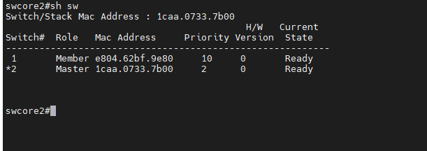
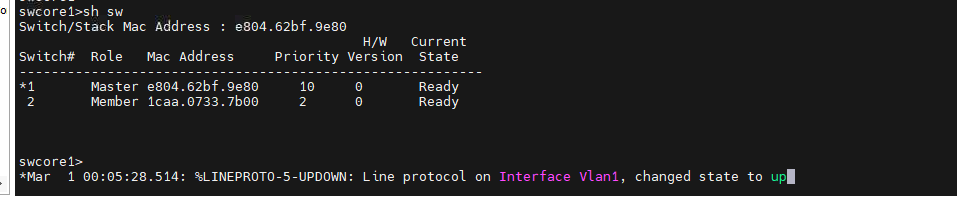
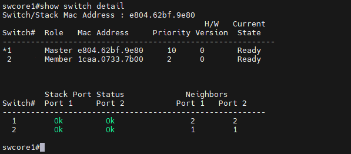
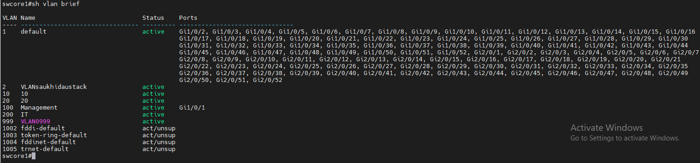
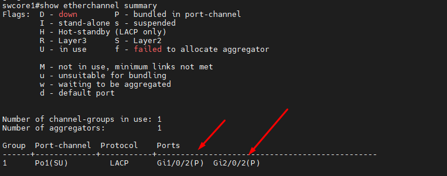
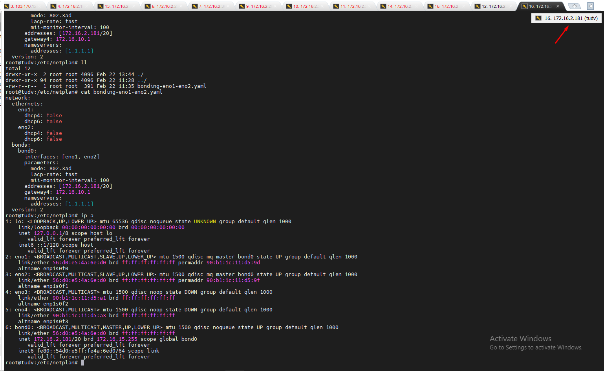
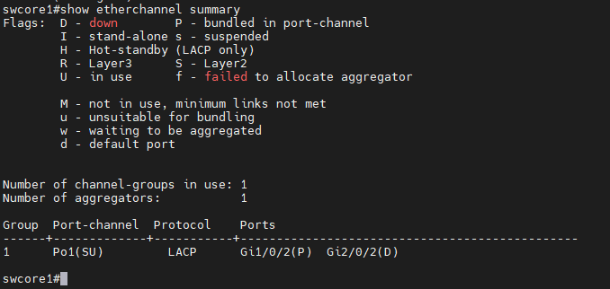
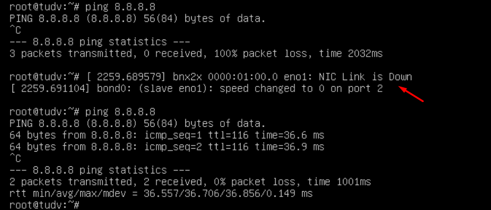
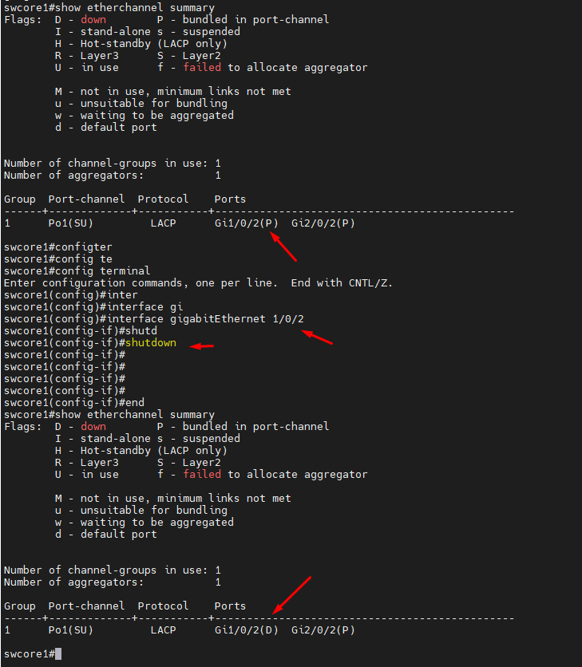
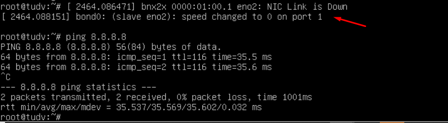

## Phần Lý Thuyết đấu stack

  Switch trong phòng LAB của tôi có vị trí như sau: swcore1-COM3 trên - swcore2-COM4 dưới

#### Các khái niệm trong Stack
  Các khái niệm liên quan đến Stack Switch bao gồm: Switch stack membership, stack member number, stack member priority value, Switch stack bridge ID, bầu cử active switch

#### Switch Stack Membership
  Mối 1 switch độc lập có thể coi là 1 Stack Switch với 1 member và hoạt động như 1 Active Switch. Bạn có thể kết nối 1 switch độc lập khác vào để tạo thành 1 stack với 2 stack member, trong đó có 1 switch được active và 1 switch ở chế độ standby. 

  Nếu như bạn thay thế 1 Stack member bằng 1 switch cùng model, switch mới sẽ có cấu hình và stack member number giống như switch được thay thế

#### Stack Member Numbers
  Một switch mới sẽ có stack member number mặc định là 1. Khi kết nối vào 1 stack, stack member number mặc định sẽ thay đổi thành giá trị stack member number thấp nhất có sẵn trong stack (giá trị này chưa được gán cho member nào)

  Giá trị stack member number là duy nhất và không được trùng nhau trong 1 stack. Giá trị này được gán tự động khi Joint vào stack hoặc bạn có thể gán giá trị này thông qua câu lệnh.

#### Stack Member Priority Values
  Các thành viên trong stack sẽ bầu chọn 1 switch làm Active switch, việc này được tính toán dựa trên chỉ số Priority. Stack member nào có chỉ số Priority cao nhất sẽ có tỉ lệ cao được bầu chọn làm Active switch. Chỉ số priority này có giá trị từ 1 đến 15. Giá trị priority mặc định là 1, bạn có thể kiểm tra thông số này thông qua câu lệnh show switch

    swcore1#show switch

  Theo ảnh sau:

  

  Nhưng tôi muốn swcore1 làm Master nên đã thay đổi lại priority của swcore1 cao hơn của swcore2

    swcore2(config)#hostname swcore1
    swcore1(config)#switch 2 priority 2
    Changing the Switch Priority of Switch Number 2 to 2
    Do you want to continue?[confirm]y
    New Priority has been set successfully

    swcore2(config)#switch 1 priority 10
    Changing the Switch Priority of Switch Number 1 to 10
    Do you want to continue?[confirm]
    New Priority has been set successfully

    swcore1#reload

  Sau khi chạy lệnh thay đổi, tôi check kiểm tra ngay không thấy quá trình bầu chọn diễn ra

  
  
  Thực hiện reboot swcore1 là switch có priority cao hơn khi check hiện tại

    swcore1#reload

  Quá trình boot hoàn tất tôi đã có config như ý muốn, MAC address của stack cũng đã thay đổi:

  

  Bạn nên chọn 1 switch là Active Switch và đặt chỉ số priority cao nhất cho switch này để đảm bảo Switch này có tỉ lệ cao được chọn là Active nếu có xảy ra quá trình bầu chọn lại active switch

#### Bridge ID

  Mỗi stack switch trong mạng được xác định bằng bridge ID, là địa chia MAC của Switch Master và cũng được coi là stack MAC address. Nếu như Stack Master thay đổi thì bridge ID này sẽ là địa chỉ MAC của Stack master mới. 

  Tuy nhiên, bạn cũng có thể sử dụng tính năng "persistent MAC address" để đặt thời gian delay trước khi stack MAC address thay đổi. Nếu trong khoảng thời gian này Switch Master cũ Joint lại vào stack thì địa chỉ MAC của stack vẫn giữ nguyên, ngay cả khi switch này không được bầu chọn làm master nữa. Khi hết thời gian này, địa chỉ MAC của stack sẽ được thay thế bằng địa chỉ MAC của stack master mới.

#### Quá trình bầu cử Active Switch

  Các stack member đều có thể là active switch hoặc standby switch. Nếu như active switch bị lỗi, standby switch sẽ được đưa lên là active switch. Quá trình bầu cử xảy ra khi trong hệ thống có 1 trong các nguyên nhân sau:

    Stack switch được reset lại.
    Active switch lỗi, reset, tắt nguồn hoặc được tháo ra khỏi stack
    Thêm member vào stack

#### Quá trình bầu chọn stack switch master dựa vào các tiêu chí sau và theo thứ tự ưu tiên từ trên xuống:

    Switch đang là switch Master trong stack
    Switch member với chỉ số priority cao nhất
    Switch có thời gian khởi động ngắn nhất
    Switch có địa chỉ MAC thấp nhất

#### Kích hoạt tính năng Persistent MAC Address

  Khi kích hoạt tính năng này, sẽ có 1 cảnh báo về những hậu quả của tính năng này. Khi kích hoạt tính năng này, sẽ có 1 khoảng thời gian delay trước địa chỉ MAC của stack chuyển sang địa chỉ MAC của switch active mới. Nếu trong khoảng thời gian này, bạn mang switch active cũ lắp vào 1 địa điểm khác trong mạng. Lúc này trong mạng sẽ có 2 địa chỉ MAC trùng nhau sẽ dẫn tới xung đột mạng và dẫn tới mất traffic.

    swcore1# configure terminal

    swcore1(config)# stack-mac persistent timer [time-value]

  Giá trị time-value là khoảng thời gian delay trước khi địa chỉ MAC được thay đổi, giá trị này được đặt từ 1 đến 60 phút

  Giá trị time-value = 0 tương ứng việc địa chỉ MAC của stack sẽ không thay đổi khi có sự thay đổi stack switch master. Địa chỉ MAC chỉ thay đổi khi tắt tính năng này đi bằng câu lệnh

    swcore1(config)#no stack-mac persistent timer

  Nếu như không có giá trị nào được đặt thì mặc định thời gian delay là 4 phút,tất cả cấu hình này đều được thực hiện trên stack switch master.

  Lệnh:

    swcore1#show switch 

  Thay đổi number mới cho 1 switch bằng lệnh: switch current-stack-member-number renumber new-stack-member-number

    swcore1#switch 2 renumber 5

  Reload lại switch member có number vừa thay đổi

    swcore1#reload slot 5

#### Xóa 1 Switch ra khỏi stack

 Kiểm tra member number của switch chuẩn bị tháo ra khỏi stack bằng lệnh ``show switch``

    swcore1#show switch

 Tháo Switch ra khỏi stack. Ví dụ stack có 2 member, stack member 1 đang là active switch, stack member 2 là switch đang muốn tháo ra khỏi stack. Để tránh thông báo lỗi bạn nên rút dây nguồn member 2, tháo cable stack, và kết nối cable giữa các member còn lại trong stack, sau đó mới sử dụng câu lệnh: no switch stack-member-number provision

  Xóa bỏ thông tin switch vừa tháo ra khỏi stack

    swcore1#no switch 2 provision

## Giám sát stack switch

  Các lệnh dùng để theo dõi stack

#### Hiển thị thông tin tóm tắt về stack switch, bao gồm switch number, poriority, role là active hay standby, trạng thái switch

   swcore1#show switch

#### Hiển thị thông tin của 1 stack member chỉ định

    show switch stack-member-number

    show switch detail

  Hình ảnh hiển thị thông tin chi tiết của stack

  

#### Hiển thị hàng xóm của stack

    show switch neighbors

## Thực hành stack : Đấu stack và config 2 port trên 2 switch gom thành 1 + 2 port trên server gom thành 1

### Đấu stack :

  Cắm dây stack vào switch, do mình đấu stack 2 switch nên đấu chéo: Port stack1 của switch1 nối với Port stack 2 của switch 2, Port stack2 của switch1 nối với Port stack 1 của switch 2, 
  
  Sau khi cắm xong và reload(reboot) mình sử dụng lệnh 

    swcore1#sh vlan brief

  Để có cái nhìn tổng quan nhất, sau khi đấu stack tôi đã có tổng Gi1/0/1-52 và Gi2/0/52 = 104 Port giống nhau.

  

#### Trước tiên cần kiểm tra trước:

    show etherchannel summary

  Xác định các interface đang được cấu hình channel-group:

  Từ kết quả, bạn sẽ thấy các interface đang thuộc các channel-group (nếu trước đó đã có config).

  Xóa cấu hình channel-group trên các interface:

    swcore1#interface <interface_id> no channel-group

  Thay <interface_id> bằng ID của các interface cần xóa cấu hình, ví dụ Gi1/0/2.

  Xóa cấu hình port-channel:

    swcore1# no interface port-channel <channel_number>

  Thay <channel_number> bằng số của port-channel.

#### Tiến hành config 

##### 1. Port Gi1/0/2 và Gi2/0/2trên 2 switch gom thành 1 

  Config switch

    swcore1(config)#interface gigabitEthernet 1/0/2
    swcore1(config-if)#sw mode access
    swcore1(config)#interface gigabitEthernet 2/0/2
    swcore1(config-if)#sw mode access

    swcore1#configure terminal
    Enter configuration commands, one per line.  End with CNTL/Z.
    swcore1(config)#interface range Gi1/0/2
    swcore1(config-if-range)#channel-group 1 mode active
    Creating a port-channel interface Port-channel 1
    swcore1(config-if-range)#exit

    swcore1(config)#interface range Gi2/0/2
    swcore1(config-if-range)#channel-group 1 mode active
    swcore1(config-if-range)#exit

    swcore1(config)#interface port-channel 1
    swcore1(config-if)#end
    swcore1#wr mem
    Building configuration...
    [OK]

  Show: `show etherchannel summary` Gi1/0/2(P)  Gi2/0/2(P) - Trạng thái P cả 2 port

  

##### 2. Hai port trên server gom thành 1

  Mình có máy chủ ubuntu 22.04, mình cài đặt các gói sau:

    apt-get install ifenslave

  Tạo file config trong /etc/netplan/

  /etc/netplan/bonding-eno1-eno2.yaml

  

  Đã ssh thành công

  

#### Kiểm thử:

  Thử shutdown 1 port Gi2/0/2

    swcore1(config)#interface gigabitEthernet 2/0/2
    swcore1(config-if)#shu
    swcore1(config-if)#shutdown
    swcore1(config-if)#end
    swcore1#wr mem
    Building configuration...
    [OK]
 
  Kiểm tra lại `swcore1#show etherchannel summary` thì thấy port gigabitEthernet 2/0/2 chuyển trạng thái Gi1/0/2(P) sang Gi2/0/2(D)

  

  Máy chủ ubuntu vẫn hoạt động bình thường

  

  Giờ mình no shutdown gigabitEthernet 2/0/2 và shutdown gigabitEthernet 1/0/2

  Gi1/0/2 đã chuyển trạng thái (P) sang (D)

  

  Máy chủ vẫn hoạt động bình thường:

  

