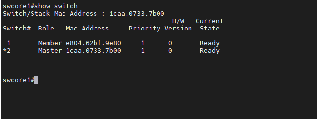

## Đấu stack: 2 port trên 2 switch gom thành 1 + 2 port trên server gom thành 1

#### sw1-COM3 trên - sw2-COM4 dưới

Các khái niệm trong Stack
Các khái niệm liên quan đến Stack Switch bao gồm: Switch stack membership, stack member number, stack member priority value, Switch stack bridge ID, bầu cử active switch

Switch Stack Membership
Mối 1 switch độc lập có thể coi là 1 Stack Switch với 1 member và hoạt động như 1 Active Switch. Bạn có thể kết nối 1 switch độc lập khác vào để tạo thành 1 stack với 2 stack member, trong đó có 1 switch được active và 1 switch ở chế độ standby. 

Nếu như bạn thay thế 1 Stack member bằng 1 switch cùng model, switch mới sẽ có cấu hình và stack member number giống như switch được thay thế

Stack Member Numbers
Một switch mới sẽ có stack member number mặc định là 1. Khi kết nối vào 1 stack, stack member number mặc định sẽ thay đổi thành giá trị stack member number thấp nhất có sẵn trong stack (giá trị này chưa được gán cho member nào)

Giá trị stack member number là duy nhất và không được trùng nhau trong 1 stack. Giá trị này được gán tự động khi Joint vào stack hoặc bạn có thể gán giá trị này thông qua câu lệnh.

Stack Member Priority Values
Các thành viên trong stack sẽ bầu chọn 1 switch làm Active switch, việc này được tính toán dựa trên chỉ số Priority. Stack member nào có chỉ số Priority cao nhất sẽ có tỉ lệ cao được bầu chọn làm Active switch. Chỉ số priority này có giá trị từ 1 đến 15. Giá trị priority mặc định là 1, bạn có thể kiểm tra thông số này thông qua câu lệnh show switch

    swcore1#show switch

  Theo ảnh sau:

  

Bạn nên chọn 1 switch là Active Switch và đặt chỉ số priority cao nhất cho switch này để đảm bảo Switch này có tỉ lệ cao được chọn là Active nếu có xảy ra quá trình bầu chọn lại active switch

Switch Stack Bridge ID
Mỗi stack switch trong mạng được xác định bằng bridge ID, là địa chia MAC của Switch Master và cũng được coi là stack MAC address. Nếu như Stack Master thay đổi thì bridge ID này sẽ là địa chỉ MAC của Stack master mới. 

Tuy nhiên, bạn cũng có thể sử dụng tính năng "persistent MAC address" để đặt thời gian delay trước khi stack MAC address thay đổi. Nếu trong khoảng thời gian này Switch Master cũ Joint lại vào stack thì địa chỉ MAC của stack vẫn giữ nguyên, ngay cả khi switch này không được bầu chọn làm master nữa. Khi hết thời gian này, địa chỉ MAC của stack sẽ được thay thế bằng địa chỉ MAC của stack master mới.

Quá trình bầu cử Active Switch
Các stack member đều có thể là active switch hoặc standby switch. Nếu như active switch bị lỗi, standby switch sẽ được đưa lên là active switch. Quá trình bầu cử xảy ra khi trong hệ thống có 1 trong các nguyên nhân sau:

Stack switch được reset lại.
Active switch lỗi, reset, tắt nguồn hoặc được tháo ra khỏi stack
Thêm member vào stack
Quá trình bầu chọn stack switch master dựa vào các tiêu chí sau và theo thứ tự ưu tiên từ trên xuống:

Switch đang là switch Master trong stack
Switch member với chỉ số priority cao nhất
Switch có thời gian khởi động ngắn nhất
Switch có địa chỉ MAC thấp nhất
Cấu hình stack Switch
Kích hoạt tính năng Persistent MAC Address
Khi kích hoạt tính năng này, sẽ có 1 cảnh báo về những hậu quả của tính năng này. Khi kích hoạt tính năng này, sẽ có 1 khoảng thời gian delay trước địa chỉ MAC của stack chuyển sang địa chỉ MAC của switch active mới. Nếu trong khoảng thời gian này, bạn mang switch active cũ lắp vào 1 địa điểm khác trong mạng. Lúc này trong mạng sẽ có 2 địa chỉ MAC trùng nhau sẽ dẫn tới xung đột mạng và dẫn tới mất traffic.