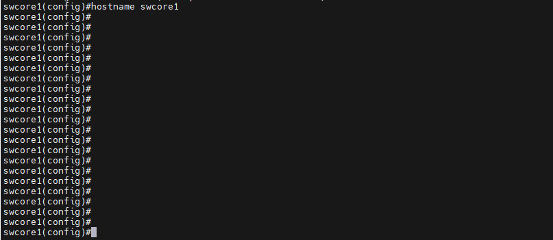
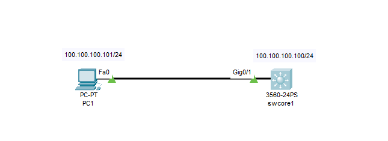
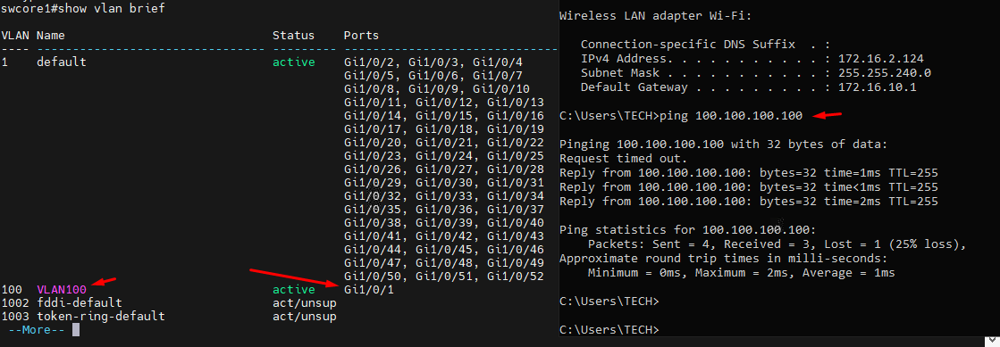
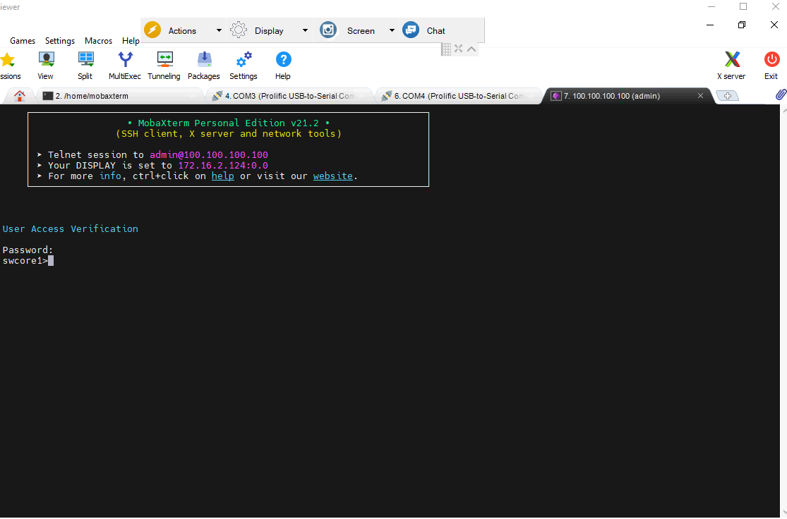
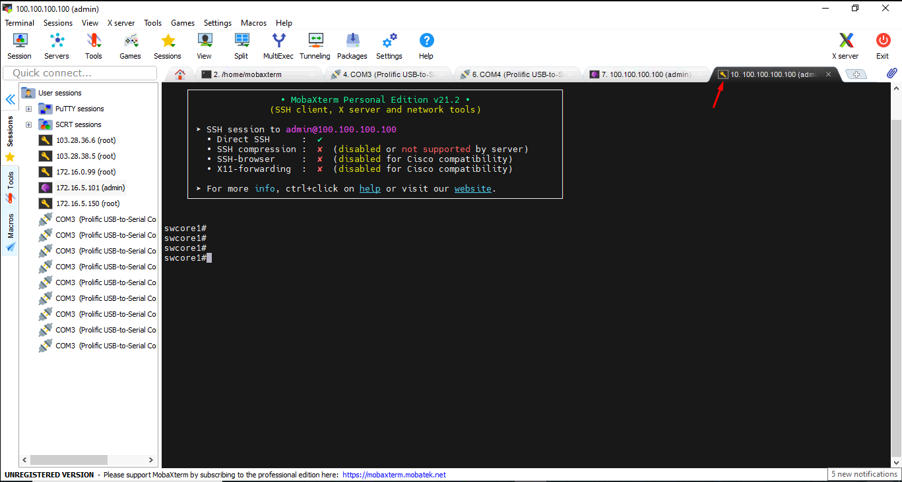

Dưới đây là các bước cơ bản để cấu hình hostname, IP management, đồng bộ thời gian và NTP trên switch Cisco layer 3:

    Switch>enable
    Switch#configure terminal

#### Đặt hostname:

    Switch(config)#hostname swcore1

  Hình ảnh:

  

#### Cấu hình IP management:

  

  Khai báo vlan 100 là VLAN quản lý,đặt IP interface vlan, sau đó cắm dây mạng PC vào port GigabitEthernet1/0/1:  
    
    swcore1(config)#vlan 100
    swcore1(config-vlan)#name Management    
    swcore1(config)#interface vlan 100
    swcore1(config-if)#ip address 100.100.100.100 255.255.255.0
    swcore1(config-if)#no shutdown 
    swcore1(config)#interface GigabitEthernet1/0/1
    swcore1(config-if)#switchport access vlan 100
    swcore1(config-if)#end
    swcore1#copy running-config startup-config 

  Kết quả:

  

#### Cấu hình Telnet

    swcore1>enable
    swcore1#configure terminal
    swcore1(config)#line vty 0 15
    swcore1(config-line)#transport input telnet
    swcore1(config-line)#password 123456
    swcore1(config-line)#login
    swcore1(config-line)#exit
    swcore1(config)#enable password 123456

    swcore1#copy running-config startup-config 
    Destination filename [startup-config]? 
    Building configuration...
    [OK]

  Sau khi cài xong telnet ta dùng Mobaxtem connect đến theo port 23 với user là admin pass là 123456

  

#### SSH

    swcore1>enable

  Nhập password đã tạo: 123456

    swcore1#configure terminal
    swcore1(config)#ip domain-name swcore1
    swcore1(config)#crypto key generate rsa
    The name for the keys will be: swcore1.swcore1
    Choose the size of the key modulus in the range of 360 to 2048 for your
    General Purpose Keys. Choosing a key modulus greater than 512 may take
    a few minutes.
    How many bits in the modulus [512]: 768
    swcore1(config)#ip ssh version 2
    *Feb 19 7:8:3.178: %SSH-5-ENABLED: SSH 1.99 has been enabled
    swcore1(config)#username admin privilege 15 password 12345678aA@
    swcore1(config)#line vty 0 15
    swcore1(config-line)#transport input ssh
    swcore1(config-line)#login local
    swcore1(config-line)#end
    swcore1#copy running-config startup-config 
    Destination filename [startup-config]? 
    Building configuration...
    [OK]

   Set timeout interval

    swcore1(config)#line vty 0 15
    swcore1(config-line)#exec-timeout 15

  Hình ảnh ssh:

    
    
#### Cấu hình đồng hồ thời gian:
    swcore1#show clock detail
    swcore1#clock set <hh:mm:ss> <dd> <month> <yyyy>

  The options are:
  hh:mm:ss - Specifies the current time in hours (military format), minutes, and seconds. The range are the following:
  + hh - 0 to 23
  + mm - 0 to 59
  + ss - 0 to 59

   Set time thủ công

    swcore1#clock set 13:33:16 19 Feb 2025
    swcore1#configure terminal
    swcore1(config)#clock timezone UTC -7
    swcore1(config)#exit
    swcore1#show clock
    6:43:41.339 UTC Wed Feb 19 2025

  + zone - The acronym of the time zone. The range is up to four characters.
  + hours-offset - The hours difference from UTC. The range is from -12 to +13.
  + minutes-offset - (Optional) The minutes difference from UTC. The range is from 0 to 59.
  + day - Specifies the current day of the month. The range is from 1 to 31.
  + month - Specifies the current month using the first three letters of the month name. The range is from Jan (January) to Dec (December).
  + year - Specifies the current year. The range is from year 2000 up to 2037.

#### Cấu hình NTP (Network Time Protocol):

  + ntp server <ntp_server_ip_address>

  Thực hiện

    swcore1(config)#ntp server 14.248.82.194 //để chỉ định địa chỉ IP của NTP server.
    swcore1(config)#ntp update-calendar //để cập nhật đồng hồ hệ thống từ NTP.
    swcore1(config)end
    swcore1#copy running-config startup-config 
    Destination filename [startup-config]? 
    Building configuration...
    [OK]

  Ảnh kiểm tra:

  
