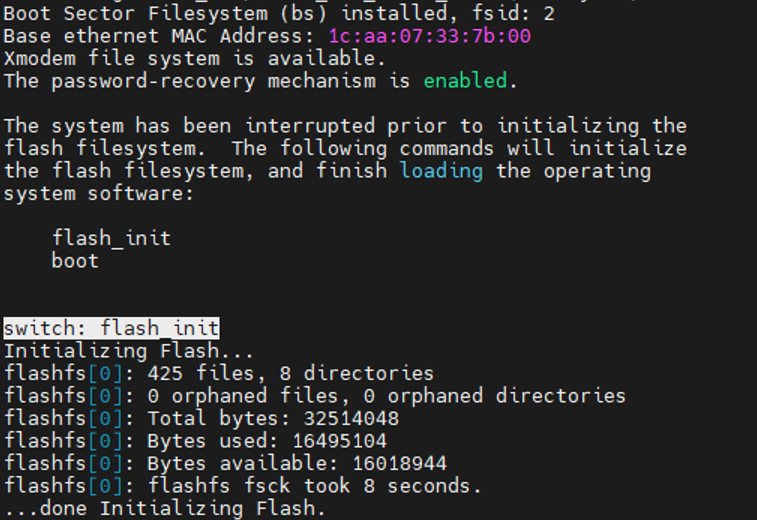
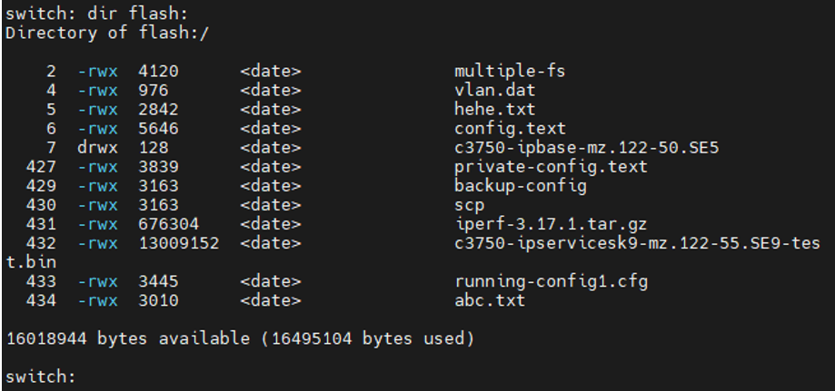
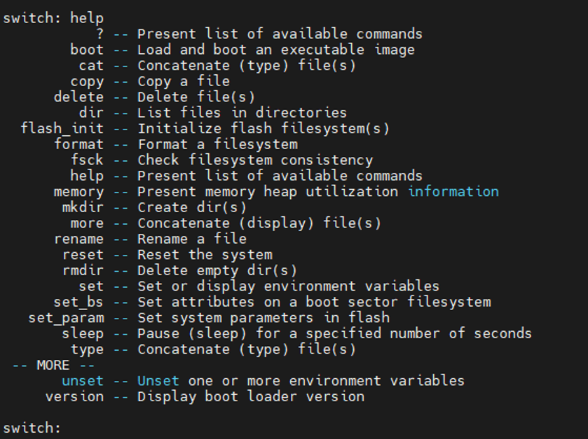
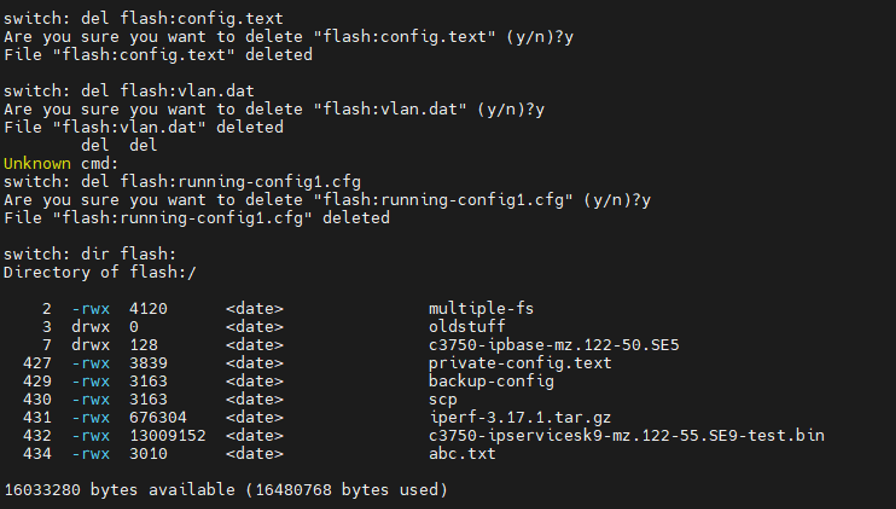
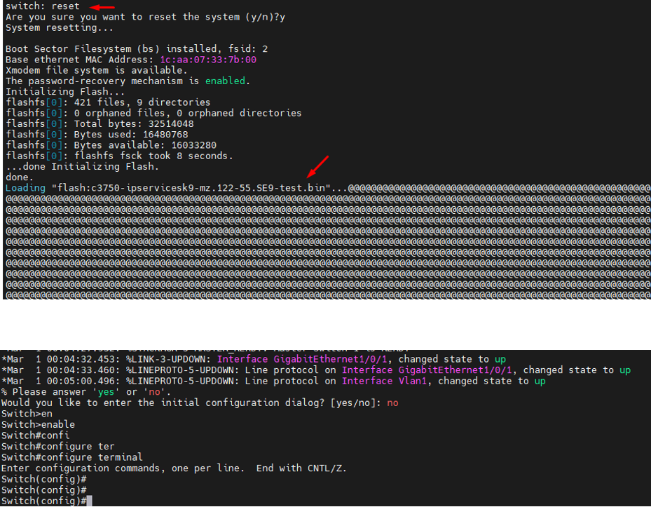

## Reset Factory Cisco 3750

  Reset switch về cài đặt mặc định:

  + Tắt nguồn switch.
  + Giữ nút "Mode" trên switch tầm 30s và bật nguồn lại.
  + Đợi cho đến khi các đèn LED nhấp nháy(nháy xanh chuyển cam ), sau đó thả nút "Mode".
  + Switch sẽ khởi động lại với cài đặt mặc định.

  Khi switch reboot đúng vào mode recovery, giao diện terminal xuất hiện 
    
    switch:

  

  Sau đó gõ lệnh:

    switch: flash_init

  và
 
    switch: dir flash:

  

    switch: help

  

  Nếu cần backup gì, bạn hãy dùng lệnh mkdir và copy nhé

    mkdir flash:oldstuff

  Del các file config:

    switch: del flash:vlan.dat
    switch: del flash:config.text

  

  Để lại và file OS

    c3750-ipservicesk9-mz.122-55.SE9-test.bin

  Sau đó:

    switch: reset

  

  Xử lý trường hợp quên mật khẩu admin:

  Tắt nguồn switch.

  Giữ nút "Mode" trên switch và bật nguồn lại.

  Đợi cho đến khi các đèn LED nhấp nháy, sau đó thả nút "Mode".

  Switch sẽ khởi động lại ở chế độ "Password Recovery".

  Sử dụng giao diện console để truy cập switch.

  Tại dấu nhắc, nhập lệnh no enable password để xóa mật khẩu admin.

  Nhập lệnh write erase để xóa cấu hình hiện tại.

  Nhập lệnh reload để khởi động lại switch với cài đặt mặc định.

## Lưu ý:

  Quá trình reset sẽ xóa toàn bộ cấu hình hiện tại của switch.

  Sau khi reset, switch sẽ khởi động lại với cài đặt mặc định, bao gồm:

  Hostname: Switch

  Địa chỉ IP quản lý: 192.168.1.1/24

  Mật khẩu admin: cisco