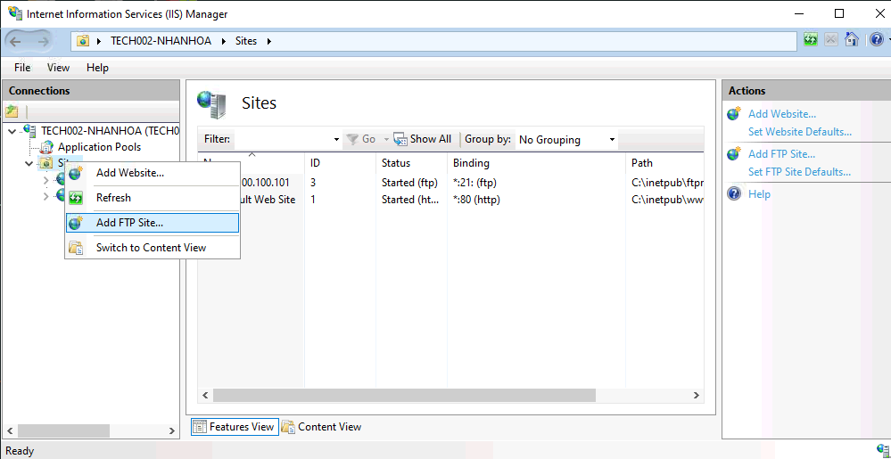
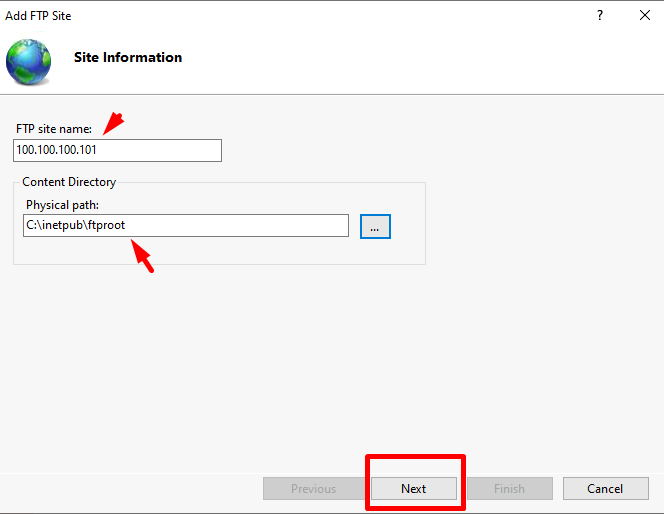
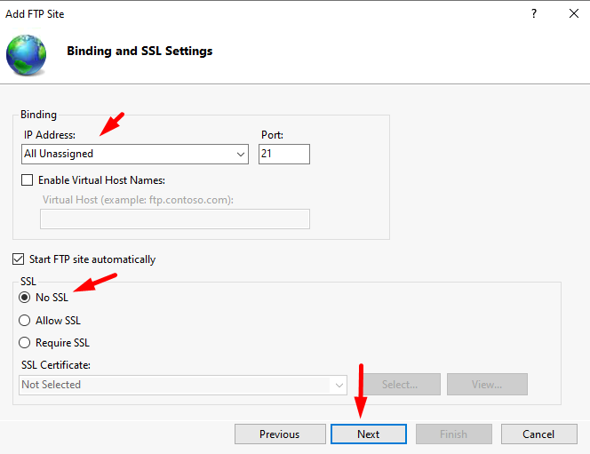
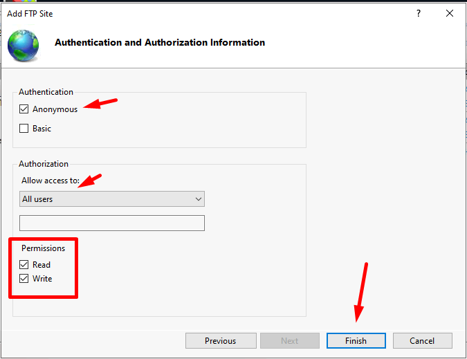
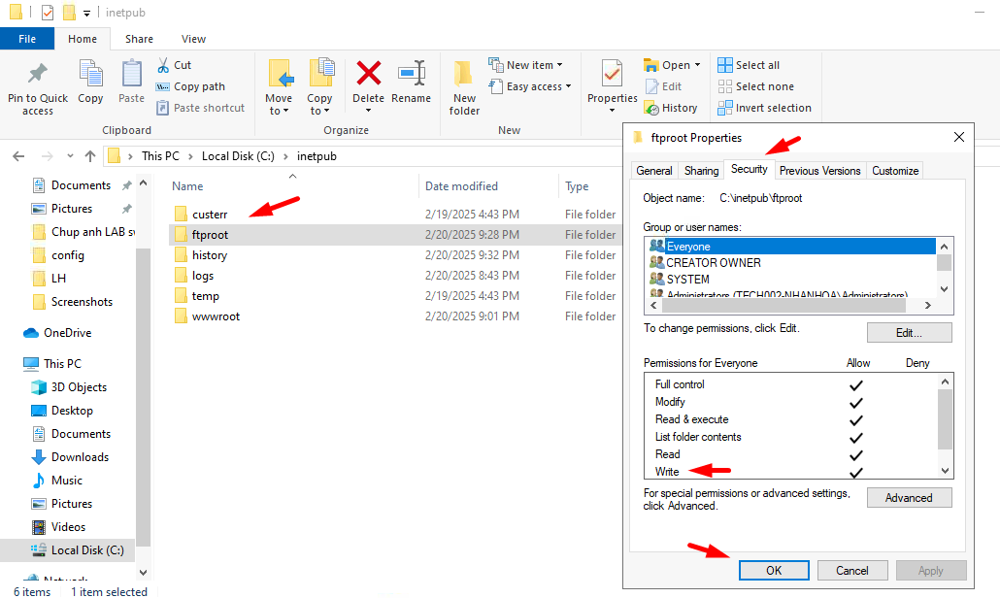
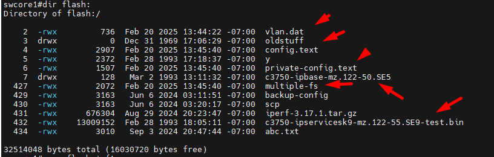
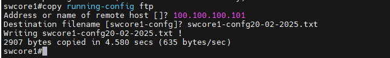
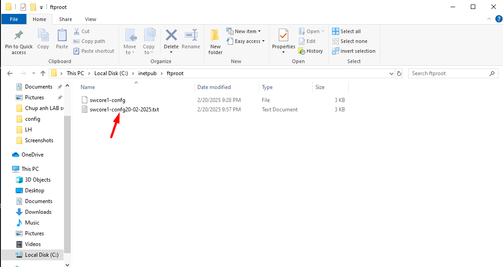
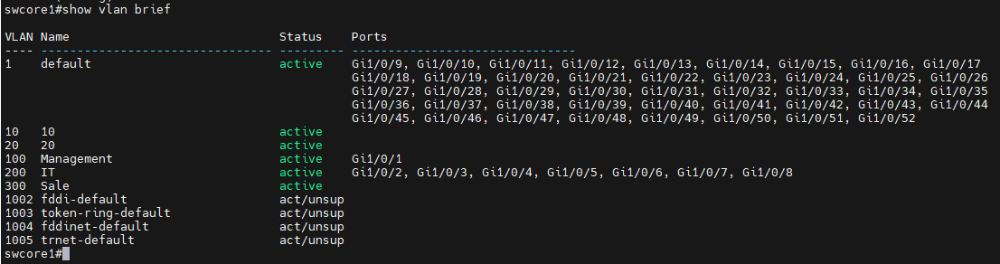

## Sao lưu (Backup) cấu hình switch:
  Mình dựng 1 IIS FTP SERVER, sau đó backup thủ công config sw về FTP server IIS này, nếu an toàn thì có thể cài FTPs server hoặc Retrics IP của các switch 
  được phép kết nối đến FTP server này.
  IP máy chủ FTP 100.100.100.101
 
  

  

  

  

  Tại docroot của ftp server, mình thêm người dùng everyone được quyền write

  

  Kết nối switch với máy tính thông qua giao diện console hoặc ssh

  Sử dụng lệnh copy running-config ftp để sao lưu cấu hình đang chạy (running-config) lên một máy chủ FTP.

    switch# copy running-config ftp
    Address or name of remote host []? <ip_address_tftp_server>
    Destination filename [switch-config]? <filename>

  Để backup file image từ bộ nhớ flash của router ra ftp server ta dùng lệnh,lưu ý các file trong mũi tên chỉ:

    swcore1#dir flash:

  

    switch#copy flash: ftp

  Nhập địa chỉ IP của máy chủ FTP và tên tệp tin cấu hình, sau đó bấm Enter để bắt đầu quá trình sao lưu.
  Ví dụ:

    swcore1#copy running-config ftp
    Address or name of remote host []? 100.100.100.101
    Destination filename [swcore1-confg]? swcore1-confg20-02-2025.txt
    Writing swcore1-confg20-02-2025.txt !
    2907 bytes copied in 4.580 secs (635 bytes/sec)

  

  Kiểm tra trên FTP server file swcore1-confg20-02-2025.txt đã được tranfer về.

  

## Khôi phục (Restore) cấu hình switch:

  Kết nối switch với máy tính thông qua giao diện console hoặc ssh.
  Truy cập giao diện dòng lệnh (CLI) của switch.
  Sử dụng lệnh copy ftp running-config để khôi phục cấu hình từ máy chủ FTP.

    switch# copy tftp running-config
    Address or name of remote host []? <ip_address_tftp_server>
    Source filename []? <filename>

  Nhập địa chỉ IP của máy chủ FTP và tên tệp tin cấu hình, sau đó bấm Enter để bắt đầu quá trình khôi phục.

  Sau khi quá trình khôi phục hoàn tất, bạn có thể sử dụng lệnh show running-config để xác nhận cấu hình đã được khôi phục thành công.

  Ví dụ:

  Cấu hình hiện hiện tại đã backup trước đó swcore1-confg20-02-2025.txt : không có vlan 10 20 

  Mình đã thêm vlan 10 20

  
 

#### Để Upgrade file cấu hình từ ftp server vào bộ nhớ RAM của sw ta dùng lệnh:
    swcore1#copy ftp: running-config
    Address or name of remote host []? 100.100.100.101
    Source filename []? swcore1-confg20-02-2025.txt
    Destination filename [running-config]?
    Accessing ftp://100.100.100.101/swcore1-confg20-02-2025.txt...
    Loading swcore1-confg20-02-2025.txt !
    [OK - 2907/4096 bytes]
    % Generating 1024 bit RSA keys, keys will be non-exportable...[OK]
    Failed to generate persistent self-signed certificate.
    Secure server will use temporary self-signed certificate.
    2907 bytes copied in 18.027 secs (161 bytes/sec)
    swcore1#write mem 
    swcore1#copy running-config startup-config
    
#### Để Upgrade file cấu hình từ ftp server vào bộ nhớ NVRAM của sw ta dùng lệnh:

    swcore1#copy ftp: startup-config
    Address or name of remote host []? 100.100.100.101
    Source filename []? swcore1-confg20-02-2025.txt
    Destination filename [startup-config]? 
    Accessing tftp://100.100.100.101/swcore1-confg20-02-2025.txt
    Loading swcore1-confg20-02-2025.txt from 100.100.100.101: !
    [OK - 1633 bytes]
    1633 bytes copied in 0 secs
    swcore1#write mem
    swcore1#copy running-config startup-config

  

#### Lưu ý:

  Đảm bảo switch và máy chủ TFTP ở cùng mạng LAN hoặc có đường kết nối mạng phù hợp.
  Nếu sử dụng giao thức HTTPS thay vì TFTP, các lệnh tương ứng sẽ là copy running-config https và copy https running-config.
  Sau khi khôi phục cấu hình, bạn nên kiểm tra lại toàn bộ cấu hình để đảm bảo hoạt động đúng.
  Quá trình sao lưu và khôi phục cấu hình switch là rất quan trọng để có thể dễ dàng phục hồi cấu hình khi cần thiết.