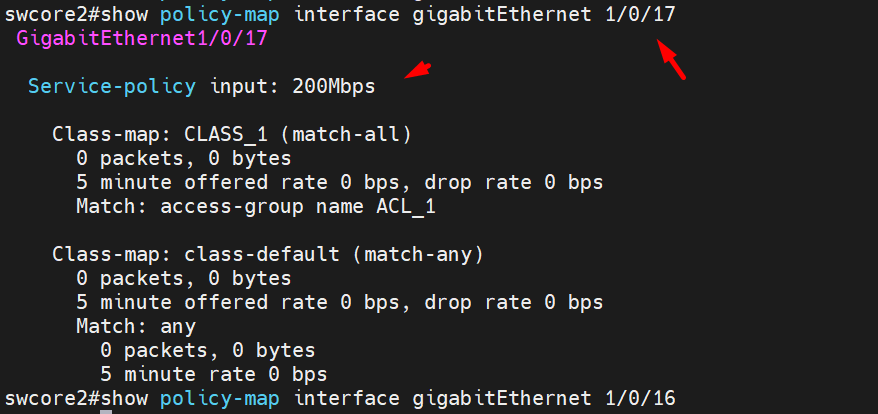

## Qos limit băng thông

  Hiển thị cấu hình QoS trên tất cả các cổng:

    swcore2#show policy-map interface

  Hiển thị cấu hình QoS trên một cổng cụ thể:

    swcore2#show policy-map interface gigabitEthernet 1/0/17

  Liệt kê tất cả các policy-map QoS đã được định nghĩa:

    switch#show policy-map

  Xem chi tiết một policy-map QoS cụ thể:

    switch#show policy-map [policy-map-name]

  Ví dụ: policy-map tên 200Mbps đã được định nghĩa 

    swcore2#show policy-map 200Mbps
    Policy Map 200Mbps
    Class CLASS_1
    police 200000000 1000000 exceed-action drop

  1000000 bytes - là kích thước bucket (Burst Committed - BC) trong cấu hình QoS của switch Cisco,kích thước bucket xác định lượng dữ liệu tối đa có thể được phép vượt quá tốc độ cam kết (Committed Information Rate - CIR) mà không bị phạt.

  Cụ thể:

  Committed Information Rate (CIR): Đây là giới hạn băng thông tối đa (bps) được phép truyền qua. Ví dụ: 200Mbps.
  Burst Committed (BC): Kích thước bucket (bytes) - lượng dữ liệu tối đa được phép vượt quá CIR mà không bị phạt. Ví dụ: 1000000 bytes.
  Khi lưu lượng vượt quá CIR, nhưng vẫn nằm trong kích thước bucket, các gói tin sẽ được phép truyền (conform-action transmit). Nếu vượt quá cả CIR và kích thước bucket, các gói tin sẽ bị drop (exceed-action drop).

## Qos limit băng thông trên switch cisco 3750

#### 1. Kích hoạt tính năng Qos: 

    swcore2(config)#mls qos

#### 2. Tạo access-list cho phép mọi truy cập

    swcore2(config)#ip access-list extended ACL_1
    swcore2(config-ext-nacl)#permit ip any any

#### 3. Tạo class-map để phân loại các traffic

    swcore2(config)#class-map match-all CLASS_1
    swcore2(config-cmap)#match access-group name ACL_1

#### 4. Tạo policy:

    swcore2(config)#policy-map 200Mbps
    swcore2(config-pmap)#class CLASS_1
    swcore2(config-pmap-c)#police 200000000 1000000 exceed-action drop       #Tốc độ tối đa có thể đạt được là 200Mbps nếu quá sẽ bị drop k cho sử dụng.

  Trong đó: 200000000 là tốc độ tính bằng bit/s, 200000000 bit/s = 8Mbps
  100000 là burst size tính bằng byte

#### 5. Gán Policy cho cổng mạng muốn hạn chế tốc độ.

  Áp dụng policy-map "200Mbps" vào interface gigabitEthernet 1/0/17:

    swcore2(config)#interface gigabitEthernet 1/0/17
    swcore2(config-if)#service-policy input 200Mbps
    switch(config-if)#exit

  Lưu cấu hình:

    switch#copy running-config startup-config

  Sau khi hoàn tất các bước trên, gigabitEthernet 1/0/17 sẽ được áp dụng policy-map "200Mbps", theo đó lưu lượng trên interface sẽ được giới hạn băng thông 200 Mbps, vượt quá bị drop.
  Chúng ta cắm cổng gigabitEthernet 1/0/17 vào PC để test speed.

  Hình ảnh: 

  

## Để tạo thêm các policy-map QoS với giới hạn băng thông 100Mbps và 300Mbps, bạn có thể sử dụng các lệnh sau:

#### Tạo policy-map 100Mbps:

    swcore2(config)#policy-map 100Mbps
    swcore2(config-pmap)#class CLASS_1
    swcore2(config-pmap-c)#police 100000000 1000000 exceed-action drop

  Lệnh này tạo policy-map "100Mbps" với giới hạn băng thông 100Mbps và kích thước bucket là 1000000 bytes. Các gói tin vượt quá giới hạn sẽ bị drop.

#### Tạo policy-map 300Mbps:

    swcore2(config)#policy-map 300Mbps
    swcore2(config-pmap)#class CLASS_1
    swcore2(config-pmap-c)#police 300000000 1000000 exceed-action drop

  Lệnh này tạo policy-map "300Mbps" với giới hạn băng thông 300Mbps và kích thước bucket là 1000000 bytes. Các gói tin vượt quá giới hạn sẽ bị drop.

  Áp dụng policy-map 100Mbps vào cổng:

    swcore2(config)#interface gigabitEthernet 1/0/18
    swcore2(config-if)#service-policy input 100Mbps

  Lệnh này áp dụng policy-map "100Mbps" vào cổng gigabitEthernet 1/0/18.

  Áp dụng policy-map 300Mbps vào cổng:

    swcore2(config)#interface gigabitEthernet 1/0/19
    swcore2(config-if)#service-policy input 300Mbps

  Lệnh này áp dụng policy-map "300Mbps" vào cổng gigabitEthernet 1/0/19.

#### Sau khi thực hiện các bước trên, bạn sẽ có 3 policy-map QoS với các giới hạn băng thông khác nhau:

    "200Mbps" với giới hạn 200Mbps, áp dụng trên cổng gigabitEthernet 1/0/17.
    "100Mbps" với giới hạn 100Mbps, áp dụng trên cổng gigabitEthernet 1/0/18.
    "300Mbps" với giới hạn 300Mbps, áp dụng trên cổng gigabitEthernet 1/0/19.

#### Để gán vào 1 loạt port, chúng ta khai báo theo range port

  Áp dụng policy-map "200Mbps" vào dải cổng Gi1/0/1 đến Gi1/0/16:

    swcore2(config)#interface range gigabitEthernet 1/0/1 - 16
    swcore2(config-if-range)#service-policy input 200Mbps

