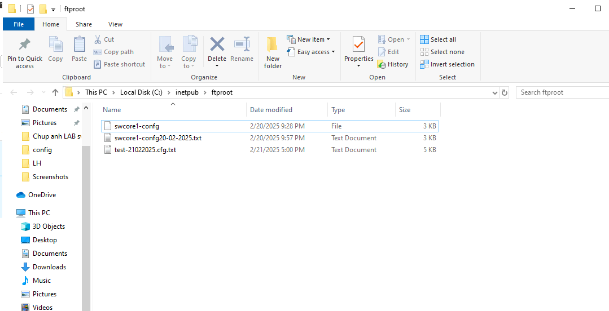
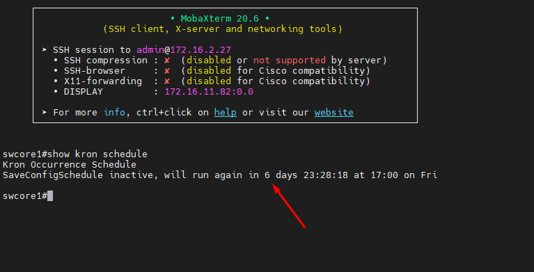

## Kron và backup về FTP server

  Có nhiều cách thức để lưu cấu hình của switch.

  Sử dụng Kron backup tự động config của switch lên máy chủ FTP chúng ta sẽ xử lý như sau

    + Lưu cấu hình switch định kỳ vào bộ nhớ của switch.
    + Sao lưu cấu hình switch lên FTP server định kỳ.

  Các lệnh thao tác:

    swcore1(config)#kron policy-list SaveConfig //Tạo một policy-list có tên "SaveConfig".
    swcore1(config-kron-policy)#cli write //Thêm lệnh "write" vào policy-list, để ghi lại cấu hình hiện tại của switch.
    swcore1(config-kron-policy)#exit
    swcore1(config)#kron occurrence SaveConfigSchedule at 17:00 Fri recurring //ạo một sự kiện xảy ra định kỳ vào lúc 17:00 vào thứ Sáu, và liên kết với policy-list "SaveConfig".
    swcore1(config-kron-occurrence)#policy-list SaveConfig
    swcore1(config-kron-occurrence)#end
    swcore1#show kron schedule
    Kron Occurrence Schedule
    SaveConfigSchedule inactive, will run again in 0 days 00:37:22 at 17:00 on Fri
    swcore1#configure terminal
    Enter configuration commands, one per line.  End with CNTL/Z.
    swcore1(config)#kron policy-list Backup //Tạo một policy-list mới có tên "Backup".
    swcore1(config-kron-policy)#cli show run | redirect ftp://100.100.100.101/test-21022025.cfg.txt //Thêm lệnh để lấy cấu hình hiện tại của switch và chuyển hướng (redirect) nó lên FTP server địa chỉ 100.100.100.101, với tên tệp "test-21022025.cfg.txt".
    swcore1(config-kron-policy)#exit
    swcore1(config)#kron occurrence SaveConfigSchedule at 17:00 Fri recurring //Liên kết sự kiện đã tạo trước đó với policy-list "Backup".
    swcore1(config-kron-occurrence)#policy-list Backup
    swcore1(config-kron-occurrence)#

  Đợi 37p nữa xem FTP server IIS IP 100.100.100.101 có file test-21022025.cfg.txt hay không:

  Kết quả đã thấy có backup:

  

  Xem lại cấu hình backup lúc này

  