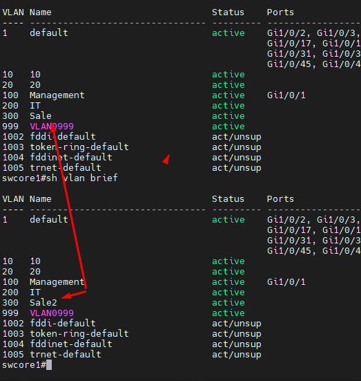
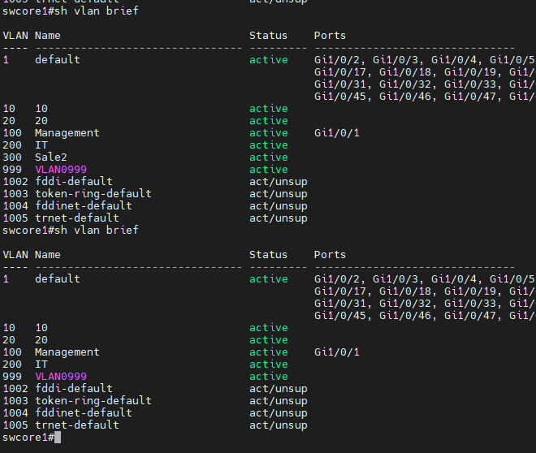

## Thao tác với VLAN
#### Tạo VLAN
  Vào chế độ cấu hình toàn cục:

    swcore1#config terminal

  Tạo VLAN với ID và tên:

    vlan <ID>
    name <Tên VLAN>

  Ví dụ:

    swcore1(config)#vlan 999
    swcore1(config-vlan)#name IT

#### Sửa VLAN: Thay đổi tên VLAN:

    vlan <ID>
    name <Tên VLAN mới>

  Sửa tên vlan 300 từ Sale sang Sales

  

    swcore1(config)#vlan 300
    swcore1(config-vlan)#name Sale2
    swcore1(config-vlan)#end
    swcore1#wr mem
    Building configuration...
    [OK]
 
#### Xóa VLAN:
    no vlan <ID>
    
 Xóa vlan 300

    swcore1(config)#no vlan 300
    swcore1(config)#end
    swcore1#wr mem
    Building configuration...
    [OK]

  

#### Mở rộng VLAN sang switch khác: 

  Cấu hình trunking giữa 2 switch tên swcore1 và swcore2
   

## Lưu ý
  Cần lưu cấu hình sau khi hoàn thành:

    copy running-config startup-config

  Kiểm tra kỹ các cổng và VLAN ID trước khi cấu hình.

  Sử dụng các lệnh show để kiểm tra cấu hình.

