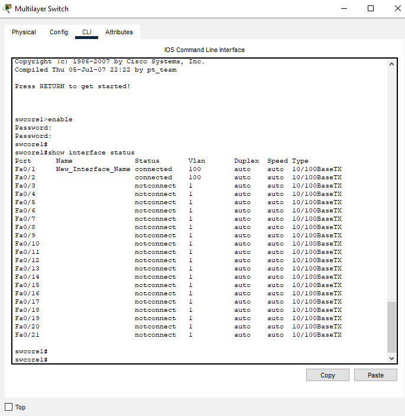
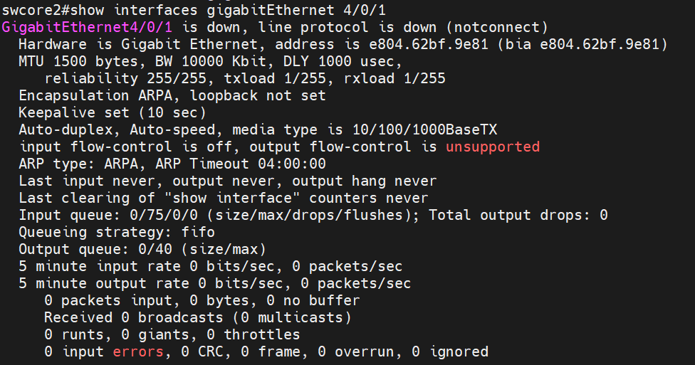
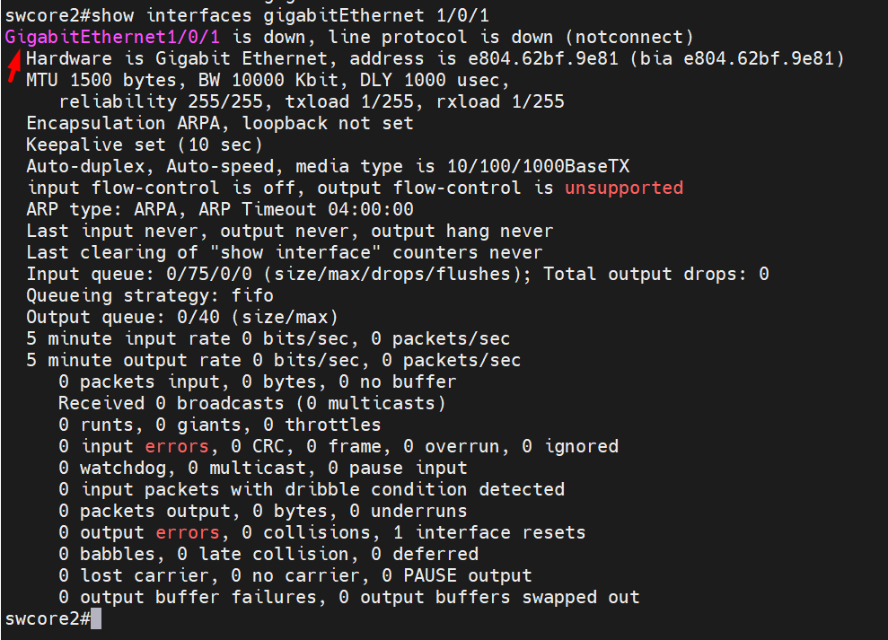

## Tạo description
  Truy cập vào giao diện CLI (Command Line Interface) của switch.

  Vào chế độ cấu hình toàn cục (global configuration mode):

    swcore1(config)#

  Truy cập vào cấu hình của interface cần đổi tên mô tả:

    swcore1(config)#interface gigabitethernet 0/1

  Sử dụng lệnh description để đặt tên mới cho interface:

    swcore1(config-if)#description New_Interface_Name

  Trong đó, New_Interface_Name là tên mới bạn muốn đặt cho interface.
  
  Lưu cấu hình:

    swcore1#copy running-config startup-config
      
  Hình ảnh kiểm tra

    swcore1#show interface status 

  

## Rename interface

  

  Thay đổi toàn bộ 

  GigabitEthernet4/0/x sang GigabitEthernet1/0/x

    swcore2(config)#switch 4 renumber 1
    WARNING: Changing the switch number may result in a
    configuration change for that switch.
    The interface configuration associated with the old switch
    number will remain as a provisioned configuration.
    Do you want to continue?[confirm]yChanging Switch Number 4 to Switch Number 1
    New Switch Number will be effective after next reboot
    swcore2(config)#end

  Lưu cấu hình để reboot

    swcore2#copy running-config startup-config
    Destination filename [startup-config]?
    Building configuration...
    [OK]
    0 bytes copied in 2.232 secs (0 bytes/sec)

  Reboot và kiểm tra

    swcore2#reload
    Proceed with reload? [confirm] Enter

  
  