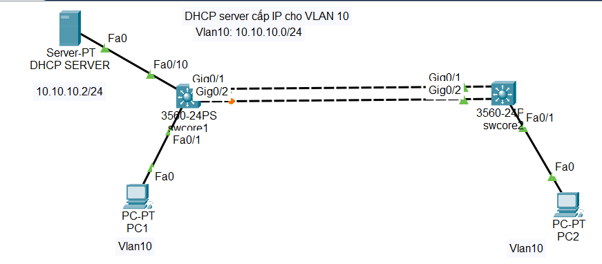
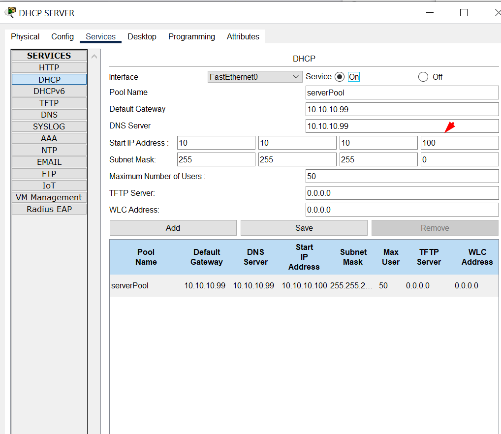
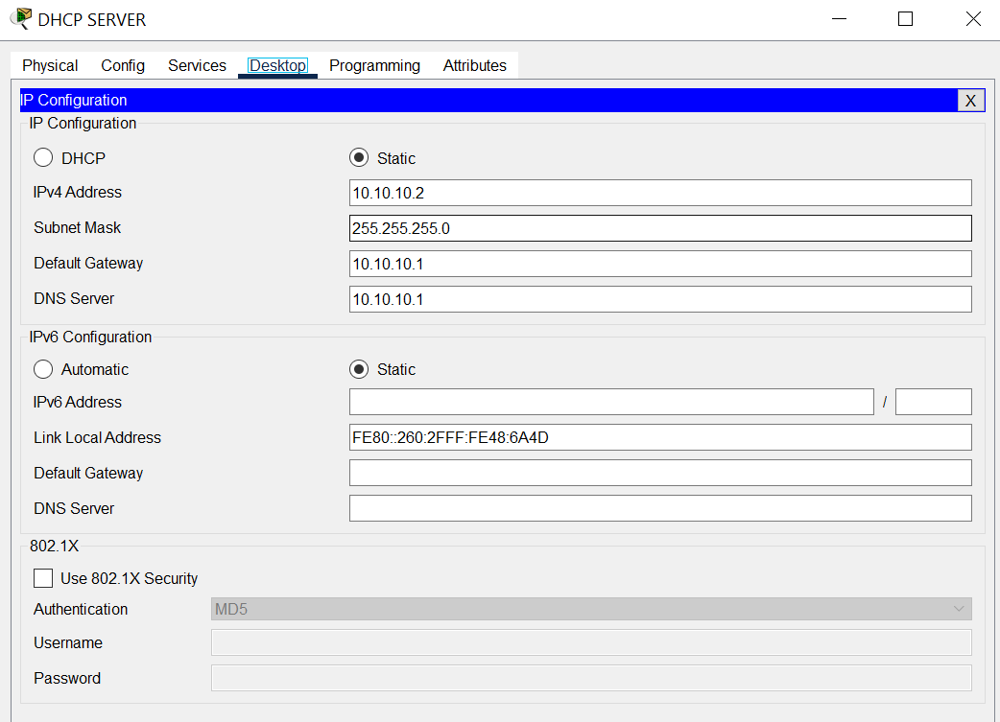
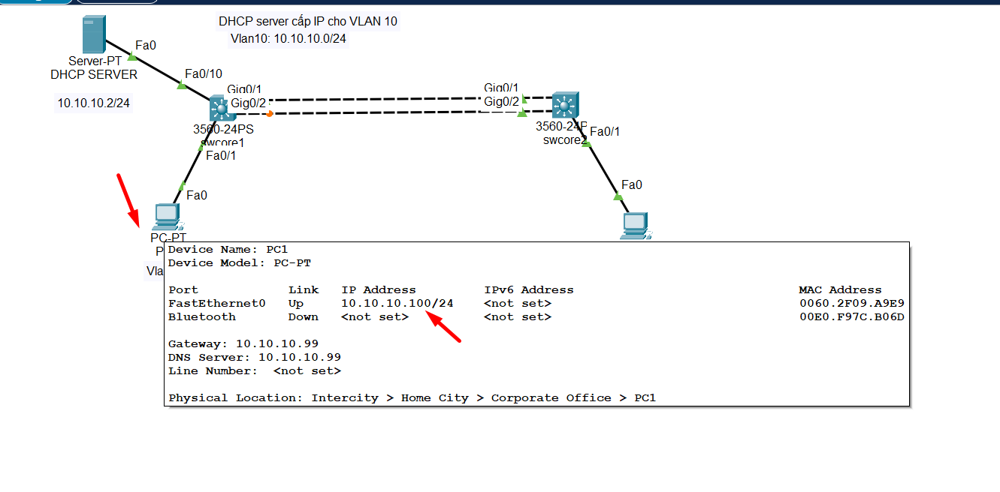
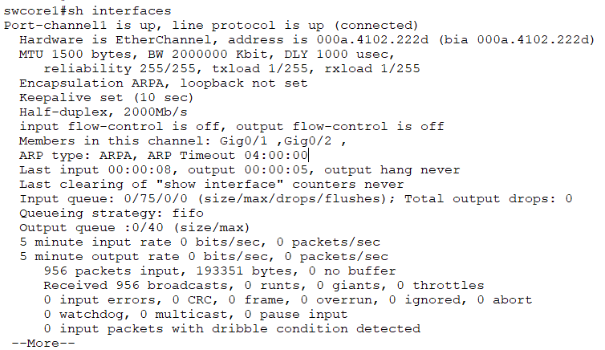
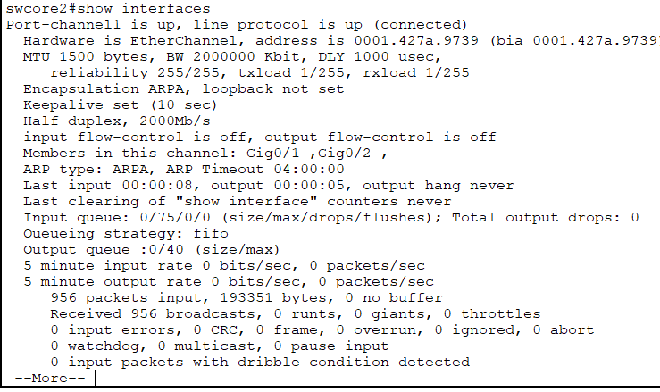
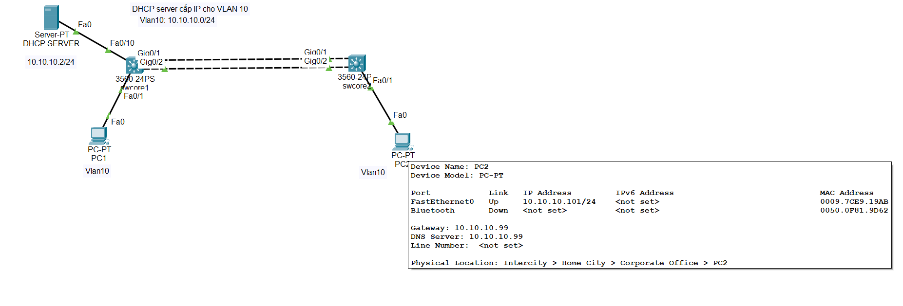

## Có nhiều đề bài:

### Portchanel switch-switch
  Cho đề bài như hình:

  

  Đây là thông tin DHCP server 

  

  IP DHCP server: 10.10.10.2/24

  

#### Cấu hình trên swcore1

    swcore1(config)#vlan 10
    swcore1(config-vlan)#exit
    swcore1(config)#interface fastEthernet 0/10    
    swcore1(config-if)#switchport trunk encapsulation dot1q 
    swcore1(config-if)#sw mode trunk 
    swcore1(config-if)#
    %LINEPROTO-5-UPDOWN: Line protocol on Interface FastEthernet0/10, changed state to down
    %LINEPROTO-5-UPDOWN: Line protocol on Interface FastEthernet0/10, changed state to up
    %LINEPROTO-5-UPDOWN: Line protocol on Interface Vlan10, changed state to up
    swcore1(config-if)#sw trunk allowed vlan all

    swcore1(config)#interface fastEthernet 0/1
    swcore1(config-if)#switchport trunk encapsulation dot1q
    swcore1(config-if)#sw mode trunk
    swcore1(config-if)#
    %LINEPROTO-5-UPDOWN: Line protocol on Interface FastEthernet0/1, changed state to down
    %LINEPROTO-5-UPDOWN: Line protocol on Interface FastEthernet0/1, changed state to up
    swcore1(config-if)#sw trunk allowed vlan all
    swcore1#wr mem
    Building configuration...
    [OK]
    
  Tới đây ta thấy PC1 đã nhận được IP  

  

#### Cấu hình trên swcore2

  Cấu hình trên FastEthernet 0/1 đang cắm với PC2

    swcore2(config)#interface FastEthernet 0/1
    swcore2(config-if)#sw trunk encapsulation dot1q 
    swcore2(config-if)#sw mode trunk 
    swcore2(config-if)#
    %LINEPROTO-5-UPDOWN: Line protocol on Interface FastEthernet0/1, changed state to down
    %LINEPROTO-5-UPDOWN: Line protocol on Interface FastEthernet0/1, changed state to up
    swcore2(config-if)#sw trunk allowed vlan all
    swcore2#wr mem
    Building configuration...
    [OK]

#### Cấu hình port-chanel interface gigabitEthernet 0/1-2 của cả 2 sw thành 1 port
     
   Trên sw 1   
 
    swcore1(config)#interface range gigabitEthernet 0/1-2
    swcore1(config-if-range)#channel-group 1 mode active 
    swcore1(config-if-range)#
    Creating a port-channel interface Port-channel 1
    %LINEPROTO-5-UPDOWN: Line protocol on Interface GigabitEthernet0/1, changed state to down
    %LINEPROTO-5-UPDOWN: Line protocol on Interface GigabitEthernet0/1, changed state to up
    %LINEPROTO-5-UPDOWN: Line protocol on Interface GigabitEthernet0/2, changed state to down
    %LINEPROTO-5-UPDOWN: Line protocol on Interface GigabitEthernet0/2, changed state to up
    swcore1(config-if-range)#exit
    swcore1(config)#interface port-channel 1
    swcore1(config-if)#sw trunk encapsulation dot1q 
    swcore1(config-if)#switchport mode trunk 
    swcore1(config-if)#switchport trunk allowed vlan all
    swcore1(config-if)#no shutdown 
    swcore1(config-if)#end
    swcore1#
    %SYS-5-CONFIG_I: Configured from console by console
    swcore1#wr mem
    Building configuration...
    [OK]

 Trên sw 2

    switch2(config)# interface range gigabitEthernet 0/1-2
    switch2(config-if-range)# channel-group 1 mode active
    switch2(config-if-range)# exit
    switch2(config)# interface port-channel 1
    swcore2(config-if)#sw trunk encapsulation dot1q 
    switch2(config-if)#switchport mode trunk
    switch2(config-if)#switchport trunk allowed vlan all
    switch2(config-if)#no shutdown
    switch2(config-if)# exit
    switch2(config)# exit
    switch2# write memory
  
  Kiểm tra port-chanel1

  

  

  Và PC2 đã nhận được IP động

  

  Kiểm tra down 1 trong 2 port gigabitEthernet0/1 hoặc gigabitEthernet0/2 trên 1 trong 2 sw

    swcore2(config)#interface gigabitEthernet 0/1
    swcore2(config-if)#shutdown 
    swcore2(config-if)#
    %LINK-5-CHANGED: Interface GigabitEthernet0/1, changed state to administratively down
    %LINEPROTO-5-UPDOWN: Line protocol on Interface GigabitEthernet0/1, changed state to down
    swcore2(config-if)#

  Chúng ta thấy PC2 vẫn ping được DHCP server ( xin cấp lại IP động vẫn thành công )

  