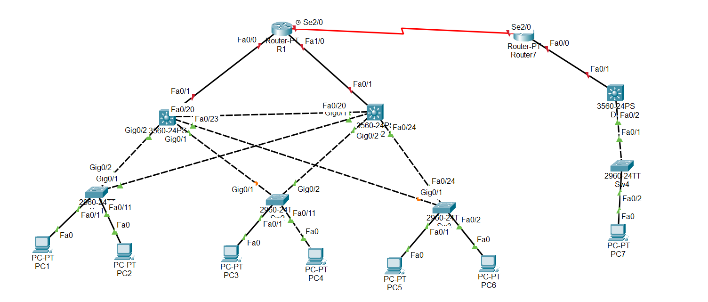

## Mô phỏng cơ chế hoạt động của STP

  

  Spanning tree protocol định nghĩa trong chuẩn IEEE 802.1D. Spanning tree là giao thức không thể thiểu trong môi trường layer 2

  (Khi Sw nhận được 1 frame ,Switch học source MAC vào bảng MAC address, ban đầu bảng MAC trắng nên nó sẽ flood frame ra tất cả các cổng.Theo mô hình trên thì nó sẽ xảy ra hiện tượng: Broadcast storm Instability MAC address table Multiple Frame copies.Hiện tương Loop trong mạng khi các switch đấu nối theo 1 vòng tròn khép kín)

  IEEE đưa ra chuẩn 802.1D(spanning tree protocol) để chống loop. Về mặt luận lý thì nó sẽ khóa 1 port( Block port)
  Để tìm ra block port nó trải qua các bước: Bầu chọn Root Switch Bầu chọn Root port Bầu chọn Alternated port

## Các lý thuyết

  Trong giao thức Spanning Tree Protocol (STP), có một số thông số chính ảnh hưởng đến quá trình bầu chọn đường đi, bao gồm:

#### Bridge ID (BID):

  BID là một số định danh duy nhất của mỗi switch trong mạng.

  BID gồm 2 thành phần: priority (16 bit) và MAC address (48 bit).

  + Switch có BID thấp nhất sẽ trở thành Root Bridge.
  + Port Cost:Port Cost là một số nguyên được gán cho từng cổng trên switch.

  Cổng có Port Cost thấp hơn sẽ được ưu tiên chọn làm đường dẫn chính.

  Giá trị mặc định của Port Cost phụ thuộc vào tốc độ của cổng (10Mbps, 100Mbps, 1Gbps, v.v.).

#### Port Priority:

  Mỗi cổng trên switch có một giá trị Priority từ 0 đến 240 (chia thành bước 16).

  Cổng có Priority thấp hơn sẽ được ưu tiên chọn làm đường dẫn chính.

#### Hello Time:

  Hello Time là khoảng thời gian giữa các gói tin BPDU (Bridge Protocol Data Unit) được gửi định kỳ.

  Giá trị mặc định là 2 giây.

  Giá trị này ảnh hưởng đến thời gian hội tụ của STP.

#### Forward Delay:

  Forward Delay là thời gian mà một cổng phải ở trạng thái Listening và Learning trước khi chuyển sang trạng thái Forwarding.
  Giá trị mặc định là 15 giây.
  Thời gian này cho phép STP hội tụ an toàn.

#### Max Age:
  Max Age là thời gian tối đa mà một switch sẽ lưu trữ và sử dụng thông tin BPDU.
  Giá trị mặc định là 20 giây.
  Khi thời gian này hết hạn, switch sẽ yêu cầu thông tin BPDU mới.

Việc điều chỉnh các thông số trên có thể giúp tối ưu hóa việc lựa chọn đường dẫn STP, đáp ứng các yêu cầu về dự phòng và hiệu suất mạng.

## Quá trình tìm Block Port Spanning tree

#### Root switch:

    Khi các switch được đấu nối, khởi động nó sẽ gửi gói tin BPDU(bridge protocol data unit) trên các port của switch.
    Thông số quyết định switch nào được làm Root switch là Bridge-ID(8 byte) gồm có các thông số : priority(của switch): dài 2 byte(9 -> 65535), default = 32768. Sw nào có chỉ số priority có chỉ số nhỏ nhất sẽ được chọn làm Root-switch MAC Address Switch: dài 6 byte. Xét từ trái sang phải từng giá trị hexa thì switch nào có MAC nhỏ nhất làm Root-switch
    Khi bầu xong Root-switch thì chỉ có Root-switch được gửi BPDU(2s/1 lần). Việc gửi đó để duy trì cây spanning tree đó không bị Loop
    Theo nguyên tắc đánh số MAC của nhà sản xuất thì khi bầu chọn root-switch nó sẽ chọn switch đời đầu làm root-switch. Nên trong thực tế ta ko bao giờ cho bầu chọn bằng MAC mà ta chỉnh priority

#### Root port:

    Là port cung cấp đường về Root-switch mà có tổng path-cost là nhỏ nhất

    Khi bầu chọn Root-port thì Root-Switch ko tham gia quá trình bầu chọn này

    Mỗi Root-switch chỉ có 1 Root-port

    Path-cost là giá trị cost trên từng cổng của Switch.

    Nguyên tắc tính tổng path-cost: tính từ switch đang muốn tính --> Root-switch

        Đi ra: ko cộng

        Đi vào: cộng cost

