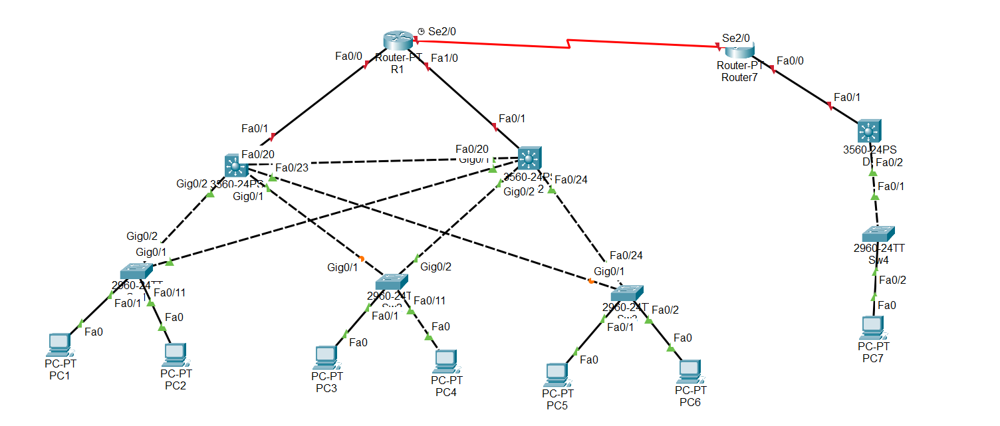

## Mô phỏng cơ chế hoạt động của STP

  Theo công nghệ của Cisco - PVST luôn chạy lên không có sự loop mạng ở đây, PVST (Per-VLAN Spanning Tree) là một công nghệ Spanning Tree Protocol (STP) được sử dụng trên các switch Cisco

  Theo như sơ đồ kết nối bên dưới 2 PC1 và PC2 đã kết nối với nhau

  

  Spanning tree protocol định nghĩa trong chuẩn IEEE 802.1D. Spanning tree là giao thức không thể thiểu trong môi trường layer 2

  (Khi Sw nhận được 1 frame ,Switch học source MAC vào bảng MAC address, ban đầu bảng MAC trắng nên nó sẽ flood frame ra tất cả các cổng.Theo mô hình trên thì nó sẽ xảy ra hiện tượng: Broadcast storm Instability MAC address table Multiple Frame copies.Hiện tương Loop trong mạng khi các switch đấu nối theo 1 vòng tròn khép kín)

  IEEE đưa ra chuẩn 802.1D(spanning tree protocol) để chống loop. Về mặt luận lý thì nó sẽ khóa 1 port( Block port)
  Để tìm ra block port nó trải qua các bước: Bầu chọn Root Switch Bầu chọn Root port Bầu chọn Alternated port
