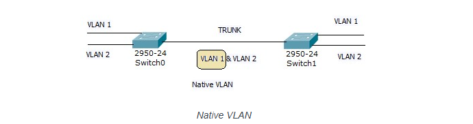

## 1.VLAN là gì?
  VLAN (Virtual Local Area Network) là một mạng LAN ảo, cho phép chia một mạng vật lý thành nhiều mạng logic riêng biệt. Mỗi VLAN hoạt động như một mạng LAN độc lập, có thể giao tiếp với nhau hoặc bị cô lập tùy theo cấu hình.
## 2.Các loại VLAN
  Có nhiều loại VLAN khác nhau, được phân loại dựa trên cách chúng gán các cổng vào VLAN:
  + VLAN dựa trên cổng (Port-based VLAN): Gán các cổng của switch vào một VLAN cụ thể. Các thiết bị kết nối vào cổng đó sẽ thuộc VLAN đó.
  + VLAN dựa trên địa chỉ MAC (MAC address-based VLAN): Gán các thiết bị vào VLAN dựa trên địa chỉ MAC của chúng.
  + VLAN dựa trên giao thức (Protocol-based VLAN): Gán các thiết bị vào VLAN dựa trên giao thức mà chúng sử dụng (ví dụ: IP, IPX).
  + VLAN dựa trên ứng dụng (Application-based VLAN): Gán các thiết bị vào VLAN dựa trên ứng dụng mà chúng đang chạy.
  + VLAN động (Dynamic VLAN): Sử dụng phần mềm để tự động gán các thiết bị vào VLAN dựa trên các tiêu chí khác nhau.
#### Trong thực tế người ta cũng phân loại theo các định nghĩa trong VLAN như sau:
  + VLAN 1 Đây là kiểu mạng mặc định của tất tất cả các thiết bị chuyển mạch hỗ trợ VLAN và nó hoạt động ở Lớp 2 (Data Link layer) trong mô hình OSI của hệ thống, vì vậy nếu hệ thống mạng máy tính của bạn được trang bị một thiết bị chuyển mạch có hỗ trợ chức năng này mà bạn chưa thiết lập các thông số kỹ thuật thì mặc định nó vẫn có thể chuyển tiếp các gói dữ liệu giữa các máy tính và thiết bị kết nối vào nó một cách bình thường như các thiết bị chuyển mạch khác, vì lúc này tất cả các cổng mạng trên thiết bị chuyển mạch mặc định đều nằm trong cùng một miền quảng bá và với sự quản lý của VLAN 1. Trong VLAN 1 có rất nhiều giao thức ở Lớp 2 hoạt động giao tiếp với nhau như: CDP, PagP, VTP; nên đây chính là lý do tại sao VLAN 1 được chọn làm kiểu mạng mặc định và rất dễ thấy trên các thiết bị mạng có hỗ trợ tính năng chia mạng ảo của Cisco System.
  + Default VLAN Là kiểu VLAN mặc định ban đầu với tất cả các cổng giao tiếp trên thiết bị chuyển mạch, vì vậy Default VLAN cũng có thể hiểu là VLAN 1, và các VLAN khác như User VLAN, Native VLAN, Management VLAN đều là các thành phần con của Default VLAN.
  + User VLAN (hay Data VLAN) Là VLAN trong đó chứa các tài khoản người dùng thành từng nhóm dựa theo các thuộc tính về đặc thù công việc của từng nhóm làm việc hay theo thuộc tính về vị trí vật lý của các nhóm làm việc này.
  + Native VLAN Là VLAN dùng để cấu hình Trunking do một số thiết bị không tương thích với nhau, lúc này ta phải sử dụng Native VLAN để chúng có thể giao tiếp với nhau. Khi đó, tất cả các khung dữ liệu (frame) của các VLAN khi giao tiếp qua kết nối Trunking đều sẽ được gắn tag của giao thức 802.1Q hoặc ISL, ngoại trừ các frame của VLAN 1. Native VLAN là VLAN mà frame của nó sẽ không được tag trước khi gửi qua đường trunk. Ngầm định Native VLAN của Switch là VLAN 1. Cấu hình Native VLAN như sau:

  ``Switch#config terminal``

  ``Switch(config)#interface fastethernet slot/port_number``

  ``Switch(config-if)#switchport trunk native vlan vlan-id``

  Trong đó vlan-id là chỉ số của VLAN native.
  
    
  
## Thành phần của VLAN
  + Switch hỗ trợ VLAN: Switch là thiết bị trung tâm của mạng VLAN, có khả năng tạo và quản lý các VLAN.
  + Cổng (Port): Các cổng của switch được gán vào các VLAN khác nhau.
  + Gói tin (Packet): Các gói tin được gắn thẻ (tag) VLAN để xác định chúng thuộc VLAN nào.
  + VLAN ID: Mỗi VLAN được gán một ID duy nhất để phân biệt.
## Ưu điểm của VLAN
  + Tăng cường bảo mật: VLAN cho phép cô lập các mạng khác nhau, giúp ngăn chặn các cuộc tấn công và hạn chế phạm vi ảnh hưởng của sự cố.
  + Nâng cao hiệu suất: VLAN giúp giảm tải cho mạng bằng cách chia nhỏ lưu lượng, từ đó cải thiện hiệu suất tổng thể.
  + Quản lý linh hoạt: VLAN cho phép dễ dàng thay đổi cấu hình mạng mà không cần thay đổi vật lý.
  + Tiết kiệm chi phí: VLAN giúp tận dụng tối đa hạ tầng mạng hiện có, giảm chi phí đầu tư.
## Cách thức hoạt động của VLAN
  + VLAN hoạt động bằng cách gắn thẻ (tag) vào mỗi gói tin, cho biết gói tin đó thuộc VLAN nào. Switch sử dụng thông tin này để chuyển gói tin đến đúng cổng.