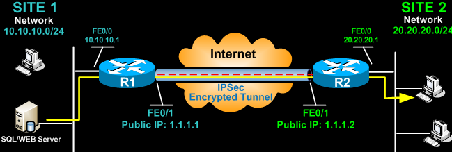

## VPN (Virtual Private Network) và IPsec (IP Security) trong thiết bị Cisco.

    

### VPN (Virtual Private Network):
  VPN là một công nghệ cho phép tạo một đường hầm (tunnel) mạng riêng và an toàn qua mạng công cộng như Internet.
#### Các loại VPN chính:
  + Remote Access VPN: Cho phép người dùng từ xa kết nối an toàn vào mạng nội bộ.
  + Site-to-Site VPN: Kết nối an toàn giữa các văn phòng/cơ sở khác nhau.
#### Các giao thức VPN phổ biến:
  + IPsec (IP Security)
  + SSL/TLS (Secure Sockets Layer/Transport Layer Security)
  + PPTP (Point-to-Point Tunneling Protocol)
  + IPsec (IP Security):
      IPsec là một bộ các giao thức mã hóa và xác thực được sử dụng trong VPN.
      Các chức năng chính của IPsec: 
      + Xác thực người dùng và máy chủ
      + Mã hóa dữ liệu
      + Đảm bảo tính toàn vẹn của dữ liệu
      IPsec hoạt động trong 2 chế độ:
  + Transport mode: Mã hóa phần tải của gói tin IP
  + Tunnel mode: Mã hóa toàn bộ gói tin IP, tạo đường hầm ảo
#### Trong thiết bị Cisco, VPN và IPsec được cấu hình và quản lý thông qua các tính năng sau:
  + VPN Concentrator: Thiết bị chuyên dụng để kết nối VPN từ xa.
  + IPsec VPN: Cấu hình các đường hầm IPsec trên router, firewall Cisco.
  + Dynamic Multipoint VPN (DMVPN): Cho phép tự động thiết lập các đường hầm IPsec site-to-site.
  + FlexVPN: Giao diện đơn giản hóa việc cấu hình và quản lý VPN trên thiết bị Cisco.