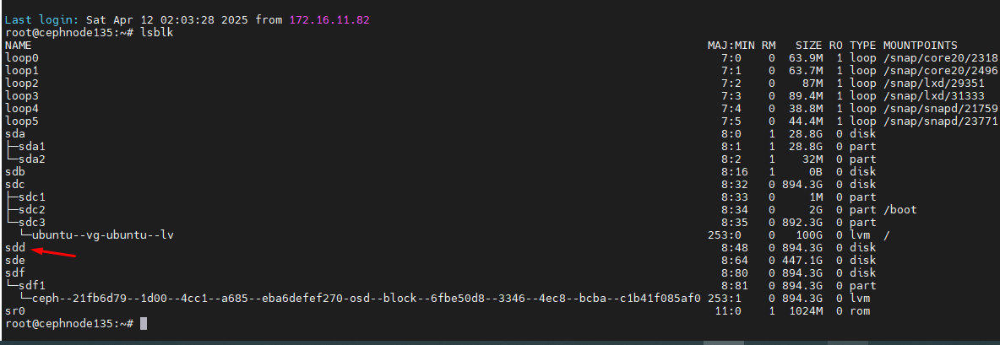
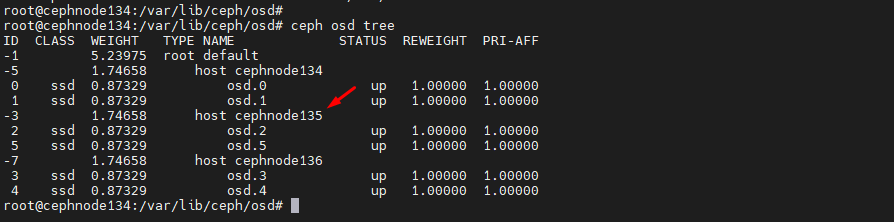
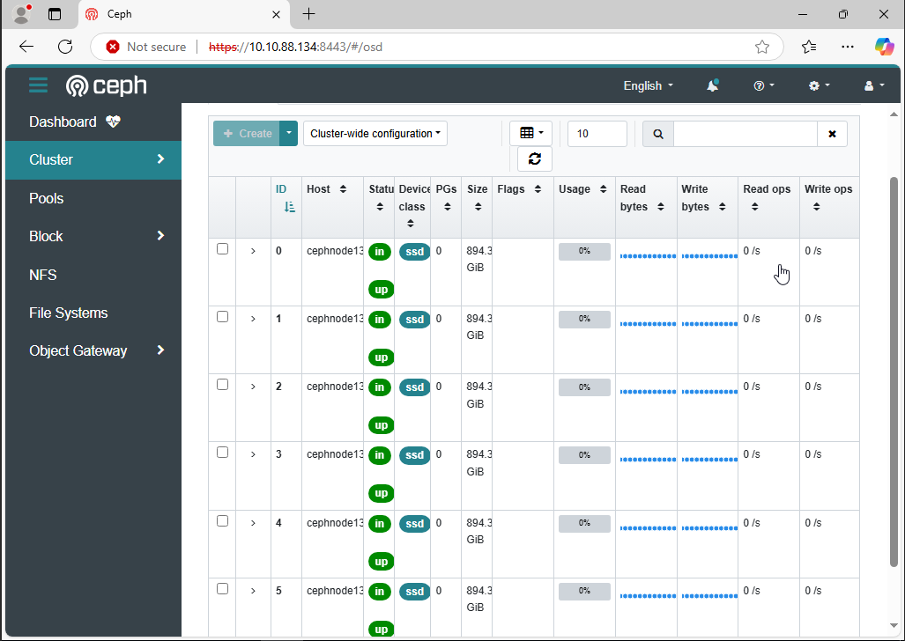

## Mô tả

Docs ghi lại quá trình thay thế 1 node Ceph bị lỗi disk OS, OS không boot được > Cần tạo máy chủ mới với OSD mới > Tham gia cụm

## Thực hiện

Cụm gồm 3 node cephnode134 cephnode135 cephnode136 với IP tương ứng 10.10.88.134 10.10.88.135 10.10.88.136 và cephnode134 đang là node mgr

Trên cụm hiện tại đang bị lỗi 1 node ceph135 > Cài lại ubuntu 22.04 với cấu hình IP và ổ đĩa như ban đầu ,Cài Ceph đúng phiên bản và join lại 10.10.88.135 tham gia cụm

Thông tin ssh config hiện tại vẫn giữ nguyên:
```Bash
root@cephnode134:~/.ssh# cat  ~/.ssh/config 
Host cephnode134
    Hostname cephnode134.dinhtu.xyz
    User root
Host cephnode135
    Hostname cephnode135.dinhtu.xyz
    User root
Host cephnode136
    Hostname cephnode136.dinhtu.xyz
    User root
```

#### 1. Copy lại public key từ cephnode134 sang cephnode135 

Xóa khóa host cũ cephnode135 khỏi known_hosts:


     ssh-keygen -f "/root/.ssh/known_hosts" -R "cephnode135.dinhtu.xyz"

Chạy lệnh này trên cephnode134.

Kết nối lại và xác minh khóa host:

Sau khi xóa khóa host cũ, hãy kết nối lại bằng ssh-copy-id:

    ssh-copy-id -o StrictHostKeychecking=no cephnode135

  

```Bash
for NODE in  cephnode135
do
    ssh -o StrictHostKeychecking=no $NODE "apt update; apt -y install ceph"
done 
```
```Bash
scp /etc/ceph/ceph.conf cephnode135:/etc/ceph/ceph.conf
scp /etc/ceph/ceph.client.admin.keyring cephnode135:/etc/ceph
scp /var/lib/ceph/bootstrap-osd/ceph.keyring cephnode135:/var/lib/ceph/bootstrap-osd

```
Create OSD lỗi ko format được, chúng ta sẽ ghi đè dữ liệu sau đó format và reboot máy
```Bash
root@cephnode134:~# for NODE in cephnode135
do
    ssh $NODE \
    "chown ceph. /etc/ceph/ceph.* /var/lib/ceph/bootstrap-osd/*; \
    parted --script /dev/sdd 'mklabel gpt'; \
    parted --script /dev/sdd "mkpart primary 0% 100%"; \
    ceph-volume lvm create --data /dev/sdd1"
done
-->  RuntimeError: Device /dev/sdd1 has a filesystem.

```
dd if=/dev/zero of=/dev/sdd bs=1M status=progress (lệnh này sẽ ghi các số 0 vào ổ đĩa )

Thực hiện trên node cephnode135

```Bash
root@cephnode135:~# dd if=/dev/zero of=/dev/sdd bs=1M status=progress
43053481984 bytes (43 GB, 40 GiB) copied, 35 s, 1.2 GB/s^C
41362+0 records in
41362+0 records out
43371200512 bytes (43 GB, 40 GiB) copied, 35.9188 s, 1.2 GB/s


root@cephnode135:~# lsblk

root@cephnode135:~# fdisk /dev/sdd

Welcome to fdisk (util-linux 2.37.2).
Changes will remain in memory only, until you decide to write them.
Be careful before using the write command.

This disk is currently in use - repartitioning is probably a bad idea.
It's recommended to umount all file systems, and swapoff all swap
partitions on this disk.


Device does not contain a recognized partition table.
Created a new DOS disklabel with disk identifier 0x92b5c76e.

Command (m for help): d
No partition is defined yet!

Command (m for help): w

The partition table has been altered.

```
```Bash
init 6
```
  

Lại gặp lỗi gì đây?
```Bash
root@cephnode134:~# for NODE in cephnode135
do
    ssh $NODE \
    "chown ceph. /etc/ceph/ceph.* /var/lib/ceph/bootstrap-osd/*; \
    parted --script /dev/sdd 'mklabel gpt'; \
    parted --script /dev/sdd "mkpart primary 0% 100%"; \
    ceph-volume lvm create --data /dev/sdd1"
done

Running command: /usr/bin/ceph-authtool --gen-print-key
Running command: /usr/bin/ceph --cluster ceph --name client.bootstrap-osd --keyring /var/lib/ceph/bootstrap-osd/ceph.keyring -i - osd new a54dd299-fb7f-4d8f-84d9-c4e69150bc48
 stderr: Error EEXIST: entity osd.5 exists but key does not match
-->  RuntimeError: Unable to create a new OSD id
root@cephnode134:~# ceph osd rm osd.5 --yes-i-really-mean-it
Error EINVAL: osd.5 does not exist. expected numerical value, got: --yes-i-really-mean-itinvalid osd id-22
```
>> Xử lý trên node cephnode135:

```Bash
root@cephnode135:~# ceph-volume lvm zap /dev/sdd1 --destroy
--> Zapping: /dev/sdd1
Running command: /usr/bin/dd if=/dev/zero of=/dev/sdd1 bs=1M count=10 conv=fsync
 stderr: 10+0 records in
10+0 records out
 stderr: 10485760 bytes (10 MB, 10 MiB) copied, 0.0386455 s, 271 MB/s
--> Destroying partition since --destroy was used: /dev/sdd1
Running command: /usr/sbin/parted /dev/sdd --script -- rm 1
--> Zapping successful for: <Partition: /dev/sdd1>

```
root@cephnode135:~# fdisk /dev/sdd

Sau 1 hồi loay hoay vẫn không được, do dùng lại disk của cephnode135 lỗi nên xảy ra vấn đề trên, tiến hành format lại osd.5 1 lần nữa

```Bash

ceph osd down osd.5
ceph osd out osd.5
ceph osd crush rm osd.5
ceph osd rm osd.5
ceph auth del osd.5

```

```Bash

root@cephnode134:/var/lib/ceph/osd# ceph osd down osd.5
ceph osd out osd.5
ceph osd crush rm osd.5
ceph osd rm osd.5
ceph auth del osd.5
osd.5 does not exist.
osd.5 does not exist.
device 'osd.5' does not appear in the crush map
osd.5 does not exist.
root@cephnode134:/var/lib/ceph/osd#
root@cephnode134:/var/lib/ceph/osd# for NODE in cephnode135
do
    ssh $NODE \
    "chown ceph. /etc/ceph/ceph.* /var/lib/ceph/bootstrap-osd/*; \
    parted --script /dev/sdd 'mklabel gpt'; \
    parted --script /dev/sdd "mkpart primary 0% 100%"; \
    ceph-volume lvm create --data /dev/sdd1"
done
Running command: /usr/bin/ceph-authtool --gen-print-key
Running command: /usr/bin/ceph --cluster ceph --name client.bootstrap-osd --keyring /var/lib/ceph/bootstrap-osd/ceph.keyring -i - osd new 9d125071-dd54-427d-8a09-f9118b13160f
Running command: vgcreate --force --yes ceph-9c854398-e1d6-40b2-a5e8-1ac7a3db2df5 /dev/sdd1
 stdout: Physical volume "/dev/sdd1" successfully created.
...Đã lược bớt, create OSD thành công ...
```
Cuối cùng cũng dựng thành công cephnode135:

  

  

```Bash
root@cephnode134:~# ceph config set mon mon_allow_pool_delete true
root@cephnode134:~# ceph osd pool delete ceph-pool-from134-for-131 ceph-pool-from134-for-131  --yes-i-really-really-mean-it
pool 'ceph-pool-from134-for-131' removed
root@cephnode134:~# ceph osd pool create ceph-pool-from134-for-131 128
pool 'ceph-pool-from134-for-131' created
root@cephnode134:~# ceph osd pool set ceph-pool-from134-for-131 pg_autoscale_mode on
set pool 5 pg_autoscale_mode to on
root@cephnode134:~# rbd pool init ceph-pool-from134-for-131
root@cephnode134:~#

```

