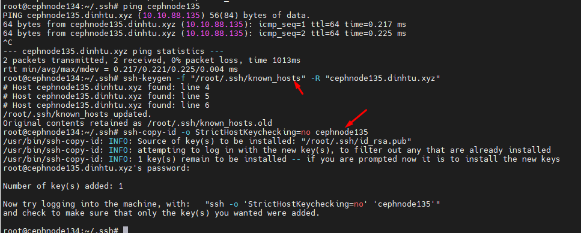

## Mô tả

Docs ghi lại quá trình thay thế 1 node Ceph bị lỗi disk OS, OS không boot được > Cần tạo máy chủ mới với OSD mới > Tham gia cụm

## Thực hiện

Cụm gồm 3 node cephnode134 cephnode135 cephnode136 với IP tương ứng 10.10.88.134 10.10.88.135 10.10.88.136 và cephnode134 đang là node mgr

Trên cụm hiện tại đang bị lỗi 1 node ceph135 > Cài lại ubuntu 22.04 với cấu hình IP và ổ đĩa như ban đầu ,Cài Ceph đúng phiên bản và join lại 10.10.88.135 tham gia cụm

Thông tin ssh config hiện tại vẫn giữ nguyên:
```Bash
root@cephnode134:~/.ssh# cat  ~/.ssh/config 
Host cephnode134
    Hostname cephnode134.dinhtu.xyz
    User root
Host cephnode135
    Hostname cephnode135.dinhtu.xyz
    User root
Host cephnode136
    Hostname cephnode136.dinhtu.xyz
    User root
```

#### 1. Copy lại public key từ cephnode134 sang cephnode135 

Xóa khóa host cũ cephnode135 khỏi known_hosts:


     ssh-keygen -f "/root/.ssh/known_hosts" -R "cephnode135.dinhtu.xyz"

Chạy lệnh này trên cephnode134.

Kết nối lại và xác minh khóa host:

Sau khi xóa khóa host cũ, hãy kết nối lại bằng ssh-copy-id:

    ssh-copy-id -o StrictHostKeychecking=no cephnode135

  

```Bash
for NODE in  cephnode135
do
    ssh -o StrictHostKeychecking=no $NODE "apt update; apt -y install ceph"
done 
```
```Bash
scp /etc/ceph/ceph.conf cephnode135:/etc/ceph/ceph.conf
scp /etc/ceph/ceph.client.admin.keyring cephnode135:/etc/ceph
scp /var/lib/ceph/bootstrap-osd/ceph.keyring cephnode135:/var/lib/ceph/bootstrap-osd

```
Create OSD
```Bash
root@cephnode134:~/.ssh# for NODE in cephnode134
do
    ssh $NODE \
    "chown ceph. /etc/ceph/ceph.* /var/lib/ceph/bootstrap-osd/*; \
    parted --script /dev/sdc 'mklabel gpt'; \
    parted --script /dev/sdc "mkpart primary 0% 100%"; \
    ceph-volume lvm create --data /dev/sdc1"
done
Error: Partition(s) 1 on /dev/sdc have been written, but we have been unable to inform the kernel of the change, probably because it/they are in use.  As a result, the old partition(s) will remain in use.  You should reboot now before making further changes.
--> Device /dev/sdc1 is already prepared

root@cephnode134:~/.ssh# fdisk /dev/sdc

Welcome to fdisk (util-linux 2.37.2).
Changes will remain in memory only, until you decide to write them.
Be careful before using the write command.

This disk is currently in use - repartitioning is probably a bad idea.
It's recommended to umount all file systems, and swapoff all swap
partitions on this disk.


Command (m for help): d

Selected partition 1
Partition 1 has been deleted.

Command (m for help): w
The partition table has been altered.
Failed to remove partition 1 from system: Device or resource busy

The kernel still uses the old partitions. The new table will be used at the next reboot.
Syncing disks.
```
