## Tổng quan.

Ceph Block Device (RBD) là một phần của hệ thống lưu trữ phân tán Ceph, cho phép nó hoạt động như một block device, giống như một ổ đĩa cứng vật lý.

RBD hỗ trợ việc chia nhỏ dữ liệu thành các block và phân phối chúng đều qua tất cả các OSD (Object Storage Daemons) trong cụm Ceph. Điều này giúp tăng hiệu suất và độ tin cậy, vì dữ liệu được lưu trữ trên nhiều OSD thay vì một ổ đĩa cứng duy nhất.

RBD cũng hỗ trợ snapshot và clone, cho phép bạn tạo bản sao của dữ liệu tại một thời điểm cụ thể và tạo các block device mới từ các snapshot đó.

RBDs có thể được ánh xạ vào hệ thống tệp cục bộ của bạn như một ổ đĩa cứng thông thường, và bạn có thể tương tác với chúng bằng các lệnh chuẩn như mount, df, v.v.

Bài Lab triển khai cụm proxmox HA connect với cụm storage triển khai độc lập, cụm này cài thuần Ceph bằng các câu lệnh và có 4 danh mục chính sau:

  + Bước 1. Cài đặt cụm proxmox HA

  + Bước 2. Cài đặt cụm Ceph

  + Bước 3. Tạo Block Device

  + Bước 4. Test HA

Bài Lab sử dụng topo như hình 

  

Mình đã gộp các mạng sau trên 1 interfaces:
  + Cluster Network = 10.10.100.0/24
  + Mon Network , Public Network = 172.16.0.0/20

## Bước 3: Tạo Block Device

  + Ceph Block Device (RBD) là một phần của hệ thống lưu trữ phân tán Ceph, cho phép nó hoạt động như một block device, giống như một ổ đĩa cứng vật lý.

  + RBD hỗ trợ việc chia nhỏ dữ liệu thành các block và phân phối chúng đều qua tất cả các OSD (Object Storage Daemons) trong cụm Ceph. Điều này giúp tăng hiệu suất và độ tin cậy, vì dữ liệu được lưu trữ trên nhiều OSD thay vì một ổ đĩa cứng duy nhất.

  + RBD cũng hỗ trợ snapshot và clone, cho phép bạn tạo bản sao của dữ liệu tại một thời điểm cụ thể và tạo các block device mới từ các snapshot đó.

  + RBDs có thể được ánh xạ vào hệ thống tệp cục bộ của bạn như một ổ đĩa cứng thông thường, và bạn có thể tương tác với chúng bằng các lệnh chuẩn như mount, df, v.v.

Dưới đây là quy trình tạo block device trong Ceph

Cụ thể chúng ta sẽ tạo một Block Device và mount nó trên Admin Node (ví dụ là cephnode221.dinhtu.xyz)

#### Cấu hình môi trường cho Ceph Client.

Để tiện thì mình sẽ chuyển khóa chung SSH sang cho Ceph Client và cấu hình nó từ Admin Node.

Hãy thêm nội dung mới vào file cấu hình SSH trong ~/.ssh/config để khai báo thông tin kết nối đến Ceph Client.

    cat >> ~/.ssh/config << 'OEF'
    Host proxmox224
        Hostname proxmox224.dinhtu.xyz
        User root
    OEF

    cat >> /etc/hosts << 'OEF'
    10.10.100.224 proxmox224.dinhtu.xyz proxmox224
    OEF

  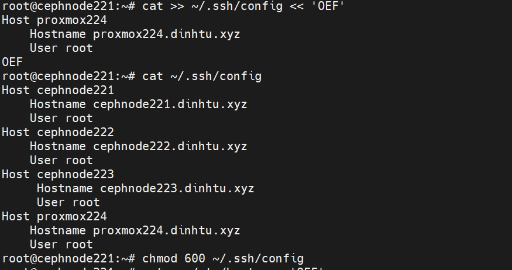

    ssh-copy-id -o StrictHostKeychecking=no proxmox224.dinhtu.xyz

  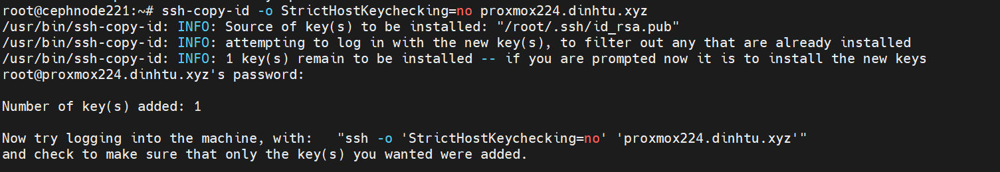

    ssh proxmox224.dinhtu.xyz "apt -y install ceph-common"

    scp /etc/ceph/ceph.conf proxmox224.dinhtu.xyz:/etc/ceph/

    scp /etc/ceph/ceph.client.admin.keyring proxmox224.dinhtu.xyz:/etc/ceph/

    ssh proxmox224.dinhtu.xyz "chown ceph. /etc/ceph/ceph.*"

    ssh proxmox224.dinhtu.xyz "ceph osd pool create proxmoxcluster224 128"

    ssh proxmox224.dinhtu.xyz "ceph osd pool set proxmoxcluster224 pg_autoscale_mode on"

    ssh proxmox224.dinhtu.xyz "rbd pool init proxmoxcluster224"

    ssh proxmox224.dinhtu.xyz "ceph osd pool autoscale-status"

  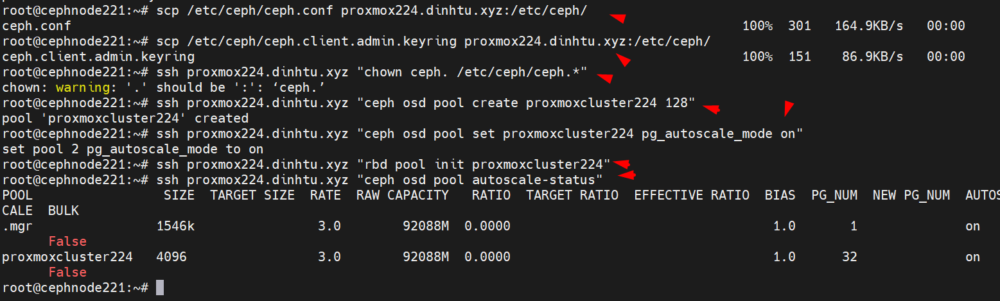

    ssh proxmox224.dinhtu.xyz "rbd create --size 10G --pool proxmoxcluster224 proxmoxcluster22401"

    ssh proxmox224.dinhtu.xyz "rbd ls -l -p proxmoxcluster224"

  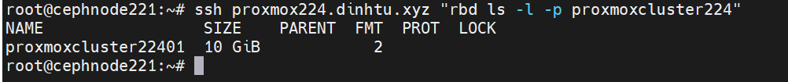

    ssh proxmox224.dinhtu.xyz "rbd map proxmoxcluster224/proxmoxcluster22401"

  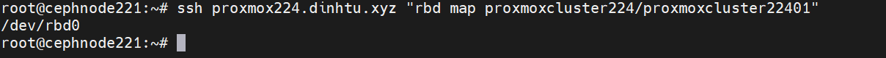

    ssh proxmox224.dinhtu.xyz "rbd showmapped"

  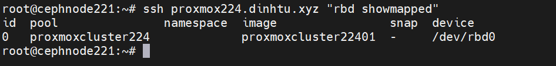

    ssh proxmox224.dinhtu.xyz "lsblk"

Dung lượng nhỏ quá > Resize

    ssh proxmox224.dinhtu.xyz "rbd resize --size 30G proxmoxcluster224/proxmoxcluster22401"

  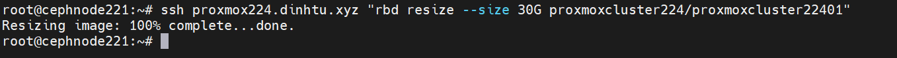

    proxmoxcluster224/proxmoxcluster22401 (/dev/rbd0) từ 10GB tăng lên 30GB

  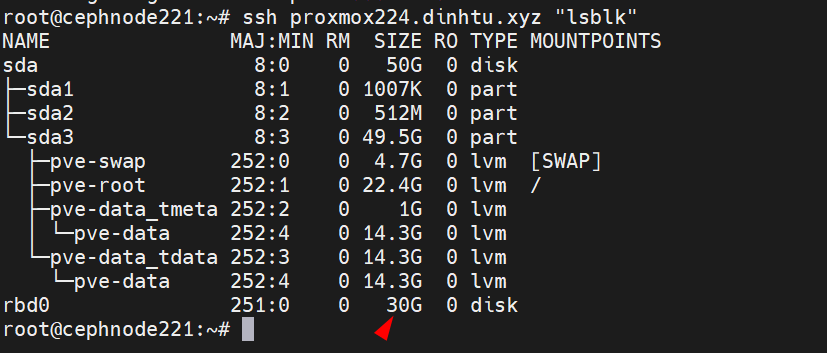

    ssh proxmox224.dinhtu.xyz "mkfs.xfs /dev/rbd0"

  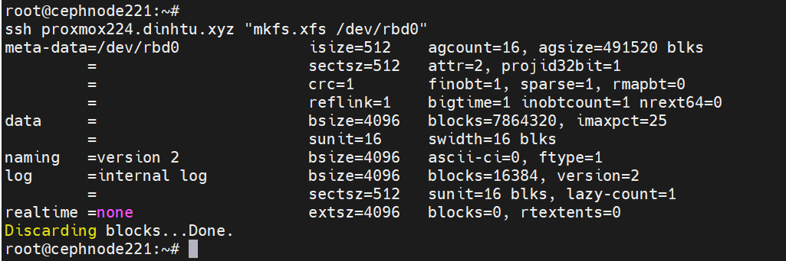
 
    ssh proxmox224.dinhtu.xyz "mkdir -p /mnt/vm"

    ssh proxmox224.dinhtu.xyz "mount /dev/rbd0 /mnt/vm"

Lưu fstab

    ssh proxmox224.dinhtu.xyz "blkid /dev/rbd0"

    root@cephnode221:~# ssh proxmox224.dinhtu.xyz "blkid /dev/rbd0"
    /dev/rbd0: UUID="ae32b8c7-522b-45d5-9822-ae8692ca697c" BLOCK_SIZE="512" TYPE="xfs"

    ssh proxmox224.dinhtu.xyz "echo 'ae32b8c7-522b-45d5-9822-ae8692ca697c /mnt/vm xfs defaults 0 2' | sudo tee -a /etc/fstab"

    root@cephnode221:~# ssh proxmox224.dinhtu.xyz "echo 'ae32b8c7-522b-45d5-9822-ae8692ca697c /mnt/vm xfs defaults 0 2' |  tee -a /etc/fstab"
    ae32b8c7-522b-45d5-9822-ae8692ca697c /mnt/vm xfs defaults 0 2

Bên trên là bước tạo và mount để tạo storage như Directory độc lập giữa các proxmox node, khác với CephFs

Bạn có thể ssh vào từng node proxmox để xem /mnt

  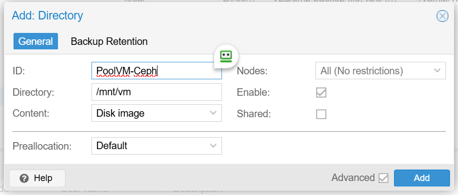

Còn đây là bước connect trực tiếp đến Pools Ceph đã tạo

Tại ``Datacenter`` > ``Storage`` > ``Add`` > ``RDB`` > 

  

cat ``/etc/ceph/ceph.client.admin.keyring`` để lấy thông tin keyring

  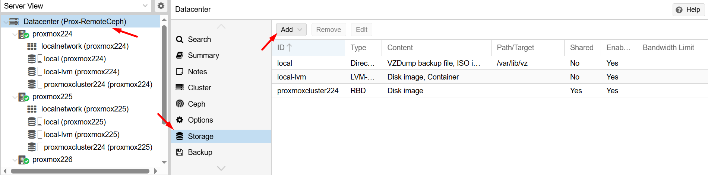

  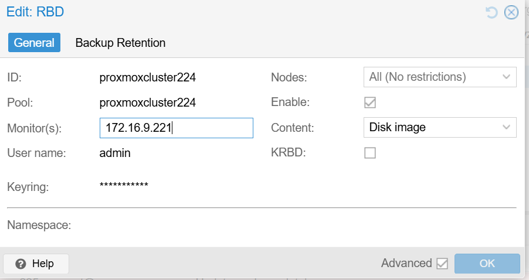

Sau khi kết nối xong chúng ta tạo thử VM

  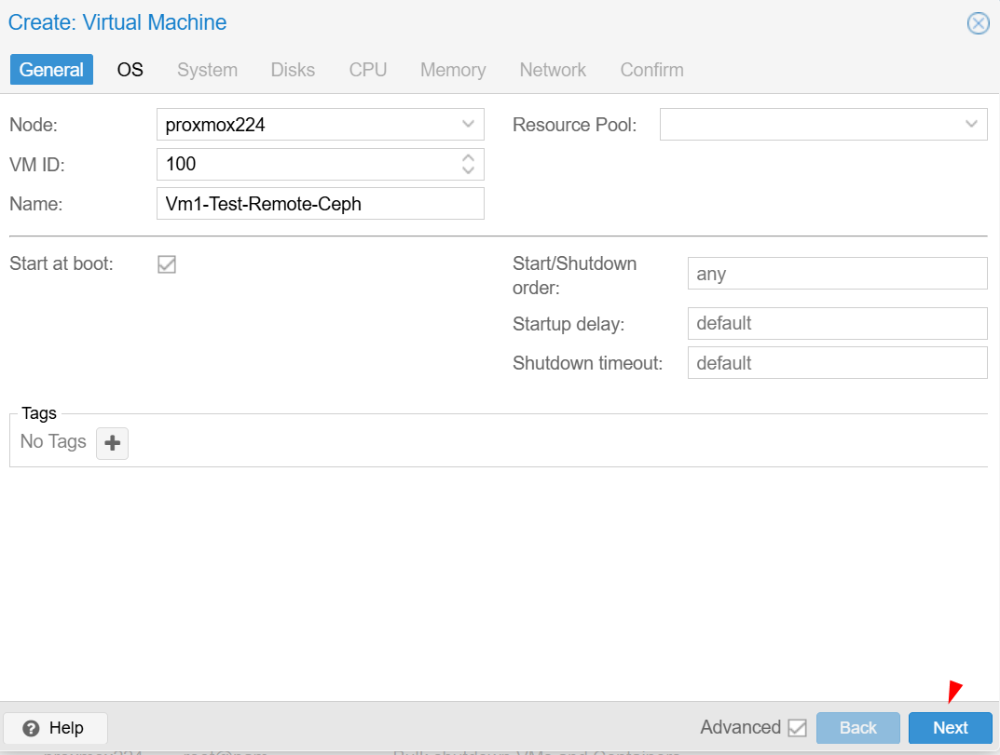

  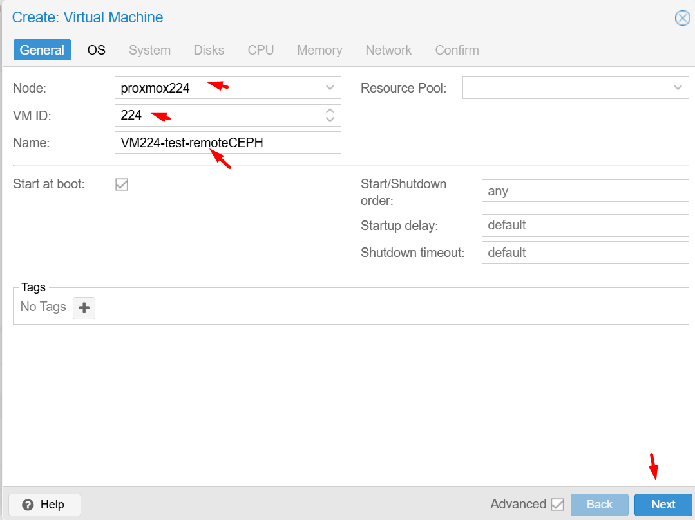
  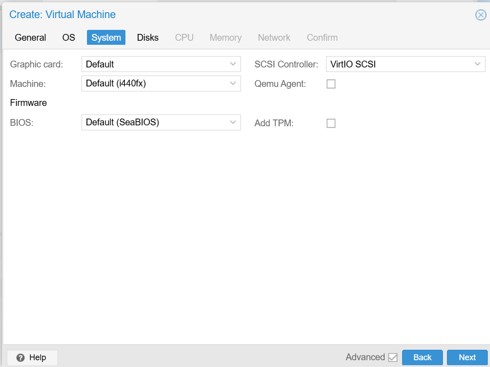
  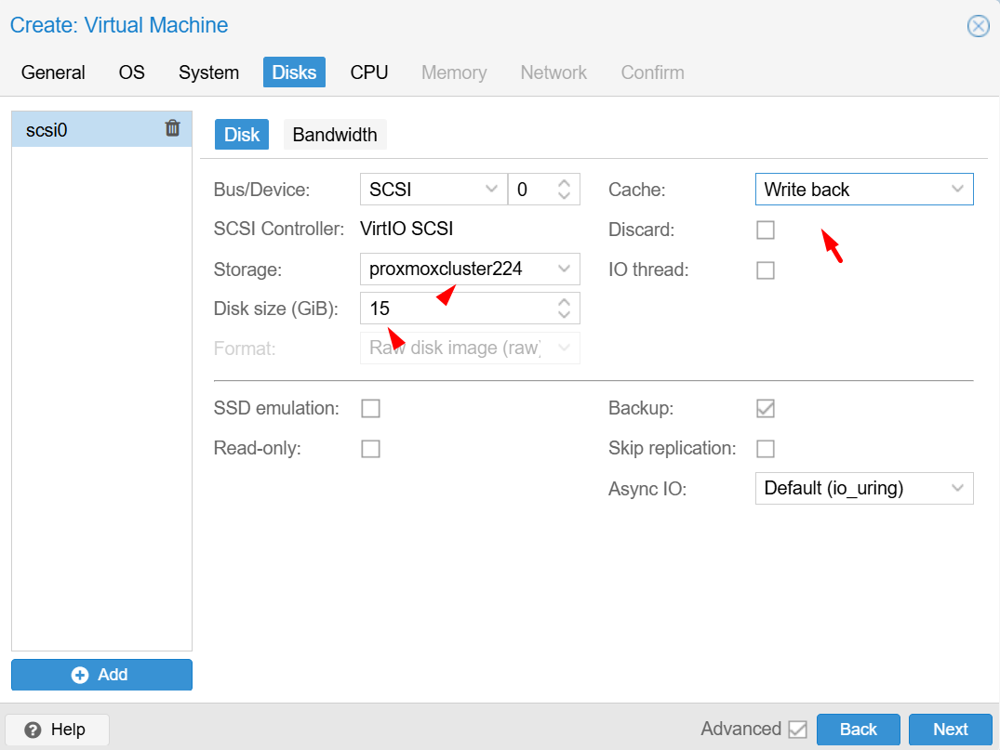

Kết thúc

